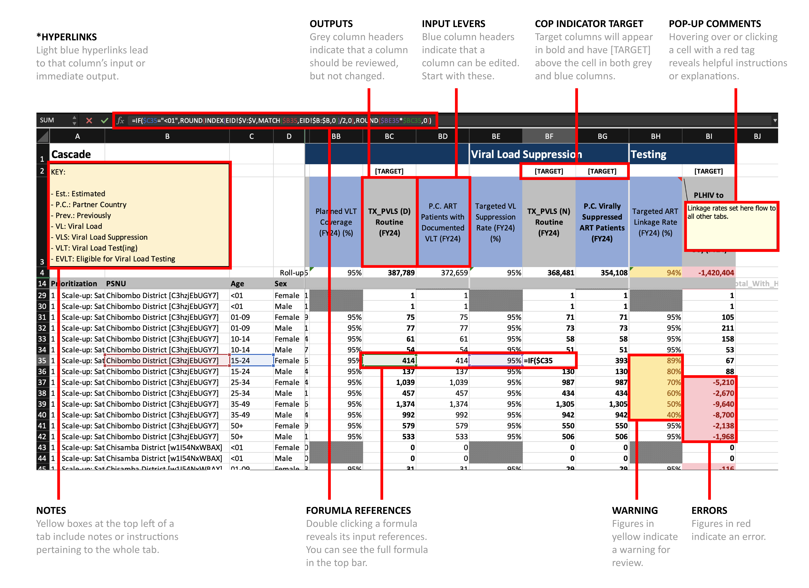

```{r setup, echo=FALSE}
suppressWarnings(suppressPackageStartupMessages({
  library(magrittr)
  library(stringr)
  library(datapackr)
  library(dplyr)
  library(tidyr)
  library(openxlsx)
  library(knitr)
  library(kableExtra)
}))

source("R/schema.R")
source("R/tables.R")
source("R/utils.R")

knitr::opts_chunk$set(echo = FALSE, fig.align ="center")
flextable::set_flextable_defaults(fonts_ignore = TRUE)
```

# COP23 Year 2/ROP24 Year 1 Target Setting Tool Overview

Welcome to the COP23 Year 2/ROP24 Year 1 Target Setting Tool User Manual. The following
pages aim to provide users of the Target Setting Tool used to set FY25 with the
information necessary to successfully complete each tab of the Target
Setting Tool tool and determine accurate, data-driven targets. For the
past several years, the DataPack has a been a key element of
PEPFAR COP planning. In the spirit of COP Reform, we have endeavored to 
reduce the level of effort in target setting and have developed a simplified 
Target Setting Tool for COP24. This tool serves a critical function in
assisting PEPFAR Country Teams in setting targets in line with the
UNAIDS 95-95-95 goals for Testing, Care & Treatment, PMTCT, VMMC, OVC,
and other program areas. Please note that the FY25 Target Setting Tool
is mandatory and must be used to set targets for FY25. For FY25, all
indicators included in the Target Setting Tool are **MER 2.7**
indicators. For further information on the MER 2.7 indicators, please go
to <https://datim.zendesk.com/hc/en-us/sections/200929315-MER>.

To submut a help desk ticket at any point please use     [DATIM.Zendesk.com](http://datim.zendesk.com/).

## About the Target Setting Tool

The FY25 Target Setting Tool supports analysis for all targets by
Priority Subnational Unit (PSNU), population, and Implementing Mechanism
(IM). This tool supports calculation of targets based on expected
treatment coverage rates by type of PSNU and population prioritization.


 - Teams must review and revise their PSNU prioritization levels for FY25. 
The FY25 Target Setting Tool assumes a 'test and start' treatment platform.


The Target Setting Tool will allow PEPFAR teams to use country specific
programmatic assumptions to develop the optimal targets by PSNU along
the program cascades to ensure the necessary number of PLHIV are
diagnosed, linked, and start treatment. The Target Setting Tool does not
necessarily calculate targets for every indicator, but it has space for
teams to enter targets for all indicators and thus can be used to record
agreed-upon COP targets, even for non-calculated indicators.

**Teams must not modify the structure of the FY25 Target Setting Tool
in any way**. The Office of the US Global Aids Coordinator (OGAC) has
developed a process by which targets can be directly imported into DATIM
via the Target Setting Tool Site Tool in order to generate targets.
However, this is *only* possible for teams that do not in any way alter
the structure or format of the Target Setting Tool. Additional details
will be available through COP webinars.

## Highlighted Changes from COP23 (FY24) to COP23 Year 2/ROP24 Year 1 (FY25)

The FY25 Target Setting Tool algorithms are largely the same as the COP23 (FY24)
Target Setting Tool. However, please note the following updates that have been
implemented as a result of feedback during COP last year. 
These changes revolve around workflow, ease of target setting,
and linkage to the COP guidance based on different aspects of the Target
Setting Tool that worked well and others that did not during COP23
target stetting:

-   **PSNUxIM tab structure** that will again handle de-duplication and
    IM allocation, but now is a single tab in a standalone file.
    
-   Fixes to formuals that arose during the last FY24 COP/ROP cycle.

-   Year 2 national level PEPFAR targets to better inform strategic planning across
multiple years.However, these targets will not be imported into DATIM until after a 
Mid-COP25 Year 2 review, in which they may be updated. 


## Data Flow and Review Process to FY25 Submission

The results from FY23 Q4 have been taken from DATIM and used to populate
the Target Setting Tool. In turn, the Target Setting Tool targets will
produce FY25 targets that will be subsequently submitted through DATIM
after COP24 has been finalized and the PSNU level data entered into the
Strategic Direction Summary (SDS) tables, where appropriate (Target
related data).There will also be strategic national level targets for the 
PEPFAR program for COP24 Year 2 (FY26), but these will not be imported into DATIM.

<!-- #
***Target Setting Tool Review***

+------------+--------------------+
|               | COP/ROP 24      |
|               | Timeline        |
+===============+=================+
| Feb 27 -      | Johannesburg    |
| March 10      |                 |
|               | Co-Planning     |
|               |                 |
|               | Meetings        |
+---------------+-----------------+
| March 6 -     | In-Country      |
| March 24      | Strategy        |
|               | Planning        |
+---------------+-----------------+
| March 20 -    | Strategy &      |
| March 31      | Tool            |
|               | Checkpoint      |
|               | 1               |
+---------------+-----------------+
| March 27 -    |                 |
| April 7       | Stakeholder     |
|               | Meeting &       |
|               | Stratgy         |
|               | Update          |
+---------------+-----------------+
| April 11 -    |                 |
| April 21      | Incorporate     |
|               | Feedback &      |
|               | Complete        |
|               | Tool            |
|               | Checkpoint      |
|               | 2               |
+---------------+-----------------+
| April 24 -    | Virtual         |
| April 28      | Approval        |
|               | Meetings        |
+---------------+-----------------+
-->

**Submission Process**

For each of the below submissions, the following process will occur:

-   Country Teams pre-validate their Target Setting Tool submission in
    the Validation Self-Service App (available at
    <https://apps.datim.org/datapack/>).cc

-   Country Team uses Validation Self-Service App to sync data
    with PAW Dossiers.

-   Country Team saves Target Setting Tool to SharePoint under the OU's
    HQ Collaboration \> COP 2023 Year 2 - FY 2025 OR ROP 2024 Year 1- FY2025 \> Guidance, Tools, and
    Resources folder \> Target Setting Tool.

-   Country Team submits a ticket in ZenDesk that includes:

    -   A link to the Target Setting Tool file saved in SharePoint

    -   Confirmation that this file has been pre-validated in the
        Validation (DataPack) Self-Service App

    -   Confirmation that this file has been sent to PAW via the
        Validation (DataPack) Self-Service App

    -   In copy: Chair, PPM, assigned DUIT Liaison, and any Interagency
        members that should be aware of ongoing review and discussions.
        
    -   Country team should generate Flatpack for sharing with CSOs and 
        send to PPM and DUIT Liaison.  PPM will then post to public PEPFAR SharePoint site.

-   Once this ticket is received, the Target Setting Tool Support Team
    will confirm all the above has occurred and send additional
    instructions as needed

-   The PPM reviews the ticket/email thread and confirms the correct
    individuals have all been copied.

-   The assigned PPM and the assigned DUIT Liaison use both the Target
    Setting Tool Self-Service App and the PAW COP Dossiers to validate
    and review the Target Setting Tool, noting any feedback in the
    ticket/email thread.

-   The assigned Chair should also review all feedback on the ticket
    thread and any additional comments as needed.

As is possible, all the above should occur within a 24 hour turnaround
from the initial submission of a Target Setting Tool from a Country
Team. While this process will remain the same for each submission for
review, the content of each review will differ, as explained below. Once
a Zendesk ticket and email thread has been started with an initial
Target Setting Tool submission, all future Target Setting Tool
submissions related to the same Country should use the same
thread/ticket to allow for easy coordination.

**Submission 1**

-   Validate high-level strategic planning direction aligns with the
    vision agreed to durring Johannesburg Co-Planning Meetings.

-   Highlight any areas for technical assistance.

-   Ensure construction of Target Setting Tool has not been tampered
    with.

For this stage of review, it is not expected that your PSNUxIM tab be
completed or even populated. At this stage, the focus should be on
ensuring the high-level cascade is strategically aligned, and only
afterward proceeding to allocating targets to IMs. Note that this is
also partly to avoid Excel performance issues that may occur with the
addition of more data to the PSNUxIM file. This year what has been the 
PSNUxIM Tab will be in a stand-alone file, similar to those used for 
target shift OPUs. This is being done to also help combat the inflated 
file size that generally occurs during COP. Please see the PSNUxIM 
section of the User Guide for more on this. 

**Submission 2**

-   Confirm resolution of any issues flagged during your first
    submission.

-   Confirm no discrepancies between targets modeled in your submitted
    Target Setting Tool and any COP Meeting presentations to date or
    other high-level discussions had with PPMs and Chairs.

-   Review the PSNUxIM tab and address issues related to IM and DSD-TA
    allocation, and deduplication.

**Submission 3**

-   Again confirm Target Setting Tool alignment with all high-level
    decisions and any final presentations given by the Country Team.

-   Confirm resolution of any issues flagged during the second
    submission.

-   Track down and resolve any last bugs and issues in seen in the
    Target Setting Tool

-   Confirm the Target Setting Tool is as near final as possible.

**Final Submission**

-   Confirm all targets modeled in the Target Setting Tool are ready for
    submission to DATIM.

-   Secure Interagency Government sign-off for import of your submitted
    Target Setting Tool to DATIM.

-   Note authority to waive any lingering validation issues flagged by
    the Target Setting Tool Self-Service App.

Once approval by PPMs, Chairs, and Liaisons is documented on the Zendesk
thread/ticket, the Target Setting Tool Support Team will move forward
with uploading your submitted Target Setting Tool to DATIM, then note
completion of this here on this ticket. Once this is done, it is
recommended that you review your data in DATIM to ensure alignment
between DATIM and your Target Setting Tool. Please note in addition to
these regular formal submissions, we encourage regular sharing and
dialogue with Chair, PPM, and DUIT Liaison around target setting process
generally, and Target Setting Tool specifically. Feel free to share
draft versions as often as is helpful.

## Target Setting Tool SharePoint Location

The Target Setting Tool will be posted on PEPFAR SharePoint:
[pepfar.sharepoint.com](https://pepfar.sharepoint.com/).

-   The file path will be OU \> Country Name \> HQ Collaboration \> COP
    2023 -- FY2024 \> Guidance, Tools, and Resources.

-   The file name will be "Target Setting Tool_CountryName_20230215.....". 
    Please reference the day in which the file was added to the folder. If
    there are new .zip files added, please utilize this file as it may
    be a new version of the Target Setting Tool tool.

## Tab Categories

Each Target Setting Tool will start with 20 tabs organized in the order
presented below. Upon downloading the Target Setting Tool, the PSNUxIM
tab will no longer appear as a blank sheet, but will be generated as 
its own file by the self-service validation app after you submit 
your preliminary Target Setting Tool.

-   Home

-   Spectrum

-   Prioritization

-   Cascade

-   KP

-   Year 2

-   PMTCT

-   EID

-   TB

-   VMMC

-   PrEP

-   HTS

-   CXCA

-   TX_TB_PREV

-   PP

-   OVC

-   GEND

-   AGYW

-   KP_MAT

-   KP Validation

-   PSNU x IM (The PSNUxIM Tab will be a stand alone tool, similar to
    that used for OPUs)

\newpage

\blandscape

## How Does Everything Connect?

```{r echo=FALSE, out.width = '100%'}
knitr::include_graphics("images/UG_Sec 1-6 How Does Everything Connect.png")
```

\newpage

## Elements of a Tab

```{r echo=FALSE, out.width = '100%'}

```

\newpage

## How to Navigate a Target Setting Tool Tab

```{r echo=FALSE, out.width = '100%'}
knitr::include_graphics("./images/image5.png")
```

\elandscape

\newpage

**ENTERING DATA IN THE CORRECT SECTION**

In the tabs for the DATIM Data Elements, sections may either have data
prepopulated from DATIM or the user will enter data into that column.
Each section of the guide will list what columns users can expect to
have data prepopulated and / or where they can enter data themselves.

**ENTERING DATA IN THE WRONG SECTION**

If you enter data into a cell that you are not supposed to enter data
into, you will receive the following message box with corrective action
suggestions as well.

**Example:**

```{r echo=FALSE, out.width = '50%'}
knitr::include_graphics("./images/image9.png")
```

## Adjustments to Historic Targets and Results

Throughout the Target Setting Tool, historic targets and results have
been provided for reference and often to drive target modeling
algorithms. If, in the process of reviewing these historic data, issues
with the data are discovered that may need to be addressed in DATIM,
follow the below procedure:

1.  Raise specific issues with historic data to your PPM and DUIT
    Liaison. Determine together whether any issue identified requires
    updating values.

2.  If you are full country team interagency, Chair, PPM and DUIT Liaison 
    are in agreement, the values can be updated in the Target Setting Tool. 
    The DUIT Liaison may need to check with PRIME and/or DUIT leadership if 
    the changes are substantial.


## Target Setting Tool Assumptions

There are many pre-populated assumptions that appear throughout the
Target Setting Tool. These assumptions are included as a result of COP
and MER Guidance. Although Target Setting Tools come pre-populated with
these assumptions, there are various cases and guidance that allow
user's to make edits to these assumptions. Below is a table of all
pre-populated assumptions, the tab in which they are located, the
Indicator, the Assumption. **Please note that all of these assumptions
are all in in editable (Blue) columns** in the Target Setting Tool, to
align with COP Reform and allow for a reduction of LOE and need for
approvals. Changing these assumptions do not require approval, and teams
are free to change these assumptions as needed.

+--------+--------+--------+--------+
| Tab    | S      | Ind    | A      |
|        | ection | icator | ssumpt |
|        |        |        | tion   |
+========+========+========+========+
| C      | ART    | Ta     | 90%    |
| ascade | Mo     | rgeted |        |
|        | deling | P      |        |
|        |        | artner |        |
|        |        | C      |        |
|        |        | ountry |        |
|        |        | ART    |        |
|        |        | Co     |        |
|        |        | verage |        |
|        |        | (FY24) |        |
|        |        | (%)    |        |
+--------+--------+--------+--------+
| C      | ART    | T      | 98%    |
| ascade | Initia | a      |        |
|        | tion   | rgeted |        |
|        |        | Re     |        |
|        |        | t      |        |
|        |        | ention |        |
|        |        | Rate - |        |
|        |        | A      |        |
|        |        | lready |        |
|        |        | on ART |        |
|        |        | (FY22) |        |
|        |        | (%)    |        |
+--------+--------+--------+--------+
| C      | ART    | T      | 98%    |
| ascade | Initia | a      |        |
|        | tion   | rgeted |        |
|        |        | Re     |        |
|        |        | t      |        |
|        |        | ention |        |
|        |        | Rate - |        |
|        |        | New on |        |
|        |        | ART    |        |
|        |        | (FY24) |        |
|        |        | (%)    |        |
+--------+--------+--------+--------+
| C      | ART    | P      | 100%   |
| ascade | Initia | ercent |        |
|        | tion   | Initia |        |
|        |        | ted on |        |
|        |        | ART    |        |
|        |        | that   |        |
|        |        | are TX |        |
|        |        | Naive  |        |
|        |        | (FY24) |        |
|        |        | (%)    |        |
+--------+--------+--------+--------+
| C      | VL     | \% of  | 70%    |
| ascade | T      | TX_NEW |        |
|        | esting | E      |        |
|        | Co     | l      |        |
|        | verage | igible |        |
|        |        | for VL |        |
|        |        | Test   |        |
|        |        | (%)    |        |
+--------+--------+--------+--------+
| C      | VL     | P      | 95%    |
| ascade | T      | lanned |        |
|        | esting | VLT    |        |
|        | Co     | Co     |        |
|        | verage | verage |        |
|        |        | (FY24) |        |
|        |        | (%)    |        |
+--------+--------+--------+--------+
| C      | Viral  | Ta     | 95%    |
| ascade | Load   | rgeted |        |
|        | S      | VL     |        |
|        | uppres | S      |        |
|        | sion   | uppres |        |
|        |        | sion   |        |
|        |        | Rate   |        |
|        |        | (FY24) |        |
|        |        | (%)    |        |
+--------+--------+--------+--------+
| C      | T      | Ta     | 95%    |
| ascade | esting | rgeted |        |
|        |        | ART    |        |
|        |        | L      |        |
|        |        | inkage |        |
|        |        | Rate   |        |
|        |        | (FY24) |        |
|        |        | (%)    |        |
+--------+--------+--------+--------+
| KP     | TX_NEW | T      | 98%    |
|        |        | a      |        |
|        |        | rgeted |        |
|        |        | Re     |        |
|        |        | t      |        |
|        |        | ention |        |
|        |        | Rate - |        |
|        |        | A      |        |
|        |        | lready |        |
|        |        | on ART |        |
|        |        | (FY24) |        |
|        |        | (%)    |        |
+--------+--------+--------+--------+
| KP     | TX_NEW | T      | 98%    |
|        |        | a      |        |
|        |        | rgeted |        |
|        |        | Re     |        |
|        |        | t      |        |
|        |        | ention |        |
|        |        | Rate - |        |
|        |        | New on |        |
|        |        | ART    |        |
|        |        | (FY24) |        |
|        |        | (%)    |        |
+--------+--------+--------+--------+
| KP     | TX_NEW | P      | 100%   |
|        |        | ercent |        |
|        |        | Initia |        |
|        |        | ted on |        |
|        |        | ART    |        |
|        |        | that   |        |
|        |        | are TX |        |
|        |        | Naive  |        |
|        |        | (FY24) |        |
|        |        | (%)    |        |
+--------+--------+--------+--------+
| KP     | T      | \%     | 70%    |
|        | X_PVLS | initia |        |
|        | (D)    | ted on |        |
|        |        | ART    |        |
|        |        | El     |        |
|        |        | igible |        |
|        |        | for    |        |
|        |        | VLT    |        |
|        |        | (FY24) |        |
|        |        | (%)    |        |
+--------+--------+--------+--------+
| KP     | T      | P      | 95%    |
|        | X_PVLS | lanned |        |
|        | (D)    | VLT    |        |
|        |        | Co     |        |
|        |        | verage |        |
|        |        | (FY24) |        |
|        |        | (%)    |        |
+--------+--------+--------+--------+
| KP     | T      | T      | 95%    |
|        | X_PVLS | a      |        |
|        | (N)    | rgeted |        |
|        |        | VL     |        |
|        |        | Supp   |        |
|        |        | r      |        |
|        |        | ession |        |
|        |        | Rate   |        |
|        |        | (FY23) |        |
|        |        | (%)    |        |
+--------+--------+--------+--------+
| KP     | H      | T      | 95%    |
|        | TS_TST | a      |        |
|        |        | rgeted |        |
|        |        | ART    |        |
|        |        | L      |        |
|        |        | inkage |        |
|        |        | Rate   |        |
|        |        | (FY23) |        |
|        |        | (%)    |        |
+--------+--------+--------+--------+
| KP     | HTS\_  | \% of  | 100%   |
|        | TST\   | H      |        |
|        | \_     | TS_TST |        |
|        | RECENT | KeyPop |        |
|        |        | Po     |        |
|        |        | s      |        |
|        |        | itives |        |
|        |        | (FY23) |        |
|        |        | (%)    |        |
+--------+--------+--------+--------+
| PMTCT  | PMT    | E      | 0%     |
|        | C      | x      |        |
|        | T_STAT | pected |        |
|        | (D)    | change |        |
|        |        | in new |        |
|        |        | ANC    |        |
|        |        | c      |        |
|        |        | lients |        |
|        |        | (%)    |        |
+--------+--------+--------+--------+
| EID    | PM     | T      | 95%    |
|        | T      | a      |        |
|        | CT_EID | rgeted |        |
|        | (N)    | % HIV  |        |
|        |        | e      |        |
|        |        | xposed |        |
|        |        | i      |        |
|        |        | nfants |        |
|        |        | tested |        |
|        |        | by 2   |        |
|        |        | mo (%) |        |
+--------+--------+--------+--------+
| EID    | PM     | T      | 100%   |
|        | T      | a      |        |
|        | CT_EID | rgeted |        |
|        | (N)    | % HIV  |        |
|        |        | e      |        |
|        |        | xposed |        |
|        |        | i      |        |
|        |        | nfants |        |
|        |        | tested |        |
|        |        | by 12  |        |
|        |        | mo (%) |        |
+--------+--------+--------+--------+
| EID    | PMT    | Est.   | 98%    |
|        | CT\_   | ART    |        |
|        | H      | L      |        |
|        | EI_POS | inkage |        |
|        | (N)    | Rate   |        |
|        |        | (%)    |        |
+--------+--------+--------+--------+
| EID    | PMT    | Est.   | 98%    |
|        | CT\_   | TX     |        |
|        | H      | Retent |        |
|        | EI_POS | ion    |        |
|        | (N)    | Rate   |        |
|        |        | (%)    |        |
+--------+--------+--------+--------+
| EID    | PMT    | \% E   | 70%    |
|        | CT\_   | l      |        |
|        | H      | igible |        |
|        | EI_POS | for    |        |
|        | (N)    | VLS    |        |
|        |        | T      |        |
|        |        | esting |        |
+--------+--------+--------+--------+
| EID    | PMT    | Est.   | 95%    |
|        | CT\_   | VL     |        |
|        | H      | T      |        |
|        | EI_POS | esting |        |
|        | (N)    | Co     |        |
|        |        | verage |        |
|        |        | Rate   |        |
|        |        | (%)    |        |
+--------+--------+--------+--------+
| EID    | PMT    | Est.   | 95%    |
|        | CT\_   | VL     |        |
|        | H      | Supp   |        |
|        | EI_POS | r      |        |
|        | (N)    | ession |        |
|        |        | Rate   |        |
|        |        | (%)    |        |
+--------+--------+--------+--------+
| TB     | T      | Es     | 0%     |
|        | B_STAT | t      |        |
|        | (D)    | imated |        |
|        |        | Change |        |
|        |        | in In  |        |
|        |        | c      |        |
|        |        | idence |        |
|        |        | (%)    |        |
+--------+--------+--------+--------+
| HTS    | H      | \%     | 0%     |
|        | T      | Change |        |
|        | S_SELF | in H   |        |
|        |        | T      |        |
|        |        | S_SELF |        |
|        |        | (%)    |        |
+--------+--------+--------+--------+
| HTS_R  | all    | \% of  | 100%   |
| ECENT  | mod    | Po     |        |
|        | a      | s      |        |
|        | lities | itives |        |
|        |        | 15+    |        |
+--------+--------+--------+--------+
| CXCA   | CX     | T      | 33%    |
|        | C      | a      |        |
|        | A_SCRN | rgeted |        |
|        |        | CXCA   |        |
|        |        | Sc     |        |
|        |        | r      |        |
|        |        | eening |        |
|        |        | c      |        |
|        |        | o      |        |
|        |        | verage |        |
|        |        | rate   |        |
|        |        | A      |        |
|        |        | lready |        |
|        |        | On ART |        |
|        |        | (%)    |        |
+--------+--------+--------+--------+
| CXCA   | CX     | T      | 100%   |
|        | C      | a      |        |
|        | A_SCRN | rgeted |        |
|        |        | CXCA   |        |
|        |        | Sc     |        |
|        |        | r      |        |
|        |        | eening |        |
|        |        | c      |        |
|        |        | o      |        |
|        |        | verage |        |
|        |        | rate   |        |
|        |        | Initia |        |
|        |        | ted On |        |
|        |        | ART    |        |
|        |        | (%)    |        |
+--------+--------+--------+--------+

| TX_TB \| TX_TB \| T \| 100% \|
| \_PREV \| (D) \| argeted \| \|
|         \| \| co \| \|
|         \| \| verage: \| \|
|         \| \| New on \| \|
|         \| \| ART (%) \| \|
|         \| \| \| \|
|         \| \| \| \|
|         \| \| \| \|

+--------+--------+--------+--------+
| TX_TB  | TX_TB  | T      | 100%   |
| \_PREV | (D)    | a      |        |
|        |        | rgeted |        |
|        |        | co     |        |
|        |        | v      |        |
|        |        | erage: |        |
|        |        | A      |        |
|        |        | lready |        |
|        |        | on ART |        |
|        |        | (%)    |        |
+--------+--------+--------+--------+
| TX_TB  | T      | \%     | 100%   |
| \_PREV | B_PREV | TX_TB  |        |
|        | (D)    | (D)    |        |
|        |        | Screen |        |
|        |        | Neg.,  |        |
|        |        | New on |        |
|        |        | ART in |        |
|        |        | i      |        |
|        |        | tiated |        |
|        |        | on TPT |        |
|        |        | (%)    |        |
+--------+--------+--------+--------+
| TX_TB  | T      | \%     | 100%   |
| \_PREV | B_PREV | TX_TB  |        |
|        | (D)    | (D)    |        |
|        |        | Screen |        |
|        |        | Neg.,  |        |
|        |        | A      |        |
|        |        | lready |        |
|        |        | on ART |        |
|        |        | in     |        |
|        |        | i      |        |
|        |        | tiated |        |
|        |        | on TPT |        |
|        |        | (%)    |        |
+--------+--------+--------+--------+
| TX_TB  | T      | T      | 90%    |
| \_PREV | B_PREV | a      |        |
|        | (N)    | rgeted |        |
|        |        | p      |        |
|        |        | letion |        |
|        |        | (%)    |        |
+--------+--------+--------+--------+
| PP     | P      | E      | 0%     |
|        | P_PREV | x      |        |
|        |        | pected |        |
|        |        | change |        |
|        |        | P      |        |
|        |        | P_PREV |        |
|        |        | s      |        |
|        |        | e      |        |
|        |        | rvices |        |
|        |        | (%)    |        |
+--------+--------+--------+--------+
| OVC    | O      | T      | 20%    |
|        | V      | a      |        |
|        | C_SERV | rgeted |        |
|        |        | Gra    |        |
|        |        | d      |        |
|        |        | uation |        |
|        |        | Rate   |        |
|        |        | among  |        |
|        |        | C      |        |
|        |        | ompre  |        |
|        |        | h      |        |
|        |        | ensive |        |
|        |        | (%)    |        |
+--------+--------+--------+--------+
| AGYW   | AG     | Pr     | 0%     |
|        | Y      | o      |        |
|        | W_PREV | jected |        |
|        |        | Net    |        |
|        |        | Change |        |
|        |        | in     |        |
|        |        | Total  |        |
|        |        | AG     |        |
|        |        | Y      |        |
|        |        | W_PREV |        |
|        |        | from   |        |
|        |        | FY21   |        |
|        |        | R      |        |
|        |        | esults |        |
|        |        | (%)    |        |
+--------+--------+--------+--------+
| AGYW   | AG     | T      | 60%    |
|        | Y      | a      |        |
|        | W_PREV | rgeted |        |
|        |        | P      |        |
|        |        | ercent |        |
|        |        | Com    |        |
|        |        | p      |        |
|        |        | letion |        |
|        |        | (%)    |        |
+--------+--------+--------+--------+

\newpage
