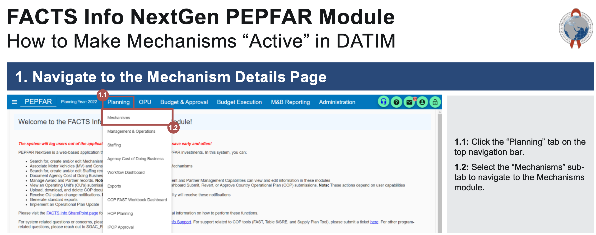
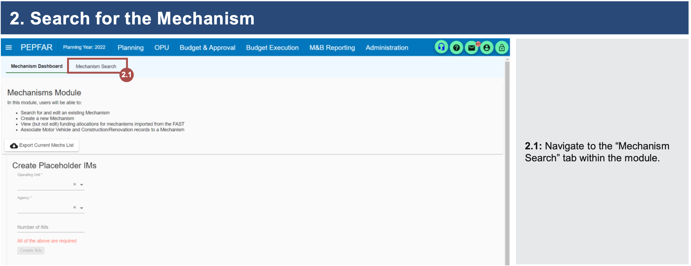
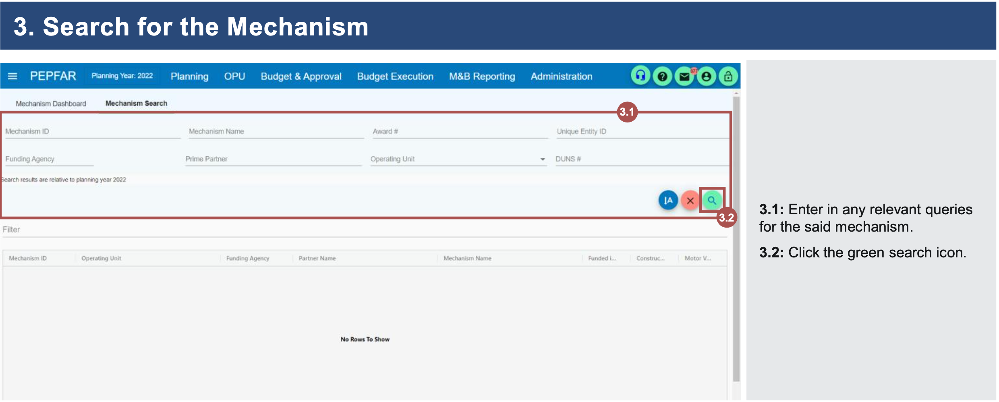
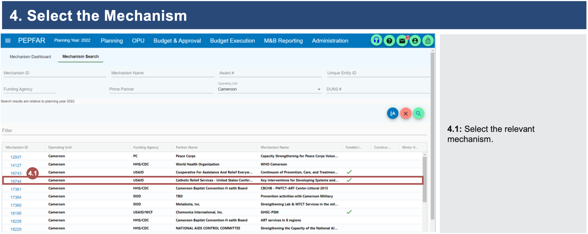
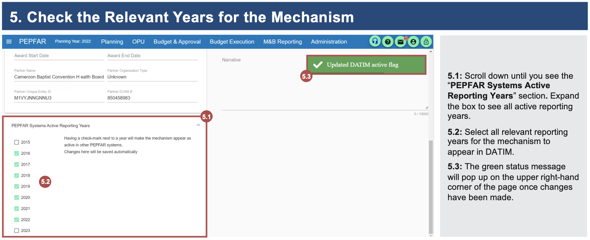

# Frequently Asked Questions and Formula Updates

## Formula Updates

The following are formula errors that have been flagged by Users and need to be updated in the Target Setting Tool:

-   On the TX_TB_PREV Tab, the FY23 TX_CURR Targets and FY24 TX_NEW Targets are not aggregating the <15 and 15+ age bands properly. Important Note, if this issue is present in your tool, it may be your version of excel, or in the generation of tools that excel added a “@”, that caused this to appear in any “IFERROR” formula in the Target Setting Tool. If you see this in any other “IFERROR” formula, please feel free to follow the step to resolve. In both of the formulas in columns F and G of the TX_TB_PREV tab there is an “@” symbol halfway through the formula. This needs to be removed in order for the formula to work properly. You will need to delete the “@”, and then drag this formula down through both of these columns to have the aggregation work as intended. 

-   On the PMTCT Tab, in column AT for **HTS_TST PMTCT Post ANC1, Negative (FY25)** $HTS\_TST.PostANC1.Neg.T$ there is a ROUND formula missing. To fix this, n cell AT15, change formula to include ROUND function:=IF(SUM($AO15)=0,"",ROUND($AO15-SUM($AS15),0)). Flash fill formula to the bottom of the column.


## FAQs

***Q: I am having trouble sending my targets to PAW and other issues with the app that I was not having yesterday, how can I resolve this?***

A: DATIM can sometimes cache a lot of data. Clearing your cache, closing your browser, and then logging back into the App should resolve this. 

***Q: On the Cascade tab, in the section for "PEPFAR FY23 Cascade (Observed)" there seems to be a discrepancy where  the TX_PVLS (D) or (N), or in the New Positiive FY23 Result column(s) do not match with DATIM/Genie/Pano, what should I do?***

A: The discrepancy you are seeing is because the TST does not account for Targeted dissagg for TX_PVLS when we pull from DATIM. For New Positives the discrepancy is from PMTCT_HEI_POS (N, DSD, Age/HIVStatus) not being included in the DATIM output. Due to this you may see slight discprepancies, but these results do not impact any of the calculations within the TST and teams should not worry.

***Q: The Cascade tab is estimating TX_PVLS_D directly from FY24 TX_CURR + (TX_NEW FY25/2) without taking into account losses between the fiscal years, why is this?***

A: This is an intentional slight overestimate, rather than the alternative which could be underestimate.  Because we want to make sure targeted coverage provides for enough VL testing for all those who could need to be tested, we don't take Interruption In Treatment (IIT) into account, because IIT can also happen after VL test is taken, but before results are returned.

***Q: I have PLHIV estimates, but they are not appearing in PAW, what do I need to do?***

A: Users will see three (3) columns for PLHIV in the Cascade and Year 2 tabs. In some cases, teams will receive two different PLHIV Estimates, one for "PLHIV_Residents.T" and another for "PLHIV_Attend.T". Please refer back to the Cascade section in the  [Partner Country Context] portion at the bottom where these FY24 indicators are explained. The default is to point to column AK, but if the tool only has values in column AL, the formula will need to be updated to point to AJ as specified in the note when you hover over cell AL3. Once you make this change and drag down the formula and you have PLHIV in column AL, and re-validate and send to PAW, PLHIV should appear.

***Q: Many of our targets, including TX_CURR are exceeding our PLHIV, What is issue and how can we address this?***

A: The Target Setting Tool will not prevent situations resulting in ART coverage exceeding 100% in a given PSNU, but will flag these cases in yellow to highlight when it occurs. Given that these may be a common occurrence in cases of urban PSNUs, or other case where service seeking behavior by clients leads them to cross PSNU boundaries, they are allowable in the tool. It may be worth considering whether the UNAIDS $PLHIV\_Attend$ estimates might provide better context in these situations, but countries need to use a consistent version of the PLHIV estimates for the whole country, otherwise they risk over or under estimating the number of PLHIV.

***Q: I am not setting Military SNU Targets, but have cells with "\*For DOD Military Use Only", what should I do with these?***

A: For cells that are labeled with "\*For DOD Military Use Only", in OU Target Setting Tools that do not have Military targets, these cells can be overwritten with zero (0). If they are left with the "\*For DOD Military Use Only", they will be dropped upon import.

***Q: I have AGYW targets, but they are not appearing in my PSNUxIM tab, why?***

A: AGYW_PREV is reported by the USG team, not an IM, so AGYW_PREV targets are not assigned to an IM. It is automatically assigned to USG team.

<!-- #  ***Q: Cascade Tab "Patner Country Context" section column V "P.C. Est. ART Patients Tested for VLS" and column X "P.C. Est. Virally Suppressed ART Patients (FY22)" are blank, how should I fill these out or can I leave them blank?*** -->

<!-- # A: These two columns have been added and left blank for country teams to add in data, should they have reliable Host Country Data available to them. Should a team have access to this data, they should consult their PPM and DUIT Liaison prior to populating the columns. If a country does not have good Host Country Data VL data, the best way forward is likely to leave blank, and the Target Setting Tool will work with your PEPFAR TX_PVLS data on it's own. -->

***Q: I have an outstanding COP23 OPU for IM shifts, what should I do?***

A: Outstanding target-shift OPUs that are only shifting targets from one IM to another will not affect the main Target Setting Tool file since it does not have a generated PSNUxIM tab (note this tab should not be generated until all main tabs have been completed). If the team would like the OPU’s target shifts to be reflected in the FY25 Target Setting Tool’s PSNUxIM file, the OU SI teams should not generate an FY25 PSNUxIM file until their target shift OPU memos are fully approved and the target shifts are imported into DATIM. Otherwise, they should be prepared to also make the IM allocation updates in their FY25 PSNUxIM file to align with the OPU updates.

***Q: When working through PSNUxIM KP mechanism allocations and I allocate the KP-specific targets to KP partners, given that the KP disaggregates are a subset of the total population being targeted, do I also need to allocate total pop targets to the KP partner?***

A: Yes, you should be setting a corresponding Total Pop target against each mechanism you set KeyPop targets against. This is because KeyPop is a subset of Total Pop. Note however, that only clinical, facility partners may have targets and report many indicators. For these indicators, the KP targets must be assigned to a partner and site qualified to report the results.

```{=html}
<!-- # ***Q: Can you use FY25 Spectrum estimates to work through the Cascade tab?***

A: No, unless you receive approval from OGAC Leadership you should use FY23 Spectrum Data. Your target setting process for the COP24 Target Setting Tool should be to set FY25 targets based on where you are ending FY24. -->
```
```{=html}
<!-- ***Q: Why in the newly generated PSNUxIM tab are data-pack totals and roll up columns blank?***

A: Once you have regenerated your PSNUxIM tab from the Target Setting Tool Self-Service app, please open your newly regenerated tool, save your tool and close it. When you reopen your tool, it should populate your targets into that column. You will also need to drag down the formula in the far right "Target Values" section of the PSNUxIM tab to ensure all rows are populated with the proper formula. -->
```
***Q: If my program performs testing but not treatment, how do I represent this in the Target Setting Tool?***

A: You will first need approval from your Chair, who should confirm with your DUIT Liaison, to do this. If you receive this approval you will need to manually alter in the Cascade Tab column "HTS_TST_POS + PMTCT_HEI_POS (FY25)" (BI). Please make the alterations to this column and not on the HTS tab. You may also exceed the minimum HTS_POS needed for your TX_NEW, by having an HTS distribution that is over 100%.

***Q: When I try to validate my Target Setting Tool in the self-service app, I get a message saying "ERROR: An error has occurred. Check your logs or contact the app author for clarification." How do I resolve this?***

A: This error can be caused by a number of different issues. The most common causes and their resolutions include:

-   Trying to validate a newly regenerated Target Setting Tool before opening it and saving it. After generating or regenerating your PSNUxIM tab, it is necessary to first open your tool and save it before uploading it to the app.
-   The browser is causing issues with the app. This can be resolved by opening an Incognito window or by clearing your cache. PLEASE NOTE: Clearing your cache will sign you out of all accounts in that browser.
-   Trying to validate a file that isn't an XLSX. If your team has saved your Target Setting Tool in a different file format for sharing, such as XLSB, ensure that you resave the file as an XLSX before validating it in the app.
-   The target distribution formulas on the PSNUxIM tab have not been applied to all rows. By default, the formulas in the "Target Value" section (Column CW and right) are only applied to Row 15. Once you generate or regenerate your PSNUxIM tab, ensure that you copy these formulas all the way down to the bottom row of your targets. After this is done, try validating your tool again.

If none of the above issues apply to your Target Setting Tool tool and you are still receiving this error, please submit a ZenDesk ticket identifying your country and attaching or linking to a copy of the Target Setting Tool tool that caused the error in the app, please always cc your DUIT Liaison on ZenDesk Tickets.

***Q: The Self-Service Validation App is flagging that I have an Invalid Mechanism. How and where do I fix this?***

A: The PSNUxIM tab will only populate with mechanisms that are marked as "active" for the current COP year in DATIM. Any mechanisms that are manually added to the PSNUxIM tab that are not active and valid will be flagged by the Self-Service App.

To ensure a mechanism is valid for the current COP year, go into the COP module in FACTS Info-Next Gen (FI-NG) and check the box for "PEPFAR Systems Active Reporting Years" for the appropriate COP year. Please note that it may take up to 24 hours for active mechanism flags to be carried over into DATIM and resolve validation errors in the Self-Service App. Please reference [How to Make Mechanisms "Active" in DATIM](https://peptest.dfafacts.gov/assets/guides/HowtoMakeMechanismsAppearinDATIM.pdf)

```{r echo=FALSE, out.width = '70%'}

```

```{r echo=FALSE, out.width = '70%'}

```

```{r echo=FALSE, out.width = '70%'}

```

```{r echo=FALSE, out.width = '70%'}

```

```{r echo=FALSE, out.width = '70%'}

```
