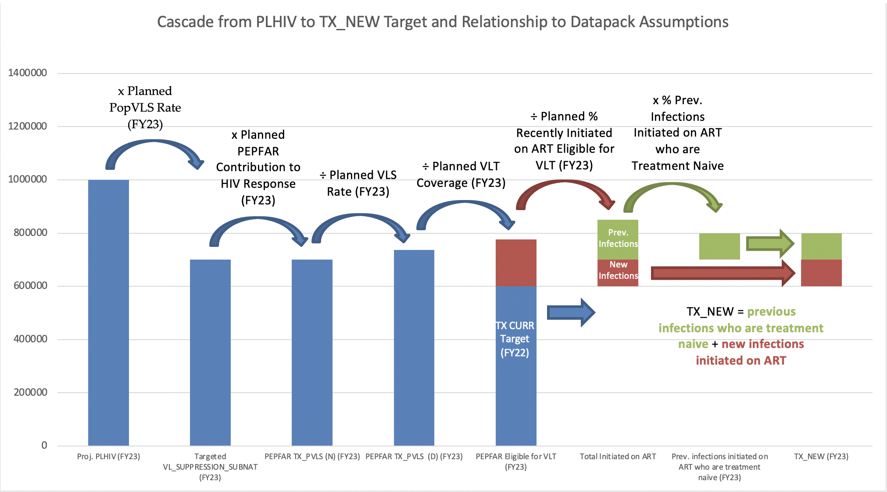

\blandscape

# CASCADE

The Cascade Tab allows Target Setting Tool users to view and set the overall contour of their treatment and testing program across both geography and population. Of all tabs in the COP23 Target Setting Tool, this tab experienced the most changes compared to the COP22 Target Setting Tool, reflecting changes in PEPFAR COP guidance to reemphasize the importance of Viral Load Testing Coverage (VLC) in the HIV response.

As seen in Section 7 of PEPFAR COP/ROP 2023 Guidance, Country Teams are asked to center their COP23 discussions around the concept of Population Viral Load Suppression (PopVLS), or the percent of all People Living with HIV who have a suppressed viral load. This metric provides a succinct, composite view of the HIV response, including: new infections, testing & diagnosis, linkage to and retention on treatment, eligibility for viral load testing, roll out of viral load testing, and viral load suppression.

Because this is a fundamental shift in the Cascade tab from previous years, it is important to have an overall understanding of the flow of the Cascade calculations from FY23 estimated PLHIV to the TX_PVLS and TX_NEW targets. This logical flow is described in the figure below. The key assumption is the "Planned PopVLS rate (FY23)", which takes you from the FY23 estimated PLHIV to the measured number of virally suppressed patients in the OU (VL_SUPPRESSION_SUBNAT (FY23)). This use of the term % PopVLS should be distinguished from its use in other settings where it is meant to convey the theoretical fraction of PLHIV who are virally suppressed (whether in-care or out of care, tested for viral load or not). As used in the Target Setting Tool, PopVLS is a programmatic PopVLS that conveys only what can be measured either by the host country or by PEPFAR. The VL_SUPPRESSION_SUBNAT (FY23) is then multiplied by the Planned PEPFAR Contribution to the HIV Response (FY23) to give the PEPFAR TX_PVLS (N) (FY23) target. The PEPFAR TX_PVLS_D is then divided by the Planned VLS Rate (FY23) to yield the TX_PVLS (D) (FY23) target.

The Target Setting Tool then calculates the TX_NEW target from the TX_PVLS (D) target. Because TX_PVLS (D) is only the number of persons on treatment tested for VL, the Target Setting Tool calculates the total number eligible for VL testing by dividing by the Planned VLT Coverage (FY23). The number eligible for viral load testing can be thought of as the sum of those who were already on treatment, i.e. TX_CURR (FY23), and those who are initiated on treatment during FY23 and eligible for VLT. To get the number of persons initiated on treatment (whether eligible for VLT or not), we divide by the Planned % Recently Initiated on ART Eligible for VLT (FY23). The number initiated on treatment during FY23 is similar to TX_NEW, but still may contain individuals who may have previously been on ART, fallen out of care, and re-initiated treatment who may not need to be retested for HIV and who should not be included in TX_NEW. Therefore, we calculate the \# of previous infections who are treatment naïve by multiplying the total number of previous infections by the % Prev. Infections Initiated on ART who are Treatment Naïve. TX_NEW is then calculated as the sum of previous infections who are treatment naïve and the new infections initiated on ART.

As in past Target Setting Tools, this tab interweaves with many other tabs of the Target Setting Tool, including the PMTCT, TB, EID, VMMC, KP, HTS, CXCA, HTS_RECENT, and TX_TB_PREV tabs. As is explained below and in sections related to these tabs, Target Setting Tool logic is most useful when target-setting begins in the Cascade tab and progresses from left to right, both within that tab, and across and within all other tabs, returning iteratively to the Cascade tab throughout.

```{r echo=FALSE, out.width = '100%'}

```


## TX_CURR (FY24), PEPFAR FY22 Cascade (Observed) & PEPFAR FY23 Cascade (Planned)
```{r echo=FALSE, results='asis'}
sheet_name <- "Cascade"
section <- "TX_CURR (FY24)"
columns <- col_seq("F", "F")
data <- prepare_table_data(sheet_name, columns)
for (t in table_seq(data)) {
  make_table(t, section)
  }
```

```{r echo=FALSE, results='asis'}
sheet_name <- "Cascade"
section <- "PEPFAR FY22 Cascade (Observed)"
columns <- col_seq("G", "K")
data <- prepare_table_data(sheet_name, columns)
for (t in table_seq(data)) {
  make_table(t, section)
  }
```

```{r echo=FALSE, results='asis'}
sheet_name <- "Cascade"
section <- "PEPFAR FY23 Cascade (Planned)"
columns <- col_seq("L", "R")
data <- prepare_table_data(sheet_name, columns)
for (t in table_seq(data)) {
  make_table(t, section)
  }
```

The first column of the Cascade, column F, introduces a long requested change to the Target Setting Tool. The column for whether TX_CURR Target derived by OU analysis. This column gives teams the ability to enter a FY24 TX_CURR Target that has been dtermined through external analysis or modeling can be entered into this column. If teams enter target values into this column, this target will take precedent to be the TX_CURR FY24 target that will be used as the target that is imported into DATIM in the ART Section (please see that section for more details). 

This section provides an overview of PEPFAR FY22 results and FY23 targets, both to give insight into the current status of PEPFAR's contribution to the host country HIV response, as well to serve as reference to many other sections in the Cascade tab. Review this section to understand PEPFAR's trends for the following data, as well as the linkages and relationships between them:

-   New Positives --- including from both HTS_TST_POS (serologic testing) & PMTCT_HEI_POS (virologic testing)

-   TX_NEW

-   TX_CURR

-   TX_PVLS (D)

-   TX_PVLS (N)

-   In the Cascade-PEPFAR FY22 Cascade (Planned) section we have added a new column based on feedback gathered in the retrospective process. The TX_CURR: Expected Achievement (FY23) has been added to default to be the larger of the TX_CURR FY22 Result or the TX_CURR FY23 Target. This column is editable for teams to indicate what the expected achievement for FY23 will be. The value in this column is the TX_CURR (FY23) that will be referenced in the ART Modeling and ART sections as well as subsequent sections of the Cascade tab.

## Partner Country Context

```{r echo=FALSE, results='asis'}
sheet_name <- "Cascade"
section <- "Partner Country Cascade (from Spectrum tab, or manually entered here)"
columns <- col_seq("S", "AL")
data <- prepare_table_data(sheet_name, columns)
for (t in table_seq(data, max_col = 4)) {
  make_table(t, section)
}
```

For those leveraging UNAIDS Spectrum estimate exports for the Data Pack, once these have been loaded into the Spectrum tab of the Data Pack, this first portion of the Cascade tab will automatically update to reflect these estimates. For those leveraging alternatives to Spectrum, see below.

In specific, the Partner Country Context section of the Cascade tab provides space for reflecting the following data:

-   **Partner Country Observed TX_CURR_SUBNAT (FY22)** $TX\_CURR\_SUBNAT.R$: Observed/actual total number of PLHIV receiving ART as of September 2022.

-   **Partner Country Estimated Population (FY23)** $POP\_EST.T\_1$: Estimated population, projected as of September 2023.

-   **Partner Country PLHIV by Residence (FY23)** $PLHIV\_Residents.T\_1$: Estimated number of people residing with HIV in an area, projected as of September 2023.

-   **Partner Country PLHIV by ART attendance (FY23)** $PLHIV\_Attend.T\_1$:  Estimated number of PLHIV who would attend health facilities in a district if 100% ART coverage, projected as of September 2023.

-   **Partner Country Estimated HIV Prevalence (FY23) (%)** $HIV\_PREV.T\_1$: Estimated HIV Prevalence, projected as of September 2023.

-   **Partner Country PLHIV Diagnosed (FY23)** $DIAGNOSED\_SUBNAT.T\_1$: Estimated number of people living with HIV who know their HIV status, projected as of September 2023.

-   **Partner Country % PLHIV Diagnosed (FY23) (%)** $DIAGNOSED\_SUBNAT.RT.T\_1$: Estimated number of people living with HIV who know their HIV status, projected as of September 2023.

-   **Partner Country Projected Incidence Rate (FY23) (%)** $Incidence\_SUBNAT.Rt.T\_1$: Estimated incidence rate, projected as of September 2023. *TO DELETE*

-   **Partner Country On ART (FY23)** $TX\_CURR\_SUBNAT.T\_1$: Estimated number of PLHIV receiving ART, projected as of September 2023.

-   **Partner Country ART Coverage (ART/PLHIV) (FY23) (%)** $PopART.Rt.T\_1$ Estimated 2023 ART Coverage taking HC Est TX_CURR SUBNAT from Column Y divided by Column U for HC Est. for PLHIV.

-   **Partner Country % Diagnosed on ART (FY23) (%)** $TX\_CURR\_SUBNAT.Rt.T\_1$ Estimated 2023 ART Coverage taking HC Est TX_CURR_SUBNAT from Column Y divided by Column W for HC DIAGNOSED_SUBNAT.T_1.

-   **Partner Country Untreated PLHIV in health facility catchment area (FY23)** $Untreated\_PLHIV\_Attend.T\_1$ Estimated number of PLHIV who are Untreated and in a health facility catchment area, projected as of September 2023.

-   **Partner Country ART Patients with Documented VLT (FY23)** $VL\_TESTING\_SUBNAT.T\_1$ Estimated number of people who are ART Patients with Documented Viral Load Testing, projected as of September 2023.

-   **Partner Country VLT Coverage (FY23) (%)** $VL\_TESTING\_SUBNAT.Rt.T\_1$ Estimated coverage taking Partner Country ART Patients with Documented VLT (FY23) divinded by ost Country On ART (FY23).

-   **Partner Country Estimated Virally Suppressed ART Patients (FY23)** $VL\_SUPPRESSED.T\_1$: Estimated PLHIV who are on ART and have a suppressed viral load, projected as of September 2023. \**See note below*

-   **Partner Country Est. VLS Rate (Virally Suppressed/Documented VLT) (FY23) (%)** $VLS\_SUBNAT.Rt.T\_1$: Estimated rate of Virally Suppressed ART Patients (FY23) divided by ART Patients with Documented VLT, projected as of September 2023. \**See note below*

-   **Partner Country Projected Incidence Rate (FY24) (%)** $Incidence\_SUBNAT.Rt.T\_1$: Estiamted new Incidence rate projected to occur in FY24, based on projected FY23 Incidence Rates.

-   **Partner Country Projected New Infections (FY24)** $NEW\_INFECTIONS\_SUBNAT.T\_1$: Estimated new infections projected to occur in FY24, based on projected FY23 Incidence Rates.

-   **Partner Country PLHIV by Residence (FY24)** $PLHIV\_Residents.T$: Estimated number of people residing with HIV in an area, projected as of September 2024.

-   **Partner Country PLHIV by ART attendance (FY24)** $PLHIV\_Attend.T$:  Estimated number of PLHIV who would attend health facilities in a district if 100% ART coverage, projected as of September 2024.

-   **Partner Country Projected PLHIV (FY24)** $PLHIV.T$: Teams must select whether the final PLHIV will pull from Partner Country PLHIV by Residence (FY24) (column AJ) or Partner Country PLHIV by ART attendance (FY24) (column AK). You must chose one PLHIV and cannot mix and match. This is the PLHIV that will flow to DATIM and PAW.


\**Note:* This indicator is not available via Spectrum for COP23. If high quality data is available from another source, you may enter it this here, overwriting formulas, though retain data source documentation. However, if data is not readily available, it is best to leave this column blank --- the Target Setting Tool was designed to populate subsequent columns even without this data.

### DATIM Import

The following data points will be imported into DATIM from this section, replacing any preexisting estimates for these indicators that may have already been entered in DATIM:

-   **Partner Country Projected PLHIV (FY24)** $PLHIV.T$

### Instructions

1.  If using UNAIDS Spectrum as the source for these data:

    a.  Review the above columns to confirm that data has been correctly linked with the Spectrum tab. You may consider using filter drop-down menus to quickly inspect for any non-numeric, negative, or invalid data.

    b.  Review Relative Standard Error values to identify any estimates with a Relative Standard Error of more than or equal to 20. See the section below for additional instructions.

2.  If leveraging alternatives to UNAIDS Spectrum as the source for these data, see the below section.

3.  Confirm that no data has been entered against \_Military Organization Units. See below for more explanation.

Please note that the Partner Country Estimated Patients Tested for VLS (FY23) and the Partner Country Estimated Virally Suppressed ART Patients (FY23) are not available from Spectrum/Naomi. Therefore, they will not populate from the Spectrum tab. The Target Setting Tool does not need it populated to work, and if it is left blank the Target Setting Tool will rely on PEPFAR MER data.

### Leveraging Alternatives to Spectrum

Most countries are encouraged to use UNAIDS Spectrum as their source for the above data. However, Country Teams may request approval from their PPM and a DUIT Liaison to use an alternative data source if deemed more reliable.

In this case, paste estimates from other approved sources into this section of the Cascade tab by overwriting the formulas currently in these green columns. Due to hidden Relative Standard Error columns between the various estimate columns, it is recommended you paste this data in one column at a time, rather than in bulk. It may also reduce technical issues to first copy geographic data in the SNU1, PSNU, Age, and Sex columns into a separate spreadsheet, then use Excel lookup functions to add estimates data against the correct geographies and populations, and then return to pasting data into the original Cascade tab column by column.

Please note that it is not required to populate the Partner Country Estimated Patients Tested for VLS (FY23) and the Partner Country Estimated Virally Suppressed ART Patients (FY23) columns. In fact, in the absence of appropriate programmatic or clinical data, it is inadvisable to expend great effort on making these estimates. The Target Setting Tool has been redesigned with the understanding that most countries will not have these data. If these columns are left blank, the Target Setting Tool will automatically use PEPFAR program data to estimate the Working PopVLS Rate and the cascade calculations will still be able to proceed.

### Relative Standard Errors

UNAIDS Spectrum estimates are accompanied by Relative Standard Errors (RSE) for each data point, both at the District level as well as the Age/Sex-specific level. These indicate the relative reliability of each of these data, which should be considered when using these to make program planning decisions.

Along with the data points above, RSEs will also automatically be populated in the Cascade tab from data loaded into the Spectrum tab. While initially these RSE columns will be hidden, you can unhide these columns to inspect these values. RSEs are also used to color-coded related columns based on the relative uncertainty of each specific data point as follows:

-   **Red:** RSE $\geq$ 40.

-   **Yellow:** RSE \< 40, but $\geq$ 20.

-   **Green:** RSE \< 20.

Red or yellow highlighting may not always mean a data point should be disregarded, nor is it the case that all green values should be taken at face value. Either way, consider these RSEs as helpful guideposts in interpreting the contextual meaning and quality of UNAIDS Spectrum estimates.

If, in reviewing Relative Standard Error values, the uncertainty interval of an estimate appears to be concerning, consider the following next steps:

1.  Raise and discuss the issue with your PPM and DUIT Liaison.

2.  Communicate concerns to assigned UNAIDS liaisons and discuss appropriate methods for improving or better understanding data quality for the data points in question.

### Partner Country Estimates for Military Organization Units

Due to issues of political sensitivity and national security, estimates for the above indicators should not be entered against Military Organization Units. Any case where this does occur will be flagged in the Data Pack Self-Service App, and removed during DATIM import.

## ART Modeling

```{r echo=FALSE, results='asis'}
sheet_name <- "Cascade"
section <- "ART Modeling"
columns <- col_seq("AM", "AP")
data <- prepare_table_data(sheet_name, columns)
for (t in table_seq(data)) {
  make_table(t, section)
  }
```

### DATIM Import

No Targets will be imported to DATIM from this section.

### Instructions

This section does not need to be utilize if teams have modeled their TX_CURR (FY24) target in column F, but this section can still be used should teams want to see a modeled TX_CURR to compare to that they derived through their own analysis. 

-   Review Targeted H.C. ART Coverage (ART/PLHIV) (FY24) (%) that will be defaulted to 90%, unless the Partner Country Estimated ART Coverage (ART/PLHIV) (FY23) (%) from column Z is greater. If either of these two coverage rates are not sufficient, teams can enter a different rate. 

-   The modeled Targeted H.C. # on ART (FY24) $TX\_CURR\_SUBNAT.M$ will multiply the Partner Country FY24 Projected Estimate byt the ART Coverage rate.

-   For <01 yr olds, PMTCT_HEI_POS Linked & Retained on ART (FY24) will pull from the EID tab and teams should review the EID tab for these targets.

-   The modeled Calculated TX_CURR (FY24) takes TX_CURR_SUBNAT.M from column AJ divided by the rate which is a rate of  TX_CURR.Expected.T_1 from column O divided by the Estimated H.C. # on ART from column Y (TX_CURR_SUBNAT.T_1).

-   This will produce the modeled TX_CURR for FY24. The next section will explain how the final TX_CURR is set to be imported.

## ART

**TX_CURR:** Number of adults and children currently receiving anti-retroviral therapy (ART).

```{r echo=FALSE, results='asis'}
sheet_name <- "Cascade"
section <- "ART"
columns <- col_seq("AQ", "AS")
data <- prepare_table_data(sheet_name, columns)
for (t in table_seq(data)) {
  make_table(t, section)
  }
```

### DATIM Import

The following data points will be imported into DATIM from this section:

-   **TX_CURR (FY24)** $TX\_CURR.T$
-   **TX_CURR_SUBNAT (FY24)** $TX\_CURR\_SUBNAT.T$

### Instructions

-   If teams entered a FY24 TX_CURR Target in column F to begin the Cascade tab, this will take precedent to be used in Column AM and be imported into DATIM. For teams that do not utilize column F, they will need to return to the ART Modeling section to calculate and complete the modeling of the TX_CURR target in column AL that will popualte column AM.

-   The H.C. # on ART (FY24) is calculated using the following formula, and if needed, teams can adjust this as needed.

$$
\frac{TX\_CURR (FY24)}{TX\_CURR (FY23)} * Host\ Country\ Est.\ TX\_CURR\_SUBNAT\ (FY23)
$$

-   Lastly, the H.C. ART Coverage (ART/PLHIV) (FY24) (%) will take the TX_CURR_SUBNAT and the H.C. Estimated FY24 PLHIV.

## ART Initiation

**TX_NEW:** Number of adults and children newly enrolled on anti-retroviral therapy (ART).

```{r echo=FALSE, results='asis'}
sheet_name <- "Cascade"
section <- "ART Initiation"
columns <- col_seq("AT", "AY")
data <- prepare_table_data(sheet_name, columns)
for (t in table_seq(data)) {
  make_table(t, section)
  }
```

### DATIM Import

The following data points will be imported into DATIM from this section:

-   **TX_NEW (FY24)** $TX\_NEW.T$

### Instructions

1.  Review Retention - Already on ART (FY24) (%) and Retention - Initiated on ART (FY24) (%) which will be defaulted to 98% and can be adjusted by users as needed.

2.  TX_NET_NEW (FY24) is set taking the difference of the TX_CURR (FY24) Target and the expected achievement for FY23 TX_CURR from Column O. 

3.  To then calculate those Initiated on ART, the following is used:

$$
TX\_CURR.T  = (TX\_CURR.T\_1) (TX\_RET.Already.T) * (Initiations)(TX\_RET.New.T)
$$
Therefore

$$
Initiations =\frac{TX\_CURR (FY24) - (TX\_CURR (FY23)*TX\_RET.Already.T)}{(TX\_RET.New.T)}
$$
to then determine TX_NEW (FY24)

$$
TX\_NEW.T  = Initiations * (TX\_INITIATED.NewRt.T)
$$

### TX_NEW

Because MER guidance stipulates that TX_NEW is to be used for reporting initiation on ART of those who are treatment naive, TX_NEW may not always be the same as the target for the Total Initiated on ART (FY23) set in the VLT Coverage section previously due to portions of the total number initiated that may be comprised of individuals who are returning to treatment.

## VL Testing Coverage

**TX_PVLS (D):** Number of ART patients with a Viral Load (VL) result documented in the medical or laboratory records/laboratory information system (LIS) within the past 12 months.

```{r echo=FALSE, results='asis'}
sheet_name <- "Cascade"
section <- "VL Testing Coverage"
columns <- col_seq("AZ", "BD")
data <- prepare_table_data(sheet_name, columns)
for (t in table_seq(data)) {
  make_table(t, section)
  }
```

### DATIM Import

The following data points will be imported into DATIM from this section:

-   **TX_PVLS (D) Routine (FY24)** $TX\_PVLS.D.Routine.T$

### Instructions

1.  Review % Initiated on ART Eligible for VLT (FY24) (%) which is defaulted to 70%

2.  Eligible for VLT (FY24) takes TX_CURR (FY23) plus Initiated on ART (FY24) times the % Initiated eligible for VLT

3.  Review Planned VLT Coverage (FY24) (%) which is defaulted to 95%

4.  TX_PVLS (D) Routine (FY24) is those Eligible for VLT (FY24) times the Planned VLT Coverage (FY24) (%)

5.  H.C. ART Patients with Documented VLT (FY24) is then calculated by taking the product of TX_PVLS (D) Routine (FY24) and ART Patients with Documented VLT (from column AB) and dividing this by TX_PVLS (D) (FY23).


## Viral Load Suppression

**TX_PVLS (N):** Number of ART patients with suppressed VL results (\<1,000 copies/mL) documented in the medical or laboratory results/LIS within the past 12 months.

```{r echo=FALSE, results='asis'}
sheet_name <- "Cascade"
section <- "Viral Load Suppression"
columns <- col_seq("BE", "BG")
data <- prepare_table_data(sheet_name, columns)
for (t in table_seq(data)) {
  make_table(t, section)
  }
```

### DATIM Import

The following data points will be imported into DATIM from this section:

-   **TX_PVLS (N) Routine (FY24)** $TX\_PVLS.N.Routine.T$

### Instructions

1.  Review Targeted VL Suppression Rate (FY24) (%) which is set to the default of 95%

2.  TX_PVLS (N) Routine (FY24) is calculated by the Targeted VL Suppression Rate (FY24) (%) and TX_PVLS (D) Routine (FY24) that was set in the previous section.

3.  Finally, review and adjust H.C. Virally Suppressed ART Patients (FY24) which is initially calculated by taking the product of TX_PVLS (N) Routine (FY24) and H.C. # on ART (FY24) (from column AN) and dividing this by TX_CURR (FY24). 

## Testing

```{r echo=FALSE, results='asis'}
sheet_name <- "Cascade"
section <- "Testing"
columns <- col_seq("BH", "BI")
data <- prepare_table_data(sheet_name, columns)
for (t in table_seq(data)) {
  make_table(t, section)
  }
```

### DATIM Import

No Targets will be imported to DATIM from this section.

### Instructions

-   The Testing Section has been significantly reduced in the Cascade tab from COP22 to COP23. All of the detailed testing work will occur on the HTS tab. Below are the steps for how PLHIV to Identify (HTS_TST_POS + PMTCT_HEI_POS) (FY24) will be set. Note that these will then pull into the EID and HTS tabs where the full breakdown of Testing will occur.

-   Review Targeted ART Linkage Rate (FY24) (%) which will default to 95%.

-   PLHIV to Identify (HTS_TST_POS + PMTCT_HEI_POS) (FY24) is then calcualted by dividing TX_NEW (FY24) by the Targeted ART Linkage Rate (FY24) (%).


### PEPFAR Contribution to HIV Response

While PEPFAR's contribution to the HIV response within the Partner Country may vary across areas of that response, this column attempts to summarize this contribution for use in modeling subsequent targets.

The Target Setting Tool first attempts to describe PEPFAR's contribution during FY23, based on both Partner Country estimates as well as PEPFAR Results and Targets. Keep in mind as you review these data that the methodologies used in producing Partner Country estimates may produce artificial discrepancies between PEPFAR and Partner Country values. For example, if Partner Country estimates are produced from household surveys, these residential-centric data may differ significantly from PEPFAR's data, which are largely collected at point of service. (Because of this, it is recommended that Partner Country estimates follow a point-of-service model where possible.)

In the following column, adjust values to reflect PEPFAR's planned contribution to the HIV response. Keep in mind that if PEPFAR's FY22 results or FY23 targets are greater than Partner Country Estimates for a given geography of population, it may be wise to maintain this same relationship to avoid depressing treatment and testing values set later in the Cascade tab beyond what would be the result of projected retention rates.


\elandscape

\newpage
