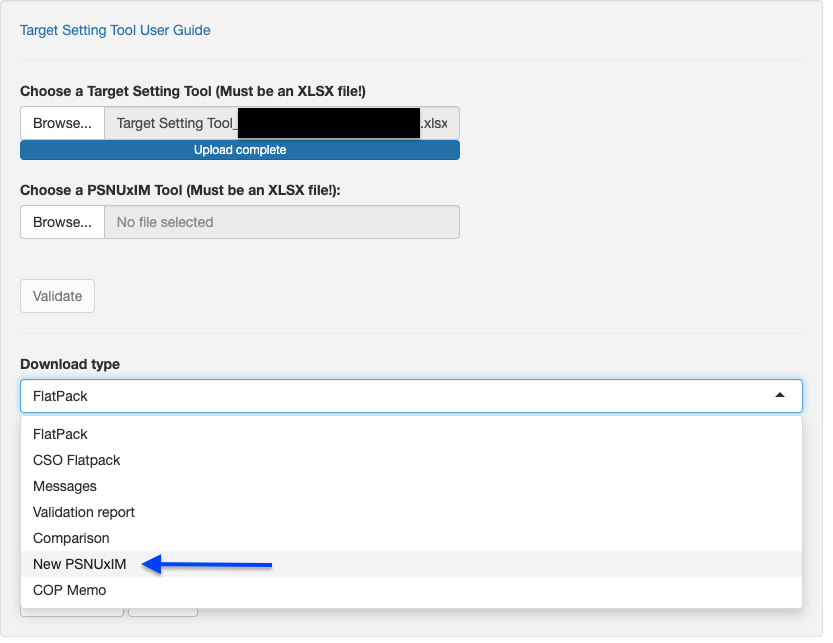

\blandscape

# PSNU x IM

Upon completing previous sections of the Target Setting Tool, the PSNUxIM tool and tab
serves as a critical next step in allocating these targets to specific
Implementing Mechanisms (IMs). To receive and populate a PSNUxIM tool,
follow the below instructions.

### DATIM Import

The following data points will be imported into DATIM from this section:

-   **All mechanism integer value totals**

-   **All deduplication proportions**

*Reminder: For final COP23 Target Setting Tool Review, Validation, Approval, and DATIM Import, 
both the PSNUxIM File and the Main Target Setting Tool File will be required.*

## Receiving a PSNU x IM Tab File for the First Time

***Important Note:***

*As earlier mentioned, the PSNUxIM Tab has been split off from the main tabs of the Target Setting Tool to help with the 
larger files of old DataPacks and slow performace speeds of the excel workbooks.*
*Because of these new changes to the process, the PSNUxIM tab will no longer be directly tied via formulas to the targets
in the main tabs of the tool.* *Due to this new user approach, it is
recommended to run* *initial validations in the self-service validation App and
ensure the Target Setting Tool is in a* *good state of completeness prior to
generating and working on the PSNUxIM tool. Although the* *App will give the option to
update the PSNUxIM tool each time both files are validated,* *it is not
required to complete this step until you are fully* *prepared to begin
the mechanism allocation process.*

Upon first receipt, the Target Setting Tool will not contain a populated PSNUxIM
tab as in previous COPs. To receive a populated version of this tool, follow the below
instructions:

1)  Submit a preliminary Target Setting Tool for validation to the self-service validation
    tool at [datapack.DATIM.org](http://datapack.datim.org/). Validate your Tool in the prompted box. 

```{r echo=FALSE, out.width = '100%'}

```

2)  The self-service validation App will automatically detect that a
    PSNUxIM tool is not uploaded and will give the option for a "New PSNUxIM" tab to be generated. This PSNUxIM Tool will contain All FY24 Targets that need to be allocated to Implementing Mechanisms. (*A reminder that AGYW Targets are not allocated and therefore will not appear in the PSNUxIM tool, 
    but the targets will be imported to DATIM from what has been set in the main Target Setting tool in the AGYW Tab.*)
    

3)  Download the new copy of your PSNUxIM tool generated by the Self-Service
    App and make it, and the Target Setting Tool, available to the rest of your team as appropriate.

4)  When you received your newly generated PSNUxIM tool for the first
    time by generating it from the self-service validation app, you will
    need to scroll to the "Target Values" Section that begins in column
    CW and copy down the formulas populated in row 15 all the way down
    to the bottom of your Target Setting Tool. This will be required in order for
    your Roll-up column to properly populate as well as the
    Deduplication sections. Once you do this, be sure to save the file.

5)  Review the initial PSNUxIM tab for any obvious errors made in the
    automated generation process. Flag any issues to the Target Setting Tool
    Support Team at [DATIM.Zendesk.com](http://datim.zendesk.com/).

6)  **DO NOT DELETE** any columns in the PSNUxIM tab. If there are blank
    columns not being used, HIDE them, but deleting columns will cause
    an error and will not allow the Target Setting Tool to validate the next time
    it is imported into the Self-Service App.

In producing a PSNUxIM tool for the first time, the self-service validation app
will write data and formulas into this tab as follows:

-   Each PSNU.

-   Target Setting Tool Indicator Codes, which reference codes used throughout the
    Target Setting Tool hidden in row 14 on each tab.

-   Age, Sex, & Key Population for each sub-population, where specified.

-   Total Target Setting Tool Targets, as set in previous tabs of the Target Setting Tool. In
    adding these targets, the self-service validation app will write
    formulas allowing dynamic referencing of each target. In cases where
    additional updates to previous tabs of the Target Setting Tool may be
    necessary, any updates to target values will automatically be
    updated on this tab in this column.

-   Rollup totals, summing allocated targets across all mechanisms. This
    column can be helpful in quickly assessing whether Target Setting Tool Target
    totals have been over- or under-allocated across DSD or TA, and IMs.
    Red highlighting indicates cases where Rollup sums differ from
    original Target Setting Tool Target totals.
    Yellow highlighting indicates where roll-up has a different less than or euqal to 2, which may arise from rounding. This can be waived, but the Roll-up total is what will be imported to DATIM. 

-   Percentage totals allocated to a column titled "Not PEPFAR", signifying targets that may have been modeled
    in the Target Setting Tool to allow a full picture of services to be
    demonstrated, but which will likely be implemented by another
    partner organization separately from PEPFAR's support. These values
    are considered in the Rollup totals to ensure complete allocation,
    but are dropped in passage to PAW, the Self Service App, and DATIM.

-   Percentage allocations across IMs and DSD or TA, based on FY23
    Target proportions as currently reported in DATIM. Note that these
    are based on a snapshot of DATIM taken at the time this data is
    originally written into the PSNUxIM tab. These allocation
    percentages will not automatically update once they have been first
    written into this tab. See below for how to either adjust existing
    allocations, or add new IMs and allocations to this section.

-   Possible maximum and minimum Deduplicated Rollup Totals,
    Deduplicated DSD Totals, and Deduplicated TA Totals.

-   Observed and Targeted Dedupe Resolution strategies as seen in
    DATIM-reported data for FY23 Targets, or based on allocations chosen
    in the Target Setting Tool. See below for additional information.

-   Duplicated Rollups, summing by DSD, TA, and Total across all
    allocated mechanisms. These data will automatically update as
    allocations are adjusted on this tab, or as total targets are
    adjusted on other tabs.

-   IM-level Target Values, as integers, calculated by multiplying
    Target Setting Tool Target totals by mechanism allocation percentages.

## Adjusting IM Allocations

To adjust, remove, and add allocations across Mechanisms in the PSNUxIM
tab, follow the below instructions:

1)  Review initial allocations written automatically into the Target Setting Tool
    based on patterns observed in FY23 Targets in DATIM.

2)  To adjust existing percentages, type over percentages already
    provided in the Target Setting Tool with new percentages reflecting COP23
    strategic programming. Note that these allocations are both to
    distribute targets to mechanisms *as well as* to distribute them
    across DSD and TA. In other words, in a case with no deduplication,
    allocations should sum to 100%, representing how each target will be
    divided both across mechanisms and by service type.

3)  To remove existing percentages, **DO NOT DELETE COLUMNS**. Instead,
    either replace the name of a mechanism in row 14 with a new name
    (following the format #####\_DSD or #####\_TA) and repurpose or
    replace the allocations in the rows below it, or delete only those
    percentage allocations for a given mechanism --- but keeping the
    mechanism name in row 14 the same --- effectively withdrawing it
    from a certain geography or population or program area.

4)  To add new mechanisms for allocation, follow the below steps:

    a.  Unhide the buffer of hidden green columns between pre-populated
        mechanism columns and the gray columns to the right describing
        Deduplicated Totals (Columns I -- CE).

    b.  Type the new mechanism name into the green cell in row 14,
        making sure to also denote the service type, whether DSD or TA.
        These names must be of the format: #####\_DSD, or #####\_TA. Do
        not leave any blank columns between mechanisms. Again, **DO NOT
        DELETE COLUMNS**.

    c.  Confirm that mechanisms added here are entered in FACTS Info,
        approved, and valid for MER data entry for COP23. While there
        can be up to a 24 hour delay in synchronizing these mechanisms
        from FACTS Info to DATIM, as soon as a mechanism is added and
        approved and valid in FACTS Info, its 4-6 digit numeric code can
        be entered here in the Target Setting Tool, and you can begin allocating
        targets to this new mechanism. However, note that in order to
        validate these data using the self-service validation app,
        mechanisms must have already been synchronized from FACTS Info
        to DATIM. Validation alerts in the self-service validation app
        will note where this may not be the case.

    d.  Add allocations in the rows below any new mechanisms, making
        sure that new and old allocations still aggregate to no less
        than 100% allocation in all cases, and also no more than 100%
        allocation where no deduplication occurs.

## Resolving Invalid Mechanism Errors

The PSNUxIM tab will only populate with mechanisms that are marked as
"active" for the current COP year in DATIM. Any mechanisms that are
manually added to the PSNUxIM tab that are not active and valid will be
flagged by the Self-Service App.

To ensure a mechanism is valid for the current COP year, go into the COP
module in FACTS Info-Next Gen (FI-NG) and check the box for "PEPFAR
Systems Active Reporting Years" for the appropriate COP year. Please
note that it may take up to 24 hours for active mechanism flags to be
carried over into DATIM and resolve validation errors in the
Self-Service App.

```{r echo=FALSE, out.width = '70%'}
knitr::include_graphics("./images/FACTS Info Valid mech 1.png")
```

```{r echo=FALSE, out.width = '70%'}
knitr::include_graphics("./images/FACTS Info Valid mech 2.png")
```

```{r echo=FALSE, out.width = '70%'}
knitr::include_graphics("./images/FACTS Info Valid mech 3.png")
```

```{r echo=FALSE, out.width = '70%'}
knitr::include_graphics("./images/FACTS Info Valid mech 4.png")
```

```{r echo=FALSE, out.width = '70%'}
knitr::include_graphics("./images/FACTS Info Valid mech 5.png")
```

## Note on Peace Corps Mechanisms

As in COP23, Peace Corps will no longer report targets under their older
mechanisms, and will instead report all targets under Management &
Operations (M&O) mechanisms. Note that the PSNUxIM tab will initially
populate mechanisms and distributions based on previous year targets, so
there may be cases where you will need to shift Peace Corps targets to
M&O mechanisms from previous mechanisms by changing the IM reference
number at the top of the tab to the appropriate M&O IM code.

## Resolving Rounding Errors

Due to the combination of multiplication of percentage values against
target values coming from other parts of the Target Setting Tool, and rounding of
all mechanism target values to integers, target values allocated against
mechanisms may roll up with some slight difference from Target Setting Tool
Targets. It may be necessary to iteratively adjust rounding errors and
deduplications throughout the IM allocation process, though in general
it is a good practice to resolve rounding errors as much as possible
before moving on to deduplication. To resolve rounding errors, adjust
percentages gradually, as follows:

1)  If you had previously unhid the buffer of green Percentage
    Allocation columns (the section between columns I and CE) while
    adding new mechanisms, or the Deduplication columns in columns CF to
    CV, it may be helpful to hide columns in these sections again now to
    more easily see both Percentage Allocations and Target Values at the
    same time on your screen.

2)  It may also be helpful to review Duplicated Rollup values in columns
    CW to FS in addition to Target Setting Tool Targets in column G so as to
    consider rounding errors distinctly from the impacts of
    deduplication.

3)  While maintaining overall distribution patterns as intended,
    gradually adjust percentage allocations under affected mechanisms in
    columns I through CE to increase or decrease Duplicated Rollups as
    needed.

Note that while all rounding errors should be resolved if possible, a
small margin of error around some values is permissible, so long as this
does not exceed an absolute value of 2 in either direction of the
Target Setting Tool Target in column G.

## Performing Deduplication

Follow the below steps to perform all Deduplication associated with IM
allocations of targets. Note that all deduplication must be performed
here in the PSNUxIM tab, and will not be permitted for COP23 targets in
DATIM.

1.  If you had previously unhid the buffer of green Percentage
    Allocation columns (columns I -- CE), it may be helpful to hide
    empty columns in this section again now.

2.  Review Duplicated Rollups for DSD, TA, and total targets. These are
    dynamically summed across all mechanism targets allocated in the
    PSNU x IM tab to the right of these columns. To adjust these totals,
    return to the Percentage Allocation section.

3.  Review TA Deduplication, DSD Deduplication, and Crosswalk
    Deduplication (recommended in that order for each row):

    a.  Where only a single mechanism is assigned targets under either
        DSD or TA (for DSD and TA Deduplication), where deduplicated DSD
        and TA totals aggregate to less than or equal to Target Setting Tool
        targets (for Crosswalk Deduplication), or where total mechanism
        targets aggregate to less than or equal to Target Setting Tool Targets,
        gray highlighting in these sections indicates that deduplication
        is not necessary or permitted.

    b.  Review allowable ranges for possible deduplicated totals by
        referencing the SUM and MAX rollup columns. As in the DATIM
        Deduplication App, SUM values represent cases with zero
        deduplication, and MAX rollups represent application of the most
        deduplication possible, resulting in values equivalent to the
        largest IM target among either the DSD or TA mechanisms (for DSD
        or TA deduplication), or the larger of either DSD or TA
        deduplicated totals (for crosswalk deduplication).

    c.  Review Observed Dedupe Resolutions seen in FY23 Target
        allocations. These are provided for reference, and indicate
        which deduplication approach was used in FY23 Target
        deduplication, performed in the DATIM Deduplication App.

    d.  For cases where Custom deduplication was used in FY23 Targets,
        review the Custom Dedupe Allocation observed in FY23 Targets.
        Percentages here are calculated by dividing the DSD or TA
        deduplication value (for DSD or TA deduplication) or the sum of
        Deduplicated DSD and Deduplicated TA (for crosswalk
        deduplication) by the sum of all mechanisms and deduplication
        values, across both DSD and TA. As such, these values are all
        negative or zero, and can be easily compared against target
        allocation percentages used in columns I -- CE.

    e.  In columns CT for TA, CN for DSD, and CH for Crosswalk, manually
        type the deduplication resolution approach to be used to resolve
        deduplication issues, as follows:

        i.  "CUSTOM" or "custom" or "Custom"

        ii. "SUM" or "sum" or "Sum"

        iii. "MAX" or "max" or "Max"

    f.  Where Custom deduplication is selected, also indicate the
        percentage allocation to be assigned to the deduplication value
        in the column to the immediate right. Again, a reminder that
        these values should all be negative or zero, and represent the
        proportion of deduplication values relative to the Target Setting Tool
        Target total in column I. Initially upon indicating Custom
        deduplication, the Target Setting Tool will preset this deduplication
        allocation equal to the value observed in FY23 Targets, if any.
        You may alter and adjust this value as needed, so long as it is
        negative or zero. Also note that it is not enough to only type
        in a percentage deduplication allocation; you must also enter
        "CUSTOM", "SUM", or "MAX", as explained in the previous step.
        Note that instead of entering "SUM", it is possible to enter
        "CUSTOM" but enter a deduplication percentage allocation of 0%;
        and instead of entering "MAX", it is possible to enter "CUSTOM"
        but enter a deduplication percentage allocation that results in
        the equivalent of the MAX value shown in columns CG, CL, or CR.

4.  Review the Rollup values in column H for any mismatch against
    Target Setting Tool Targets in column G that may necessitate adjustment of
    Deduplication allocations. Note that while it is not a strict
    requirement that percentage allocations across mechanisms and
    deduplication add to 100%, it is a requirement that integer values
    add to equal the Target Setting Tool Target in column G, ± 2. Red highlights in
    column H indicate values more than 2 (integer, absolute value) away
    from the Target Setting Tool Targets in column G; yellow highlights indicate
    values 1 or 2 (integer, absolute value) away from the Target Setting Tool
    Targets column G.

## Key Nuances/Scenarios for this year's PSNUxIM Validation

1.    If you only have a Target Setting tool, you get a new PSNUxIM Tool.

2.    If at any point you revceive a WARNING Message for missing combos and you choose "Missing PSNUxIM" you will only get the missing rows

3.    If in the above case, you choose "Append Missing PSNUxIM" and you have equal targets, they will be appended to the existing rows to the bottom of the PSNUxIM

4.    If you receive an ERROR for Targets in Column G that do not match, you will need to do is use the "non_euqal_targets" tab from the Validation Report. This will show you what the discrepancies are between then Main tabs and column G of the PSNUxIM tab. You will then need to update Column G yourself. 
  
  <!--  If you have unequal targets, and choose "New PSNUxIM", your allocations will be preserved and your targets in column G will be updated, but you will need to drag the formulas again (and any other changes like custom dedupes) will be lost -->

\elandscape

\newpage
