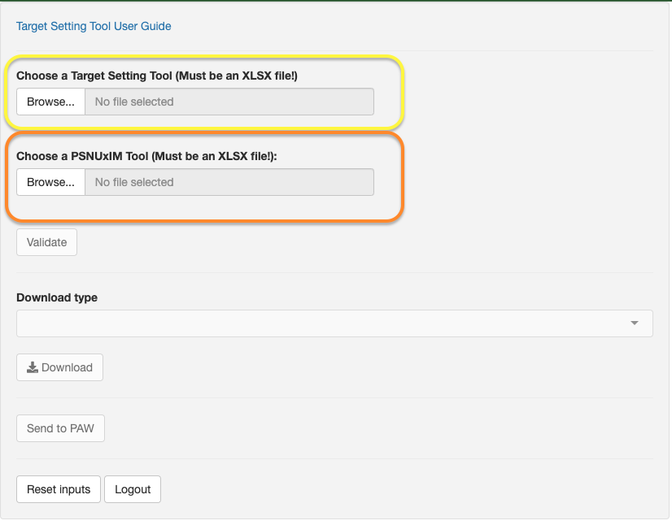
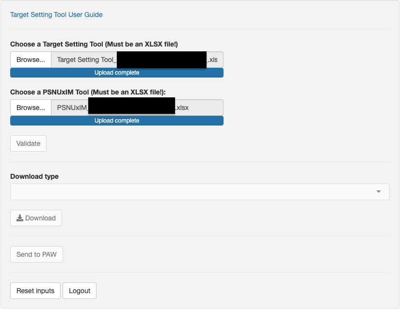

# Target Setting Tool Self-service App

The Target Setting Tool self-service app provides a one-stop shop for validating
and analyzing your Target Setting Tool. After logging into the app via [datapack.DATIM.org](http://datapack.datim.org/), you can upload
a copy of your Target Setting Tool, and receive feedback regarding the structure
and content of the Target Setting Tool. The app will attempt to provide feedback
regarding any errors which may prevent the import of your Target Setting Tool into
DATIM. In general, all errors must be resolved prior to any approval or
import of data into DATIM. Warning messages should be carefully
reviewed. While these may not prevent import of your data, ignoring them
may lead to data quality problems. The app also provides a number of
charts and tables to assist with review of your Target Setting Tool. Each of these
functions will be described in more detail in the remained of this
chapter.

## Logging in

In order to access the app, you will need to login with your DATIM
credentials. If you do not have a DATIM username and password or if your
account has been deactivated, please contact DATIM support before you login.

When you log on you will first be prompted with a "Login with DATIM" and be redirected to a DATIM login screen. Once you have logged in, you will be redirected to a page for DHIS2 Authorization. There will be a question "Do you authorize 'Datapack' to access your protected resources?" to which you must click "Authorize" in order to then be redirected to the app for validation. 

## Uploading a Target Setting Tool

Once you have logged into the app, choose "Browse" from the left side
pane. Select the Target Setting Tool you wish to validate. Please be sure to use an
"XLSX" file! Other formats such as XLSB or ZIP archives of your Target Setting Tool
are not supported, and cannot be used.

Because the Main tabs of the target setting tool and the PSNUxIM tab are in separate files/tools this year, you will see two areas for files to be selected and upaloded. 

```{r echo=FALSE, out.width = '100%'}

```

Users should note that the top option is for the main Target Setting Tool file and the bottom will be used when there is an additional PSNUxIM Tool to validate. 

Please note that the Main Target Setting Tool File will be the source of truth for targets. In order for final approvals, full validation, and DATIM import to occur, both of these files will be needed as shown below. Note that when you are validating a PSNUxIM Tool, with its the associated Target Setting Tool, all data for the visuals in the app will be drawn from the PSNUxIM Tool, with the exception of the figures in the Year 2 Pivot.

```{r echo=FALSE, out.width = '100%'}

```

Once your file(s) is completely uploaded to the server, the "Validate"
button should become active.

## Validating your Target Setting and PSNUxIM Tools

After pressing the "Validate" button on the left-side pane, the app will
perform a number of structural checks on your file. It is critical that
the structure of the Target Setting Tool matches that which was provided to you.
Any tabs or columns which have been removed will result in a parsing
error, and these will need to be fixed prior to import. Other checks
include:

-   Altered formulas: Generally, formulas should not be altered, but
    there can be valid programmatic reasons for doing so. These warnings
    are provided in order to allow those reviewing the Target Setting Tool to make
    a determination as to whether they are valid changes or not. The app will only flag when formulas have been altered in Grey Columns of the tool which could require approval or justification for changing. 

-   Decimal values: In general, all values (with a few exceptions)
    should be whole integer numbers. Decimals cannot be imported into
    DATIM, and thus must be rounded prior to import. This can lead to
    variations in the numbers which are visible in the Target Setting Tool and
    those which are imported into DATIM.

-   Negative numbers: In general, all numbers in the Target Setting Tool should be
    whole, positive integers.

-   Non-numeric values: Any values which are not numeric, e.g.
    characters, are not allowed.

-   Imbalanced PSNUxIM distribution: When distributing data from the
    main Target Setting Tool tabs, to the PSNUxIM tab, small varations due to
    rounding may result. As an example, if a target of 100 has been set
    in the main tab, and is then distributed evenly between three
    partners, each with a target value of 33, a value of 1 remains
    undistributed. To avoid this situation you may need to use
    allocation targets of 34%,34%,32% instead, which would ensure that
    the values allocated in the PSNUxIM tab match those in the main
    programmatic area tabs.

-   Threaded comments: This type of comment, as opposed to the previous
    type of Notes used in Microsoft Excel, causes corruption issues when
    the app attempts to update your PSNUxIM tab. Prior to submitting for
    an updated PSNUxIM tab, you MUST remove all threaded comments. For
    more information about the differences between threaded comments and
    notes visit this
    [link](https://support.office.com/en-us/article/the-difference-between-threaded-comments-and-notes-75a51eec-4092-42ab-abf8-7669077b7be3).

-   Duplicated rows: There should be no duplicated rows in any of the
    main tabs or the PSNUxIM tab.

-   Invalid organisation units: All PSNUs referened in the Target Setting Tool must
    exist in DATIM.

-   Missing metadata: Certain columns such as the PSNU, Indicator code,
    Age, Sex and KeyPop columns must always be present. If any of these
    values is for some reason missing, please find the location of the
    error and fix the issue.
    
-   Non-equal targets: This situation occurs when the targets which are in the main tabs of the Target Setting Tool do not match those contained
    in the PSNUxIM tab. This situation may occur if you have altered
    the data in the Target Setting Tool **after** you have received a PSNUxIM Tool. 
    In order to rectify this siutation, you can manually update the values
    in the PSNUxIM tab, or you can choose to regenerate your PSNUxIM Tool. 
    Please note that if you decide to regenerate your PSNUxIM Tool, 
    any custom dedupe values which you have populated will be lost. 
-   Missing PSNUxIM values: This situation occurs when you already 
    have a PSNUxIM tool, but additional targets have been added to the 
    main tabs of the Target Setting Tool. You can download the missing PSNUxIM targets
    and manually append them to your existing PSNUxIM tab. Alternatlively, 
    you can also have the app append these rows for you. Please note that
    appending the rows to your PSNUxIM tab, may require a singnificant amount
    of time to execute, depending on the size of your PSNUxIM tab. If you
    only have a few missing PSNUxIM combinations, then it is advised that you
    manually copy and paste them into your existing PSNUxIM tab. 

## Validation Rule Checks

Validation rules provide additional data quality controls between
certain indicators. As a simple example, the number of persons testing
positive for HIV should be less than or equal to the number of
individuals tested. Under most circumstances, validation rules should
not be violated, but there can be certain programmatic reasons why these
violations should be waived.

With the separation of the two tools, it is important that validation rules be resolved in the main tabs before proceeding to the PSNUxIM Tool. When both files are uplaoded and validated, the app will flag all validation rules, but will be be able to specify which file is causing the rule to flag. It is also likely that if you have Validation Rule issues in your main tabs, this will be compounded when you then allocate and validate targets in the PSNUxIM process. 

A number of rules have been created, and many of them are enforced in
the Target Setting Tool itself. However, not all rules have been implemented in the
Target Setting Tool, and due to formula changes and subtleties in how targets are
allocated at the PSNUxIM level, additional review of the data in the
PSNUxIM tool and main tabs may be required. During the validation of the
Target Setting Tool, all data contained in the PSNUxIM tool will be checked against
all of the validation rules defined in DATIM. If there are any
violations of the validation rules, the app will provide detailed
feedback in regards to which PSNUxIM combination is affected. In order
to resolve these, you will need to carefully review how the PNSUxIM
allocations have been made to respective mechanisms in the PSNUxIM tab.

While validation rule violations will not prevent the import of your
data into DATIM, they may lead to data quality problems in both DATIM
and downstream systems such as Panorama and PAW. If there are any
validation rule issues, your PPM and DUIT can be requested to waive
these at their discretion.

## Analytics Checks

Analytics checks provide an additional type of data quality control. As
an example, one analytics check looks for VMMC indeterminate rates
greater than 5 percent. Ideally, the indeterminate rate should be a low
as possible, but if for some reason targets have been set where the rate
is greater than 5 %, the app will inform you about the specific PSNUxIM
where this occurs. Again, these flags will not prevent the import of
your data into DATIM, but are provided to help reviewers to make a
determination regarding the approval of the Target Setting Tool for import.

The app will provide a list of all analytics checks which have been
flagged in the "Analytics checks" tab on the right side of the app pane.

## Indicator Summary

This table provides a high-level SNU level summary of indicators from
each of the main tabs of the Target Setting Tool. Note, that this data is NOT drawn
from the PSNUxIM tab. This can be a useful first check of your Target Setting Tool,
prior to the allocation of the data in the PSNUxIM tab.

## SNU Level Summary

This table listing provides all of the data from each of the main
Target Setting Tool tabs summarized by the SNU level.

## Memo Tables Pivot

A recent update to the Self Service App now includes a "Memo Tables" tab
that replaces what was the "Prioritization" tab view. This Pivot table
function allows users to view by Prioritization, by Agency, or by
Partner. There is also the "PSNUxIM Pivot" which contains data elements,
while the "Memo Tables" Pivot contains derived indicators. If a user
ever needs to rest to the original view, select one of the other "Pivot
Styles" from the drop-down, and then re-select the "Prioritization"
option.

## Validation Rules

This tab provides a listing of all validation rule violations, if any.
The table provides the following fields

-   PSNU: The specific PSNU where the violation occurs

-   Mechanism: The specific mechanism where the violation occurs.

-   Formula: The rule is specified with a left side, a right side, and
    an operator. The left and right side correspond to a data element
    (or data elements) located in the PSNUxIM tab. Using a combination
    of filters (PSNU, Mechanism and Data elemement), you should be able
    to locate the specific rows in the PSNUxIM tab which are leading to
    the validation rule violation.

-   Diff (%) : Provides the percentage difference between the left and
    right side.

-   Diff (Absolute) : Provides the numeric difference between the left
    and right side.

+-----------------+----------+------------+----------+---------------------+----------+
| Validation rule | PSNU     | Mechanism  | Formula  | Diff (%) (Absolute) | Diff     |
+=================+==========+============+==========+=====================+==========+
| PMTCT_STAT      | Namuno   | 160448     | 5317 \<= | 0.02                | 1        |
| (N, DSD,        |          |            | 5316     |                     |          |
| Age/Sex/        |          |            |          |                     |          |
| KnownNewResult) |          |            |          |                     |          |
| TARGET \<=      |          |            |          |                     |          |
| PMTCT_STAT      |          |            |          |                     |          |
| (D, DSD,        |          |            |          |                     |          |
| Age/Sex) TARGET |          |            |          |                     |          |
+-----------------+----------+------------+----------+---------------------+----------+


## Indicator Summary

This table provides a high-level SNU level summary of indicators from
each of the main tabs of the Target Setting Tool. Note, that this data is NOT drawn
from the PSNUxIM tab. This can be a useful first check of your Target Setting Tool,
prior to the allocation of the data in the PSNUxIM tab.

## SNU Level Summary

This table listing provides all of the data from each of the main
Target Setting Tool tabs summarized by the SNU level.

## HTS Summary Chart

This visual provides an operating unit level chart of HTS testing modalities.

## HTS Summary Table
This table provides a break down of the HTS Testing modalities. Positive 
and negative tests, along with yield and overall percentage of HTS_TST_POS
are provided. 

## HTS Yield

This visual provides an overview of testing yields by modality, aggregated
at the operating unit level. 

## VLS Testing

This stacked row chart provides an overview of TX_CURR, TX_PVLS(D), and TX_PVLS(N)
aggregated to the SNU level. 

## EPI Cascade Pyramid

This chart provides a pyramid chart for PLHIV, TX_CURR and TX_PVLS broken
down by age and sex. Data can be viewed either at the operation unit level, 
or alternatively you can select a particular SNU1 to view.

## PSNUxIM Pivot

This tab provides you with a pivot table of data elements which will be imported
into DATIM. The data can be aggregated and filtered in various ways. If you are using
a PSNUxIM tab and have allocated data to mechanisms, the data can be aggregated
by Agency, Partner and Mechanism.

## Year 2 Pivot

This pivot table is very similar to the PSNUxIM pivot, except it contains data 
from the Year 2 Tab of the Target Setting Tool. 

# Download types

The Self-service app provides you with the possibility to download a number of different reports and 
outputs. Each of these will be described in the following section. 

## Messages

With this report, you can output all of the messages which are provided by the app regarding
the structure and validation issues which were detected by the app.

## Flatpack

This report provides you with a plain data source of all of the data in your Target Setting Tool/PSNU. Each of the tabs contained in the workbook are described below.

- The "Analytics" tab of thisExcel workbook is well suited to being a data source for PivotTable analysis in Excel. 
- SNU Summary: When using the Target Setting Tool as the main data source, these numbers are obtained directly from the main tabs of the Target Setting Tool 
- HTS Summary: This tab provides a summary of HTS modalities at the operating unit level. 
- Prioritization: This tab provides a table of COP Memo indicators.
- MER Data: This tab provides additional details of the Target Setting Tool data, including
Age, Sex and KP disaggregates. 
- DATIM Export: This tab provides an output of Target Setting Tool data in the standard DATIM export format. 

## CSO Flatpack

This report is similar to the Flatpack, except that it contains no information regarding
allocation to specific mechanisms. 

## Comparison

This report is typically used during the OPU process to compare data which is already
in DATIM to that which is contained in a Target Setting Tool. 

## New PSNUxIM

This download function will generate a completely new PSNUxIM tab for you. This 
can be done using your Target Setting Tool. In this case, allocation at the PSNUxIM level
will be done using a model of prior year targets and results. 

Alternatively, you can also generate a completely new PSNUxIM tab using a Target Setting Tool with an existing PSNUxIM tab. In this case, any allocation which you have made to mechanisms will be preserved, any missing targets will be added, and any non-equal targets will be
overwritten with new values. However, if you have made any additional modifications to your PSNUxIM tab, this work will be lost. 

## Only missing PSNUxIM targets

This download type will produce a new PSNUxIM workbook with only your missing targets. 
These can then be pasted into your existing PSNUxIM workbook. This process is usually much faster than regenerating a completely new PSNUxIM tool. If you only have a few missing targets, this would be the recommended download type to use. 

## Append missing PSNUxIM Targets

This download type will appened any missing targets to the first blank row of your existing PSNUxIM tool. Note however, that if you have any unequal targets, and choose this download type, those
targets will not be updated. You will have to update these yourself. New rows will be marked in green. Note that you must also populate all of the right side formulas in order for your allolcations to function properly. 

## COP Memo

This download type will provide you with a draft version of the tables which will eventually become part of your full COP Memo or OPU. 

# Send to PAW

Clicking this button will start a process to upload the results from the Target Setting Tool/PSNUxIM tool to PAW. If ONLY the Main COP23 Target Setting Tool is validated, the FY24 Targets will be sent to PAW as Unallocasted Targets, and the Year 2 National Level Targets will also be sent. When a PSNUxIM Tool is also included and BOTH files are validated, the allocated FY24 targets from the PSNUxIM Tool will be sent to PAW and the Year 2 National Level Targets will once again be pulled and sent from the Main Target Setting Tool. 

# Reset inputs

If you wish to start over, and upload a new Target Setting Tool while you are still logged into the system, you can click this button and start the validation process over from the beginning. 

# Logout

You can logout of the app by clicking this button. Note that you will be automatically logged out of the app and DATIM after a certain point of time. It is advisable to log out of the app when you have completely your work, so that you can make the server
resources available for other users. 

\newpage
