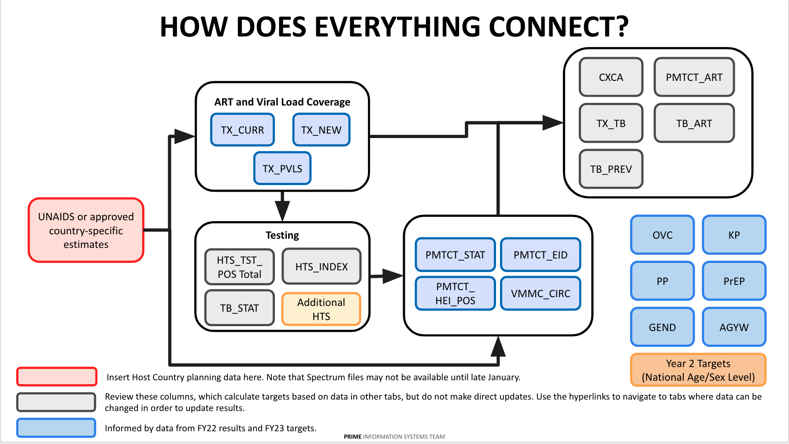
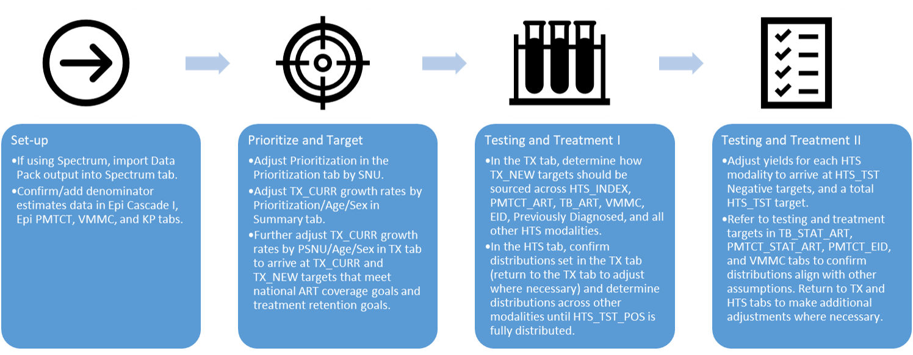
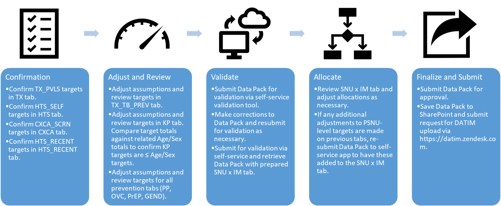

<!--chapter:end:index.Rmd-->

---
editor_options: 
  markdown: 
    wrap: 72
---

```{r setup, echo=FALSE}
suppressWarnings(suppressPackageStartupMessages({
  library(magrittr)
  library(dplyr)
  library(stringr)
  library(tidyxl)
  library(data.table)
  library(tidyr)
  library(datapackr)
  library(knitr)
  library(kableExtra)
}))

letter2number <- function(x) {
  col_ref <- stringr::str_to_upper(x)
  digits <- stringr::str_length(col_ref)
  ls <- 1:digits %>%
    lapply(function(y) {
      (utf8ToInt(stringr::str_sub(col_ref, y, y)) - utf8ToInt("A") + 1L) * (26**(digits - y))
    })
  n <- Reduce(`+`, ls)
  return(n)
}

number2letter <- function(n) {
  x <- intToUtf8(n + utf8ToInt("A") - 1L)
  return(x)
}

int2col <- function(n) {
  n_letters <- floor(log(n, base = 26)) + 1
  col <-
    1:n_letters %>%
    lapply(function(x) {
      place <- n_letters - x + 1
      letter <- number2letter(n %% (26**place))
      return(letter)
    }) %>%
    paste0()
  return(col)
}

knitr::opts_chunk$set(echo = FALSE, fig.align="center")

```

```{r echo=FALSE}
filepath <- "static/COP22_Data_Pack_Template.xlsx"
skip <- NULL
type <- "Data Pack Template"
cop_year <- datapackr::getCurrentCOPYear()

spectrum_schema <- tibble::tribble(
  ~sheet_name, ~col, ~col_name, ~value_type, ~prepopulated, ~enter_or_modify, ~calculated, ~linked,
  "Spectrum", 4, "psnu", "string", "N", "Y", "N", "N",
  "Spectrum", 5, "psnu_uid", "string", "N", "Y", "N", "N",
  "Spectrum", 6, "area_id", "string", "N", "Y", "N", "N",
  "Spectrum", 7, "indicator_code", "string", "N", "Y", "N", "N",
  "Spectrum", 8, "dataelement_uid", "string", "N", "Y", "N", "N",
  "Spectrum", 9, "age", "string", "N", "Y", "N", "N",
  "Spectrum", 10, "age_uid", "string", "N", "Y", "N", "N",
  "Spectrum", 11, "sex", "string", "N", "Y", "N", "N",
  "Spectrum", 12, "sex_uid", "string", "N", "Y", "N", "N",
  "Spectrum", 13, "calendar_quarter", "string", "N", "Y", "N", "N",
  "Spectrum", 14, "value", "integer", "N", "Y", "N", "N",
  "Spectrum", 15, "age_sex_rse", "percentage", "N", "Y", "N", "N",
  "Spectrum", 16, "district_rse", "percentage", "N", "Y", "N", "N",
  "Spectrum", 17, "ID", "string", "N", "N", "Y", "N",
) %>%
  dplyr::mutate(
    col_ref = openxlsx::int2col(col),
    col_num = col
  )

schema <- datapackr::cop22_data_pack_schema %>%
  dplyr::filter(!sheet_name %in% c("Home", "Spectrum"),
                col_type != "row_header") %>%
  dplyr::mutate(
    col_ref = openxlsx::int2col(col),
    col_num = col,
    prepopulated = dplyr::if_else(col_type == "past", "Y", "N"),
    enter_or_modify = dplyr::case_when(col_type == "past" ~ "?",
                                       col %in% c(8:9) ~ "Y",
                                       TRUE ~ "N"),
    calculated = dplyr::if_else(col_type == "past", "N", "Y"),
    linked = dplyr::if_else(col == 8, "Y", "N")) %>%
  dplyr::bind_rows(spectrum_schema) %>%
  dplyr::select(
    "Sheet Name" = sheet_name,
    "Column" = col_ref,
    "Column Number" = col_num,
    "Column Name" = col_name,
    "UID" = indicator_code,
    "Column Type?" = col_type,
    "What type of data?" = value_type,
    "Prepopulated data?" = prepopulated,
    "Enter or modify data?" = enter_or_modify,
    "Calculated column?" = calculated,
    "Linked column?" = linked)

```

```{r echo=FALSE}
schema_table <- function(table_reference, knit_type){
  
  inputs <- stringr::str_split(table_reference, "-")
  
  sheet_name <- inputs[[1]][1]
  section <- inputs[[1]][2]
  col_start <- inputs[[1]][3] %>% letter2number()
  col_end <- inputs[[1]][4] %>% letter2number()
  part <- inputs[[1]][5]
  total <- inputs[[1]][6]
  
  t <- schema %>%
    {if(sheet_name == "Spectrum") dplyr::select(schema, -UID) else .} %>%
    dplyr::filter(`Sheet Name` == sheet_name,
                  `Column Number` %in% c(col_start:col_end)) %>%
    dplyr::select(-`Sheet Name`, -`Column Number`) %>%
    tidyr::pivot_longer(cols = !Column) %>%
    tidyr::pivot_wider(id_cols = name, names_from = Column, values_from = value)
  
  if (knit_type == "latex") {
    t %<>%
      knitr::kable(
        format = "latex",
        escape = TRUE,
        booktabs = TRUE
      ) %>%
      kableExtra::kable_styling(font_size = 12,
                                latex_options="scale_down") %>%
      kableExtra::column_spec(1:(col_end-col_start+1),
                              width=paste0(toString(7.5/(col_end-col_start+1)),
                                           "in")) %>%
      kableExtra::row_spec(0, background = "#E6DFA7", align = "c")
    # flextable::flextable() %>%
    # flextable::align(part = "all", align = "center") %>%
    # flextable::align(j = 1, part = "body", align = "right") %>%
    # flextable::void(j = 1, part = "header") %>%
    # flextable::bold(part = "header") %>%
    # flextable::bg(part = "header", bg = "#E6DFA7") %>%
    # flextable::bg(part = "body",
    #               bg = rep(c("#FFFFFF", "#F2F3F4"), length.out = NROW(t))) %>%
    # flextable::hline_top(
    #   part = "header",
    #   border = officer::fp_border(color = "#D7DBDD", width = 2)) %>%
    # flextable::hline_bottom(
    #   part = "header",
    #   border = officer::fp_border(color = "#D7DBDD", width = 2)) %>%
    # flextable::border(
    #   border = officer::fp_border(color = "#E5E7E9", width = 1)) %>%
    # flextable::set_table_properties(width = 1, layout = "autofit") %>%
    # flextable::autofit()
  } else {
    t %<>%
      tibble::as_tibble() %>%
      tibble::column_to_rownames(var = "name") %>%
      knitr::kable(
        format = "html",
        escape = FALSE,
        booktabs = TRUE
      ) %>%
      kableExtra::kable_styling(font_size = 12) %>%
      kableExtra::column_spec(1:(col_end-col_start+1),
                              width=paste0(toString(7.5/(col_end-col_start+1)),
                                           "in")) %>%
      kableExtra::row_spec(0, background = "#E6DFA7", align = "c") %>%
      kableExtra::row_spec(1:{ifelse(sheet_name == "Spectrum", 7, 8)},
                           extra_css = "border:1px solid lightgrey;") %>%
      kableExtra::scroll_box(width = "100%")
  }
  
  return(t)
}

```

# COP22 DataPack Overview

Welcome to the COP22 DataPack User Manual. The following pages aim to
provide users of the DataPack with the information necessary to
successfully complete each tab of the DataPack tool and determine
accurate, data-driven targets. For the past several years, the DataPack
has a been a key element of PEPFAR COP planning, and for COP22 serves a
critical function in assisting PEPFAR Country Teams in setting targets
in line with the UNAIDS 95-95-95 goals for Testing, Care & Treatment,
PMTCT, VMMC, OVC, and other program areas. Please note that the COP22
DataPack is mandatory and must be used to set targets for COP22. For
COP22, all indicators included in the DataPack are **MER 2.6**
indicators. For further information on the MER 2.6 indicators, please go
to <https://datim.zendesk.com/hc/en-us/sections/200929315-MER>.

## About the DataPack

The COP22 DataPack supports analysis for all targets by Priority
Subnational Unit (PSNU), population, and Implementing Mechanism (IM).
This tool supports calculation of targets based on expected treatment
coverage rates by type of PSNU and population prioritization:

-   Attained

-   Scale-up: Aggressive

-   Scale-up: Saturation

-   Sustained

Prioritizations for PSNUs are arebased on COP Guidance section 7.3.2.ba.
These determine for a given PSNU programmatically what HIV treatment and
prevention services should be planned and informs both the overall
strategy and the targets. Teams must review and revise their PSNU
prioritization levels for COP22. The COP22 DataPack assumes a 'test and
start' treatment platform and will develop targets for achieving 95%
coverage in Scale up: Aggressive and Scale-up: Saturation PSNUs; all
other targets in the DataPack are based on the treatment targets,
insofar as the treatment targets are the main focus of reaching epidemic
control, and therefore relate to both testing and prevention targets.

The DataPack will allow PEPFAR teams to use country specific
programmatic assumptions to develop the optimum targets by PSNU along
the program cascades to ensure the necessary number of PLHIV are
diagnosed, linked, and start treatment. The DataPack does not
necessarily calculate targets for every indicator, but it has space for
teams to enter targets for all indicators and thus can be used to record
agreed-upon COP targets, even for non-calculated indicators.

**Teams must not modify the structure of the COP22 DataPack in any
way**. The Office of the US Global Aids Coordinator (OGAC) has developed
a process by which targets can be directly imported into DATIM via the
DataPack Site Tool in order to generate targets. However, this is *only*
possible for teams that do not in any way alter the structure or format
of the DataPack. Additional details are provided in COP Guidance and
will be available through COP webinars.

## Highlighted Changes from COP21 to COP22

The COP22 DataPack is largely the same as the COP21 DataPack. However,
please note the following updates that have been implemented as a result
of multiple feedback sessions with various country teams that had been
identified by the PRIME team, as well as new programmatic changes that
are reflected in the Section 7 of COP guidance. These changes revolve
around workflow, ease of target setting, and linkage to the COP guidance
based on different aspects of the DataPack that worked well and others
that did not during COP21 target stetting:

-   New Cascade Approach that will flow from Program Viral Load
Suppression to testing to allow for countries closer or at Epi
Control to more easily set targets, based on Section 7 of COP22
Guidance.

-   Integration of new SNS Modalities for HTS and HTS_Recent.

-   Targets will no longer be set for PrEP_CURR, but instead will be set
for a replacement indicator of PrEP_CT.

-   50+ finer age bands across the clinical cascade. These will be
aggregated to 50+ upon DATIM import for all but TX_CURR.

-   **PSNUxIM tab structure** that will again handle de-duplication and
IM allocation.

## Data Flow and Review Process to COP22 Submission

The results from APR20 have been taken from DATIM and used to populate
the DataPack. In turn, the DataPack targets will produce FY22 targets
that will be subsequently submitted through DATIM after COP22 has been
finalized and the PSNU level data entered into the Strategic Direction
Summary (SDS) tables, where appropriate (Target related data).

***DataPack Review***

+-----------------+--------+--------+--------+--------------+--------------------+
|                 | Single | Single | Single | OUs at       | Regional/          |
|                 | OU     | OU     | OU     | Epi          | Country Pair Track |
|                 | Track: | Track: | Track: | Control      |                    |
|                 | Group  | Group  | Group  |              |                    |
|                 | 1      | 2      | 3      |              |                    |
+=================+:======:+:======:+:======:+:============:+:==================:+
| 1st Draft Tool  | Feb 28 | Mar 7  | Mar 14 | Mar 7 or     | Feb 28             |
| Submission      |        |        |        | Mar 14       |                    |
+-----------------+--------+--------+--------+--------------+--------------------+
| COP Meeting     | Mar    | Mar    | Mar    | Mar 14-18 or | Mar 22-25          |
|                 | 7-11   | 14-18  | 22-25  | Mar 22-25    |                    |
+-----------------+--------+--------+--------+--------------+--------------------+
| Mid-point Tool  |        |        |        |              |                    |
| Check           |        |        |        |              |                    |
+-----------------+--------+--------+--------+--------------+--------------------+
| Tools Due for   | Apr 4  | Apr 11 | Apr 18 | Apr 11       | Apr 18             |
| Final Review    |        |        |        | or Apr 18    |                    |
+-----------------+--------+--------+--------+--------------+--------------------+
| Additional      |        |        |        |              | Rolling Each       |
| Touchpoints/    |        |        |        |              | Monday             |
| Reviews         |        |        |        |              |                    |
+-----------------+--------+--------+--------+--------------+--------------------+
| Tools Submitted | Apr 11 | Apr 18 | Apr 25 | Apr 18       | Apr 25             |
| for Upload to   |        |        |        | or Apr 23    |                    |
+-----------------+--------+--------+--------+--------------+--------------------+
| COP21           | Apr 19 | Apr 22 | Apr 29 | Apr 22       | Apr 29             |
| Submission Due  |        |        |        | or Apr 29    |                    |
+-----------------+--------+--------+--------+--------------+--------------------+

**Submission Process**

For each of the below submissions, the following process will occur:

-   Country Teamspre-validates their DataPack submission in the DataPack
Self-Service App (available at <https://apps.datim.org/datapack/>).

-   Country Team uses DataPack Self-Service App to sync data with PAW
Dossiers.

-   Country Team saves DataPack to SharePoint under the OU's HQ
Collaboration > COP 2022 - FY 2023 > Guidance, Tools, and Resources
folder.

-   Country Team submits a ticket in ZenDesk that includes:

-   A link to the DataPack file saved in SharePoint

-   Confirmation that this file has been pre-validated in the DataPack
Self-Service App

-   Confirmation that this file has been sent to PAW via the DataPack
Self-Service App

-   In copy: Chair, PPM, assigned DUIT Liaison, and any Interagency
members that should be aware of ongoing review and discussions.

-   Once this ticket is received, the DataPack Support Team will confirm
all the above has occurred and send additional instructions as
needed

-   The PPM reviews the ticket/email thread and confirms the correct
individuals have all been copied.

-   The assigned PPM and the assigned DUIT Liaison use both the DataPack
Self-Service App and the PAW COP Dossiers to validate and review the
DataPack, noting any feedback in the ticket/email thread.

-   The assigned Chair should also review all feedback on the ticket
thread and any additional comments as needed.

As is possible, all the above should occur within a 24 hour turnaround
from the initial submission of a DataPack from a Country Team. While
this process will remain the same for each submission for review, the
content of each review will differ, as explained below. Once a Zendesk
ticket and email thread has been started with an initial DataPack
submission, all future DataPack submissions related to the same Country
should use the same thread/ticket to allow for easy coordination.

**Submission 1**

-   Validate high-level strategic planning direction aligns with the
vision set by the PLL.

-   Highlight any areas for technical assistance.

-   Ensure construction of DataPack has not been tampered with.

For this stage of review, it is not expected that your PSNUxIM tab be
completed or even populated. At this stage, the focus should be on
ensuring the high-level cascade is strategically aligned, and only
afterward proceeding to allocating targets to IMs. Note that this is
also partly to avoid Excel performance issues that may occur with the
addition of more data to the PSNUxIM tab.

**Submission 2**

-   Confirm resolution of any issues flagged during your first
submission.

-   Confirm no discrepancies between targets modeled in your submitted
DataPack and any COP Meeting presentations to date or other
high-level discussions had with PPMs and Chairs.

-   Review the PSNUxIM tab and address issues related to IM and DSD-TA
allocation, and deduplication.

**Submission 3**

-   Again confirm DataPack alignment with all high-level decisions and
any final presentations given by the Country Team.

-   Confirm resolution of any issues flagged during the second
submission.

-   Track down and resolve any last bugs and issues in seen in the
DataPack

-   Confirm the DataPack is as near final as possible

**Final Submission**

-   Confirm all targets modeled in the DataPack are ready for submission
to DATIM.

-   Secure Interagency Government sign-off for import of your submitted
DataPack to DATIM.

-   Note authority to waive any lingering validation issues flagged by
the DataPack Self-Service App.

Once approval by PPMs, Chairs, and Liaisons is documented on the Zendesk
thread/ticket, the DataPack Support Team will move forward with
uploading your submitted DataPack to DATIM, then note completion of this
here on this ticket. Once this is done, it is recommended that you
review your data in DATIM to ensure alignment between DATIM and your
DataPack. Please note in addition to these regular formal submissions,
we encourage regular sharing and dialogue with Chair, PPM, and DUIT
Liaison around target setting process generally, and DataPack
specifically. Feel free to share draft versions as often as is helpful.

## DataPack SharePoint Location

The DataPack will be posted on PEPFAR SharePoint:
[www.pepfar.net](http://www.pepfar.net).

-   The file path will be OU > Country Name > HQ Collaboration > COP
2022 -- FY2023 > Guidance, Tools, and Resources.

-   The file name will be "Datapack_CountryName_20220108".

## Tab Categories

Each DataPack will start with 21 tabs organized in the order presented
below. Upon downloading the DataPack, the PSNUxIM tab will appear as a
blank sheet, but will be generated by the self-service validation app
after you submit your preliminary DataPack.

-   Introduction

-   Home

-   Host Country Planning Data

-   Spectrum

-   Prioritization

-   DATIM MER 2.5 Indicator Data Elements

-   Cascade

-   PMTCT

-   EID

-   TB

-   VMMC

-   KP

-   HTS

-   CXCA

-   HTS_RECENT

-   TX_TB_PREV

-   PP

-   OVC

-   GEND

-   AGYW

-   PrEP

-   KP_MAT

-   KP Validation

-   Mechanism Mapping

-   PSNU x IM

\newpage

\blandscape

## How Does Everything Connect?

```{r echo=FALSE, out.width = '100%', include = !knitr::is_latex_output()}

```

\begin{center}

\includegraphics[width=9in]{images/UG_Sec 1-6 How Does Everything Connect.png}

\end{center}

\newpage

## Elements of a Tab

```{r echo=FALSE, out.width = '100%', include = knitr::is_html_output()}
knitr::include_graphics("./images/image4.png")
```

\begin{center}

\includegraphics[width=9in]{./images/image4.png}

\end{center}

\newpage

## How to Navigate a DataPack Tab

```{r echo=FALSE, out.width = '100%', include = knitr::is_html_output()}
knitr::include_graphics("./images/image5.png")
```

\begin{center}

\includegraphics[width=9in]{./images/image5.png}

\end{center}

\elandscape

\newpage

**ENTERING DATA IN THE CORRECT SECTION**

In the tabs for the DATIM Data Elements, sections may either have data
prepopulated from DATIM or the user will enter data into that column.
Each section of the guide will list what columns users can expect to
have data prepopulated and / or where they can enter data themselves.

**ENTERING DATA IN THE WRONG SECTION**

If you enter data into a cell that you are not supposed to enter data
into, you will receive the following message box with corrective action
suggestions as well.

**Example:**

```{r echo=FALSE, out.width = '50%', include = knitr::is_html_output()}
knitr::include_graphics("./images/image9.png")
```

\begin{center}

\includegraphics[width=4.3in]{./images/image9.png}

\end{center}


## Adjustments to Historic Targets and Results

Throughout the DataPack, historic targets and results have been provided
for reference and often to drive target modeling algorithms. If, in the
process of reviewing these historic data, issues with the data are
discovered that may need to be addressed in DATIM, follow the below
procedure:

1.  Raise specific issues with historic data to your PPM and DUIT
Liaison. Determine together whether any issue identified requires
updating values in DATIM.

2.  It maybe that together with your PPM and DUIT Liaison you decide
that changes to historic values are not necessary in DATIM, but
still necessary in the DataPack. This is an extraordinary
circumstance and must have approval from PRIME/DUIT leadership via
your Liaison to allow. If approved, you may make changes directly in
the related column of the DataPack.

3.  If it is the case that DATIM values should be updated, follow the
usual process for OPU Target changes, requesting all necessary
approvals to initiate and expedite this process during COP.

4.  Once changes are aprroved, either through an OPU for targets, or
through data change request for results, you can enter the new
values into the related column of the DataPack yourself. If you wish
to request a new DataPack, you may do so, but will have to start the
DataPack process afresh. For either of these routes, reach out to
the DataPack Systems Team via Zendesk for support.

\newpage

<!--chapter:end:01-COP22-Data-Pack-Overview.Rmd-->

# Release Notes

### January 21 DataPack Re-release

On January 21st, we re-generated and shared new DataPacks via HQ Collaboration \> COP 2022 - FY 2023 \> Guidance, Tools, and Resources \> DataPack. Please use the \*.zip version from **January 21st**.

This new released version addresses small bugs that were caught after the initial version was released. It also added in missing "ROUND" functions into formulas on the Cascade tab as well as correcting comments to properly reflect COP Guidance.

```{r, echo=FALSE, results='asis'}
news_file <-
  url("https://raw.githubusercontent.com/pepfar-datim/datapackr/master/NEWS.md")
pasteReadMe <- function(fileName) {
  indent_headers <- function(x) {
    x <- stringr::str_replace(x, "(?<=^\\s{0,100})#", "##")
    return(x)
  }
  
  storeLines <- readLines(fileName)
  
  cat(paste0(lapply(storeLines, FUN = function(x) indent_headers(x)), "\n", collapse = ""))
}

pasteReadMe(news_file)
```

<!--chapter:end:02-Release-Notes.Rmd-->

# What's New?

#### Section 7 Changes

**Reorienting of the Cascade Tab around PVLS**, rather than ART Coverage, although both are taken into account. This year's new shift to begin setting the Cascade from Program Viral Load Suppression. This starting point will allow for country team users to build up a full cascade that will provide insight into VLS, VL Testing and how this will translate into determining the new on treatment and those returning to treatment. It will provide a full picture of the treatment ecosystem and the way in which countries understand if they will achieve 85% coverage across all three Cascades. This will allow countries that are at or close to Epidemic Control to better approach the understanding of how they will continue to sustain their 95-95-95 goals. This approach will put a greater emphasis on the Coverage Cascade as the driver of the target setting process, a direct shift from the past 5 years that have focused on the first two Cascades, and paint a picture of both VL to gap in Treatment and Testing.

#### MER2.6 Changes

**Changes in line with MER 2.6**:

-   Use of PrEP_CT in lieu of PrEP_CURR.

-   Integration of the new SNS modality.

-   50+ finer age bands across the clinical cascade. These will be aggregated to 50+ upon DATIM import for all but TX_CURR.

The introduction of 65+ age bands for TX_CURR targets this year will be visible across the Cascade, PMTCT, TB, and VMMC tabs. For structural purposes of these tabs to seamlessly work with the new inclusion of the 50+ finer age bands, targets will be set across many indicators at the finer age bands across the clinical cascade. The most important thing for users to note is that these will be aggregated to 50+ upon DATIM import for all but TX_CURR. The breakdown that has been used to disaggregate the 50+ age band into the finer age bands up to 65+ is the following:

-   50-54: 42%

-   55-59: 35%

-   60-64 14%

-   65+: 9%

These percentages were determined through various research studies. If teams feel as though they need to adjust the breakdowns based on local data and research they are able to do so, but should first consult their Chair, PPM and DUIT Liaison.

#### **PSNUxIM Tool Formulas**

The PSNUxIM tab will now be split into its own separate tool. When you received your newly generated PSNUxIM tool for the first time, you will need to scroll to the "Target Values" Section that begins in column CW and copy down the formulas populated in row 15 all the way down to the bottom of your DataPack. This will be required in order for your Rollup column to properly populate as well as the Deduplication sections.

<!--chapter:end:03-Whats-New.Rmd-->

# Frequently Asked Questions

***Q: Why are there more than just TX_CURR (FY23) Indicators being set at the new finer 65+ age bands despite MER2.6 Guidance?***

A: Due to the structure of the Cascade tab, and other COP22 - FY23 Targets that rely on TX_CURR (FY23), the tool had to be built, such that these tabs are all disaggregated to the the 65+ age band. However, upon completion of the DataPack, ONLY TX_CURR (FY23) will be import to DATIM with the finer age bands. All other indicators will be aggregated to 50+.

***Q: When working through PSNUxIM KP mechanism allocations and I allocate the KP-specific targets to KP partners, given that the KP disaggregates are a subset of the total population being targeted, do I also need to allocate total pop targets to the KP partner?***

A: Yes, you should be setting a corresponding Total Pop target against each mechanism you set KeyPop targets against. This is because KeyPop is a subset of Total Pop. Note however, that only clinical, facility partners may have targets and report many indicators. For these indicators, the KP targets must be assigned to a partner and site qualified to report the results.

***Q: Can you use FY23 Spectrum estimates to work through the Cascade tab?***

A: No, unless you receive approval from OGAC Leadership you should use FY22 Spectrum Data. Your target setting process for the COP22 DataPack should be to set FY23 targets based on where you are ending FY22.

***Q: Is the coverage rate that is used to calculate "Targeted Host Country TX_CURR_SUBNAT (FY22)" and "Targeted Host Country TX_NET_NEW_SUBNAT (FY22)" too high or being miscalculated?***

A: No, this is not a formula error. The calculations occurring are focusing on PLHIV for each district that are being treated for HIV/AIDS for each age band, as opposed to those being treated for HIV/AIDS in the district regardless of whether they live in that district. if the PEPFAR results are higher than the PLHIV Spectrum estimate in a particular district, then back-calculating the coverage rate shows a greater than 100% value for that PSNU-Age-Sex band. This can come from one of two things generally: People are coming from outside the district to seek treatment, leading to a higher PEPFAR TX_CURR value than PLHIV in the district; or The PLHIV estimate from Spectrum is too low. Either way if you have good programmatic reason for doing so, particularly health seeking behavior of PLHIV, you can aim for a coverage rate even higher than 100% (e.g., current coverage in capital city is estimated at 105%, but due to health seeking behavior you want to aim for 120% to achieve 95% for across all metropolitan area).

***Q: Why in the newly generated PSNUxIM tab are data-pack totals and roll up columns blank?***

A: Once you have regenerated your PSNUxIM tab from the DataPack Self-Service app, please open your newly regenerated tool, save your tool and close it. When you reopen your tool, it should populate your targets into that column. You will also need to drag down the formula in the far right "Target Values" section of the PSNUxIM tab to ensure all rows are populated with the proper formula.

***Q: If my program performs testing but not treatment, how do I represent this in the DataPack?***

A: You will first need approval from OGAC Leadership to do this. If you receive this approval you will need to manually alter in the Cascade Tab column "HTS_TST_POS + PMTCT_HEI_POS (FY22)" (BD). Please make the alterations to this column and not on the HTS tab.

***Q: When I try to validate my DataPack in the self-service app, I get a message saying "ERROR: An error has occurred. Check your logs or contact the app author for clarification." How do I resolve this?***

A: This error can be caused by a number of different issues. The most common causes and their resolutions include:

-   Trying to validate a newly regenerated DataPack before opening it and saving it. After generating or regenerating your PSNUxIM tab, it is necessary to first open your tool and save it before uploading it to the app.
-   The browser is causing issues with the app. This can be resolved by opening an Incognito window or by clearing your cache. PLEASE NOTE: Clearing your cache will sign you out of all accounts in that browser.
-   Trying to validate a file that isn't an XLSX. If your team has saved your DataPack in a different file format for sharing, such as XLSB, ensure that you resave the file as an XLSX before validating it in the app.
-   The target distribution formulas on the PSNUxIM tab have not been applied to all rows. By default, the formulas in the "Target Value" section (Column CW and right) are only applied to Row 15. Once you generate or regenerate your PSNUxIM tab, ensure that you copy these formulas all the way down to the bottom row of your targets. After this is done, try validating your tool again.

If none of the above issues apply to your DataPack tool and you are still receiving this error, please submit a ZenDesk ticket identifying your country and attaching or linking to a copy of the DataPack tool that caused the error in the app.

<!--chapter:end:04-Frequently-Asked-Questions.Rmd-->

# Testing Targets Cheat Sheet

## Purpose

The purpose of this cheat sheet is to document a recurring DataPack issue to guide other OU's towards a solution. This document does not supersede PEPFAR guidance. For more questions, please contact the ICPI Zendesk.

## Issue

Our HTS_TST_POS targets from modalities are summing to over 100% of the HTS_TST_POS total. We have too many positives but cannot figure out how to resolve the errors in the datapack?

## Is this issue in my DataPack?

This issue is most likely to affect countries with high treatment coverage but has been seen in lower coverage OUs as well

-   If your DataPack has negative values in the Other Modalities **(Cascade Tab; Column BR)** or a large HTS POS difference to adjust **(HTS Tab; Column BO)**

***AND***

-   You have already walked through the instructions in the Datapack User Guide HTS Section link [HERE](https://apps.datim.org/datapack-userguide/15-HTS.html)

## Why is this issue in my DataPack?

-   COP guidance recommends that age/sex/SNU combinations with high treatment coverage (above 80%) have a high rate of positives (75%) coming from index testing, but countries may already have more than 25% of positives coming from other passive modalities (PMTCT, TB).
-   Countries with lower treatment coverage will have different recommendations for positives from index testing; See figure 2.3.2.2 on page 66 of the COP guidance for more details. Even in settings with only 30% of positives coming from index testing you may still see this issue.

## Possible solutions

-   Work with your PMTCT and TB program colleagues to review your program and surveillance data and increase the percentage of known positives coming from PMTCT (and other modalities, such as TB and VMMC)

    -   Changes in PMTCT are most likely to decrease high positives (while maintaining ambitious targets for your PMTCT program)
    -   See examples below for PMTCT and TB indicators

-   If still unable to resolve high positives, need to ask permission from SGAC Chair, PPM, and DUIT liaisons to change underlying assumptions set by COP Guidance, such as % of positives that come from Index Testing

    -   Be prepared to share what the value should be and provide justification
    -   For example, in one Operating Unit, PEPFAR has already transitioned all funding lower yield provider-initiated testing (PITC) to the Ministry of Health (through Global Fund support); despite being lower yield these modalities still identify approximately 50% of positives needed to be identified at PEPFAR supported sites; it is, therefore, not possible to obtain 75% positives from PEPFAR supported index testing

## How to try these solutions in the DataPack

Remember that you can only change the sea green columns in the DP. The following solutions are in order of impact (high to low).

### PMTCT Tab - decrease positives from ANC and Post-ANC1

**Goal: To reduce column AE "Newly Tested, Positive" which feeds into the total HTS_TST_POS values that are too high**

-   Shift positives from newly tested to known positives

-   **Column Z** "Est. % ANC1 clients already Known HIV Positive (%)"

    -   Increasing column Z directly increases column AD "Known HIV Status, Positive" by the same amount it decreases column AF "Newly Tested, Negative" ultimate reducing "Newly Tested Positives"
    -   This reduction in New Positives may be small

-   **Column AB** "Est. Positivity Rate among Newly Tested ANC1 clients (%)"

    -   Decreasing column AB directly decreases column AE "Newly Tested, Positive" by the same amount it decreases column AF "Newly Tested, Negative"
    -   This reduction in Newly Tested Positives will be bigger, proceed with caution

```{r echo=FALSE, out.width = '100%', include = knitr::is_html_output()}
knitr::include_graphics("./images/image16.png")
```

\begin{center}

\includegraphics[width=7in]{./images/image16.png}

\end{center}


**Goal: To reduce Column AU "Positives" from Post ANC1**

-   This change will most likely only have a small impact on your total positives

-   Increasing Known Positives (in step above) reduces Column AQ "Total eligible for Post ANC1 retesting" thereby reducing column AU "Positive"

-   **Column AS "Yield (%)"**

    -   Reducing Yield will reduce Positive (AU)
    -   While it is not plausible to see no positives from Post ANC1, consider a programmatic maximum that you would like to target

-   While it is possible to change Column AQ, we recommend not altering this column directly so as to not create logical gaps in PMTCT testing process

```{r echo=FALSE, out.width = '100%', include = knitr::is_html_output()}
knitr::include_graphics("./images/image17.png")
```

\begin{center}

\includegraphics[width=7in]{./images/image17.png}

\end{center}


### TB tab - decrease positives from TB

**Goal: To reduce column Q "Newly Tested, Positive" which feeds into the total HTS_TST_POS values that are too high**

-   Shift positives from newly tested to known positives

-   **Column L** "Est. % TB clients already Known HIV Positive (%)"

    -   Increasing column L directly increases column P "Known HIV Status, Positive" by the same amount it decreases column R "Newly Tested, Negative" ultimate reducing "Newly Tested Positives"
    -   This reduction in New Positives may be small

-   **Column N** "Est. Positivity Rate among Newly Tested (%)"

    -   Decreasing column N directly decreases column Q "Newly Tested, Positive" by the same amount it decreases column R "Newly Tested, Negative"
    -   This reduction in Newly Tested Positives will be bigger, proceed with caution

```{r echo=FALSE, out.width = '100%', include = knitr::is_html_output()}
knitr::include_graphics("./images/image18.png")
```

\begin{center}

\includegraphics[width=7in]{./images/image18.png}

\end{center}


<!--chapter:end:05-Cheat_Sheet.Rmd-->

\blandscape

# How to Fill Out the DataPack

```{r echo=FALSE, out.width = '100%', include = knitr::is_html_output()}

```

\begin{center}

\includegraphics[width=9in]{./images/image12.png}

\end{center}

\newpage

```{r echo=FALSE, out.width = '100%', include = knitr::is_html_output()}

```

\begin{center}

\includegraphics[width=9in]{./images/image13.png}

\end{center}

\elandscape

\newpage

<!--chapter:end:06-How-To-Fill-Out-The-Data-Pack.Rmd-->

---
editor_options: 
  markdown: 
    wrap: 72
---

# How to Use the User Manual

The DataPack consists of tabs that address indicators related to each
PEPFAR program area.

The COP22 DataPack User Manual reviews all indicators within each tab
and provides you with the relevant information to complete all required
sections of the DataPack correctly. It also instructs you where to find
more information on each program area in the COP21 Guidance.

## Key Column Highlights

> ***Column type?*** Indicates whether the data in this column is a
> result from a previous fiscal year ("Result"), an assumption that the
> country team is making ("Assumption"), a target for FY2023
> ("Targets"), or a reference for the country team as they fill out the
> DataPack ("Reference").
>
> ***What type of data?*** Indicates whether the data in the column is
> an integer, e.g., a whole number, or a percentage.
>
> ***Prepopulated data?*** Indicates whether the data in this column is
> prepopulated from data in DATIM or from data elsewhere in the
> DataPack.
>
> ***Enter or modify data?*** Indicates whether the user should enter
> new information into this column or is allowed to modify the
> prepopulated information in the column. If there is a question mark
> here, country teams must consult with their PPMs and Chairs before
> modifying the data in this column. If there is an exclamation mark
> here, country teams may overwrite the formula in this column, however
> it will prevent the DataPack from refreshing this data if changes are
> made elsewhere.
>
> ***Calculated column?*** This indicates that a formula is used to
> indicate where a formula is used to calculate the values in this
> column from data elsewhere in the DataPack.
>
> ***Linked column?*** This indicates that this data is either
> prepopulated by or is used to prepopulate data in a column on another
> tab within the DataPack. For columns that are prepopulated from
> another tab, clicking on the hyperlinked column name in the DataPack
> will take you to the referenced column.
>
> ***UID in Appendix**.* The UID provided here is a DataPack reference
> ID and can be used to find more information about the data entered
> into this column in the appendices.

\newpage

<!--chapter:end:07-How-To-Use-The-User-Manual.Rmd-->

\blandscape

# SPECTRUM

The Spectrum tab will allow users to load UNAIDS data with 12 columns of data elements for your OU. A Spectrum file for your OU will be provided at the conclusion of the UNAIDS Spectrum Training for Country Teams. The contents of this file will be manually loaded into the Spectrum tab which is setup as below:

```{r echo=FALSE, include=knitr::is_latex_output()}
schema_table("Spectrum-NA-D-I-1-2", "latex")

schema_table("Spectrum-NA-J-P-2-2", "latex")
```

```{r echo=FALSE, include=knitr::is_html_output()}
schema_table("Spectrum-NA-D-P-1-1", "html")
```

With OGAC approval, countries can also populate input their own data into this tab with a different MOH/country approved set of estimates. Estimate changes can also be made in the two associated tabs, Cascade and PMTCT.

\elandscape

\newpage

<!--chapter:end:08-Spectrum.Rmd-->

---
editor_options: 
  markdown: 
    wrap: 72
---

\blandscape

# PRIORITIZATION

```{r echo=FALSE, include=knitr::is_latex_output()}
schema_table("Prioritization-Prioritization-B-E-1-1", "latex")

```

```{r echo=FALSE, include=knitr::is_html_output()}
schema_table("Prioritization-Prioritization-B-E-1-1", "html")
```

### DATIM Import

The following data points will be imported into DATIM from this section:

-   **SNU Prioritization (FY23)** $IMPATT.PRIORITY\_SNU.T$

### Instructions

1.  Review the column "SNU Prioritization (FY22)" which will indicate
    prioritization levels set in COP22 for each PSNU.

2.  Review "SNU Prioritization (FY23)" and adjust as appropriate for
    COP21 programming. This is currently set to populate with the same
    level of prioritization that was referenced in step 1. Overwrite
    this column to set new levels of prioritization based on the list
    below. This column should only be populated using integers 1-8 and
    "M", "NA", or "Not a PSNU", as follows:

    a.  1 = "Scale-up: Saturation"

    b.  2 = "Scale-up: Aggressive"

    c.  4 = "Sustained"

    d.  5 = "Centrally Supported"

    e.  6 = "Sustained: Commodities"

    f.  7 = "Attained"

    g.  8 = "Not PEPFAR Supported"

    h.  "M" = "Military"

    i.  "NA","Not a PSNU" = "INVALID"

3.  Review the column "FY23 SNU Prioritization Translation" to ensure
    the prioritization level for each PSNU is correct. To make any
    changes, only edit the column "SNU Prioritization (FY23)" from
    Step 2.

\elandscape

\newpage

<!--chapter:end:09-Prioritization.Rmd-->

---
editor_options: 
  markdown: 
    wrap: 72
---

\blandscape

# CASCADE

The Cascade Tab allows DataPack users to view and set the overall
contour of their treatment and testing program across both geography and
population. The Cascade tab of the COP22 DataPack saw the most changes
across all tabs from the COP21 version. New Section 7 COP guidance will
begin setting the Cascade from Program Viral Load Suppression. This
starting point will allow for country team users to build up a full
cascade that will provide insight into VLS, VL Testing and how this will
translate into determining the new on treatment and those returning to
treatment. It will provide a full picture of the treatment ecosystem and
the way in which countries understand if they will achieve 85% coverage
across all three Cascades. This will allow countries that are at or
close to Epi Control to better approach the understanding of how they
will continue to sustain their 95-95-95 goals. This approach will put a
greater emphasis on the Coverage Cascade as the driver of the target
setting process, a direct shift from the past 5 years that have focused
on the first two Cascades, and paint a picture of both VL to gap in
Treatment and Testing.

This tab also links heavily with many other tabs of the Data Pack,
including the PMTCT, TB, EID, VMMC, KP, HTS, CXCA, HTS_RECENT, and
TX_TB_PREV tabs. By beginning with the Cascade tab, moving through each
of these other tabs, and continually returning to the Cascade tab to
monitor and iteratively adjust the overall program plan, Country Teams
can both retain a cohesive and intentional strategy across program area,
geography, and population, as well as anchor this strategy in data and
the realities of past performance.

## Host Country Context

```{r echo=FALSE, include=knitr::is_latex_output()}
schema_table("Cascade-Host Country Context-F-I-1-5", "latex")

schema_table("Cascade-Host Country Context-J-M-2-5", "latex")

schema_table("Cascade-Host Country Context-N-P-3-5", "latex")

schema_table("Cascade-Host Country Context-Q-S-4-5", "latex")

schema_table("Cascade-Host Country Context-T-Y-4-5", "latex")
```

```{r echo=FALSE, include=knitr::is_html_output()}
schema_table("Cascade-Host Country Context-F-Y-1-1", "html")
```

For those leveraging UNAIDS Spectrum estimate exports for the Data Pack,
once these have been loaded into the Spectrum tab of the Data Pack, this
first portion of the Cascade tab will automatically update to reflect
these estimates.

In specific, the Host Country Context section of the Cascade tab
provides space for reflecting estimates from either Spectrum or an
alternative approved source for the following data:

-   **Host Country Estimated Population (FY22)** $POP\_EST.T\_1$:
    Estimated population, projected as of September 2022.

-   **Host Country Estimated PLHIV (FY22)** $PLHIV.T\_1$: Estimated
    number of people living with HIV, projected as of September 2022.

-   **Host Country Estimated HIV Prevalence (FY22) (%)**
    $HIV\_PREV.T\_1$: Estimated HIV Prevalence, projected as of
    September 2022.

-   **Host Country Projected Incidence Rate (FY22) (%)**
    $Incidence\_SUBNAT.Rt.T\_1$:

-   **Host Country Projected New Infections (FY23)**
    $NEW\_INFECTIONS\_SUBNAT.T\_1$:

-   **Host Country PLHIV Diagnosed (FY22)** $DIAGNOSED\_SUBNAT.T\_1$:

-   **Host Country Observed TX_CURR_SUBNAT (FY21)**
    $TX\_CURR\_SUBNAT.R$: Observed/actual total number of PLHIV
    receiving ART as of September 2021.

-   **Host Country Estimated TX_CURR_SUBNAT (FY22)**
    $TX\_CURR\_SUBNAT.T\_1$: Estimated number of PLHIV receiving ART,
    projected as of September 2022.

-   **Host Country Est. ART Patients Tested for VLS (FY22)**
    $VL\_TESTING\_SUBNAT.T\_1$: Estimated number of ART Patients who
    have been tested, PEPFAR projected as of September 2022.

-   **Host Country Estimated Virally Suppressed ART Patients
    (FY22)**$VL\_SUPPRESSION\_SUBNAT.T\_1$: Estimated PLHIV on ART and
    virally suppressed, projected as of September 2022.

### DATIM Import

As part of the DataPack approval process, all of the above FY22
projected estimates will be uploaded into DATIM and replace any
preexisting estimates for these indicators that may have already been
entered in DATIM, perhaps via Data Pack upload during COP21.

### Instructions

1.  If using UNAIDS Spectrum as the source for these data:

    a.  Review the above columns to confirm that data has been correctly
        linked with the Spectrum tab. You may consider using filter
        drop-down menus to quickly inspect for any non-numeric,
        negative, or invalid data.

    b.  Review Relative Standard Error values to identify any estimates
        with a Relative Standard Error of more than or equal to 20. See
        the section below for additional instructions.

2.  If not using UNAIDS Spectrum as the source for these data, see the
    below section.

3.  Confirm that no data has been entered against Military Organization
    Units. See below for more explanation.

### Leveraging Alternatives to Spectrum

In general, all data for the above should use UNAIDS Spectrum as their
source. However, there may be cases where either a more up to date or
reliable source exists, or where data may not be fully available from
UNAIDS Spectrum. In these cases, Country Teams may request approval from
their PPM and a DUIT Liaison to use an alternative data source. Be sure
to request and document this approval before deciding not to use
Spectrum as the source for your Data Pack host country estimates, as
well as what source is approved for use in its place. This is true for
all cases where you may need to leverage an alternative to Spectrum,
whether for an entire indicator, or for a specific geography or
population.

For those not leveraging Spectrum to provide host country context
estimates, you may paste estimates from other approved sources into this
section of the Cascade tab by overwriting the formulas currently in
these columns. Due to hidden Relative Standard Error columns between the
various estimate columns, it is recommended you paste this data in one
column at a time, rather than in bulk. It may also reduce technical
issues to first copy geographic data in the SNU1, PSNU, Age, and Sex
columns into a separate spreadsheet, then use Excel lookup functions to
add estimates data against the correct geographies and populations, and
then return to pasting data into the original Cascade tab column by
column.

### Relative Standard Errors

Data exported from UNAIDS Spectrum will also come with a series Relative
Standard Errors for each data point, both at the District level as well
as the Age/Sex-specific level. Along with the data points listed above,
Relative Standard Errors for each will also automatically be populated
in the Cascade tab from data loaded into the Spectrum tab. While
initially, these Error columns will be hidden, you may inspect these
values by unhiding these columns. Based on these Relative Standard
Errors, data points in related columns will be color-coded to indicate
the relative uncertainty of each specific data point along the following
ranges:

-   Red: Relative Standard Error of 40 or greater.

-   Yellow: Relative Standard Error of less than 40, but more than or
    equal to 20.

-   Green: Relative Standard Error of less than 20.

While these error estimates are available as a reference as teams
formulate targets, red or yellow highlighting may not always mean a data
point should be thrown out, nor is it the case that all green values
should be taken at face value. Either way, consider these error
estimates as helpful guideposts in interpreting the contextual meaning
and data quality of data provided via UNAIDS Spectrum output.

If, in reviewing Relative Standard Error values, the uncertainty
interval of an estimate appears to be concerning, consider the following
next steps:

1.  Raise and discuss the issue with your PPM and DUIT Liaison.

2.  Communicate concerns to assigned UNAIDS liaisons and discuss
    appropriate methods for improving or better understanding data
    quality for the data points in question.

### Host Country Estimates for Military Organization Units

Due to issues of political sensitivity and national security, estimates
for the above indicators should not be entered against Military
Organization Units. Any case where this does occur will be flagged in
the Data Pack Self-Service App, and removed during DATIM import.

## Host Country Cascade

With the pivot to setting the Cascade from a Program Viral Load
Suppression rate this section will provide users with further insight
into all three Cascades. This approach will also put a greater emphasis
on the Coverage Cascade as the driver of the target setting process, a
direct shift from the past 5 years that have focused on the first two
Cascades.

## PEPFAR Programmatic Cascade

This section has been added in an effort to further highlight the
progress being made as well as painting a picture of both VL to gap in
Treatment and Testing. These columns will be populated with FY21 Results
and FY22 Targets from DATIM and will serve as further reference as users
set targets throughout the Cascade tab.

## Cascade: PEPFAR FY21 Cascade (Observed and Planned)

```{r echo=FALSE, include=knitr::is_latex_output()}
schema_table("Cascade-PEPFAR FY21 Cascade (Observed)-Z-AD-1-1", "latex")
```

```{r echo=FALSE, include=knitr::is_html_output()}
schema_table("Cascade-PEPFAR FY21 Cascade (Observed)-Z-AD-1-1", "html")
```

```{r echo=FALSE, include=knitr::is_latex_output()}
schema_table("Cascade-PEPFAR FY22 Cascade (Planned)-AE-AI-1-1", "latex")
```

```{r echo=FALSE, include=knitr::is_html_output()}
schema_table("Cascade-PEPFAR FY22 Cascade (Planned)-AE-AI-1-1", "html")
```

This Section of the Cascade tab has been added to give users an insight
into key Cascade FY21 Results and FY22. Users can refer to these past
indicator results and targets to aid in the target setting and review
process. The following are included as both FY21 Results and FY22
Targets in these two sections:

-   New Positives (This includes both HTS_TST_POS & PMTCT_HEI_POS)

-   TX_NEW

-   TX_CURR

-   TX_PVLS (D)

-   TX_PVLS (N)

## Cascade: VL_SUPPRESSION_SUBNAT

```{r echo=FALSE, include=knitr::is_latex_output()}
schema_table("Cascade-VL_SUPPRESSION_SUBNAT-AJ-AN-1-1", "latex")
```

```{r echo=FALSE, include=knitr::is_html_output()}
schema_table("Cascade-VL_SUPPRESSION_SUBNAT-AJ-AN-1-1", "html")
```

This section of the Cascade tab builds upon the preceding Host Country
Context and the PEPFAR Programmatic Cascade sections to arrive at an
analysis of gap to VL coverage by geography and population. This
analysis, in concert with projected goals for VL to gap in TX and VL gap
to testing to be attained by the end of FY23, then helps DataPack users
simulate the required net new amount of individuals (those added less
those lost to follow-up) to be added to host country ART totals.

### DATIM Import

The following data points will be imported into DATIM from this section:

-   **Targeted Host Country VL_SUPPRESSION_SUBNAT (FY23)**
    $VL\_SUPPRESSED.T$

### Instructions

1.  Review historic PEPFAR PVLS_NET_NEW and Coverage of Host Country
    PopVLS data to understand existing trends and status of Host Country
    VLS by geography and population.

2.  Review estimates of PEPFAR Coverage of Host Country
    VLS_NET_NEW_SUBNAT and adjust as necessary. See below for additional
    information.

3.  Review baseline Host Country Estimated PopVLS Rate Coverage.

4.  Review and adjust Targeted Host Country PopVLS Rate Coverage. See
    below for additional information

5.  Review resulting **Targeted Host Country VL_SUPPRESSION_SUB NAT**
    and **Targeted Host Country VLS_NET_NEW_SUBNAT**. See below for
    additional information.

### PEPFAR Coverage of Host Country VLS_NET_NEW_SUBNAT

In the next section of the Data Pack, the VLS_NET_NEW_SUBNAT determined
in this section will be used to estimate necessary PEPFAR
TX_PVLS_NET_NEW.

To estimate PEPFAR's contribution to total TX_NET_NEW_SUBNAT in the
country, the Data Pack compares PEPFAR's most recent APR results for
TX_CURR against the observed host country TX_CURR_SUBNAT results ---
sourced from UNAIDS Spectrum, or an alternative approved source, as
described in the Host Country Context section prior to this --- for the
same time period.

While the behavior of PEPFAR and Host Country TX_CURR may differ from
that of TX_NET_NEW, this gives a baseline from which to begin, and
ultimately you may adjust this baseline in the green column titled
"**PEPFAR Coverage of Host Country TX_NET_NEW_SUBNAT (FY22) (%)**" to
more accurately reflect the likely reality of PEPFAR's contribution to
TX_NET_NEW_SUBNAT.

### Targeted Host Country PopVLS Coverage

One of the most pivotal data points in the Data Pack is the baseline
estimate of Host Country PopVLS Coverage. To calculate the estimated
Host Country PopVLS Coverage for FY22 (i.e., projected as of September
2022), the Data Pack uses the following formula:

\begin{center}

$\frac{Host\ Country\ Est.\ Virally\ Suppressed\ ART\ Patients\ (FY22)}{Host\ Country\ Est.\ PLHIV\ (FY22)}$ 

\end{center}

In the case that PEPFAR's reported TX_CURR results for FY20 exceed the
reported Host Country Observed TX_CURR_SUBNAT for FY20, the following
function will be used to calculate ART Coverage instead of the above:


\begin{center} $\frac{PEPFAR\ TX\_ CURR\ (FY20\ Results)}{Host\ Country\ Est.\ PLHIV\ (FY21)}$ \end{center}

Reviewing and understanding the PopVLS Coverage estimate arrived at in
this column is critical for much of the rest of the Data Pack. In
particular, this column is later instrumental in determining the
following key data points:

-   Host Country VL_SUPPRESSION_SUB NAT

-   Host Country VLS_NET_NEW_SUBNAT

-   PEPFAR TX_PVLS

-   PEPFAR TX_NEW

-   PEPFAR TX_CURR

-   PEPFAR TX_CURR_SUBNAT

-   PEPFAR HTS_TST totals

-   PEPFAR HTS_INDEX

After reviewing data in this column, examine the next column, **Targeted
Host Country PopVLS Coverage (FY22) (%)**. In line with the UNAIDS
95-95-95 goals, this column defaults to 95%, reflecting that since the
denominator in the Data Pack calculation is Host Country Estimated PLHIV
instead of only those PLHIV who know their HIV Status, this column
should be the equivalent of:

\begin{center} $(95\%\ of\ PLHIV\ know\ their\ HIV\ status)\ \  \times \ (95\%\ of\ PLHIV\ who\ know\ their\ status\ are\ on\ ART)$ \end{center}

However, in cases where baseline PopVLS Coverage may be greater than
95%, baseline PopVLS Coverage will be used instead of 95%.

No matter the starting default for Targeted Host Country PopVLS
Coverage, you may adjust this target to fit the realities of your
country context, and the strategy of your treatment program. It may also
be helpful to return to this column to iteratively adjust it as you
proceed through the next few sections of the Data Pack.

NOTE: The Data Pack will not prevent situations resulting in ART
coverage exceeding 100% in a given PSNU, but will flag these cases in
yellow to highlight when it occurs. Given that these may be a common
occurrence in cases of urban PSNUs, they are allowable in the Data Pack,
though should be coordinated with PPMs and DUIT Liaisons.

### Targeted VL_SUPPRESSION_SUBNAT and VLS_NET_NEW_SUBNAT

Targeted Host Country VL_SUPPRESSION_SUBNAT (FY23) is set as follows
(rounded to the nearest integer):


\begin{center} ${TX\_ CURR\_ SUBNAT}_{t}\  = \ \text{PLHIV}_{t - 1}\  \times \ \ Targeted\ Host\ Country\ ART\ Coverage$ \end{center}

Based on this target, Targeted Host Country VLS_NET_NEW_SUBNAT (FY23) is
set as follows:


\begin{center} ${TX\_ NET\_ NEW\_ SUBNAT}_{t}\  = \ {TX\_ CURR\_ SUBNAT}_{t}\  - \ {TX\_ CURR\_ SUBNAT}_{t - 1}$ \end{center}

In performing this calculation, the Data Pack also compares projected
FY21 Host Country TX_CURR_SUBNAT values reported in the Data Pack
against FY21 PEPFAR TX_CURR targets as contained in DATIM. If PEPFAR
targets exceed Host Country projected TX_CURR_SUBNAT values for FY21,
Targeted Host Country TX_NET_NEW_SUBNAT for FY22 is instead calculated
as follows:


\begin{center} ${TX\_ NET\_ NEW\_ SUBNAT}_{t}\  = \ {TX\_ CURR\_ SUBNAT}_{t}\  - \ \frac{{PEPFAR\ TX\_ CURR}_{t - 1}}{{PEPFAR\ Coverage\ of\ Host\ Country\ TX\_ CURR\_ SUBNAT\ }_{t - 1}}$ \end{center}

For those using Spectrum as their source for TX_CURR_SUBNAT projections,
this scenario is rare because of incorporation of PEPFAR TX_CURR targets
into Spectrum modeling. However, it may be possible to see discrepancies
between PEPFAR TX_CURR targets and modeled TX_CURR_SUBNAT values,
especially as Country Teams continue to make necessary OPU target
changes. In this case, as well as in cases where data from alternative
sources may exhibit discrepancies, the Data Pack takes this into account
and adjusts to maintain reasonable Host Country TX_NET_NEW_SUBNAT
targets as best as possible.

### Gap to Coverage Analysis for Military Organization Units

Due to sensitivities around ART coverage estimates for Military
organization units and populations, this data will not be reflected here
in the Data Pack. Country Teams should coordinate closely with
Department of Defense liaisons who will perform a similar analysis based
on available data sources and then directly paste resulting TX_CURR
targets into the Data Pack against the \_Military organization unit,
overwriting the formulas present in the TX_CURR column described in the
next section.

## Cascade: TX_PVLS (N)

**TX_PVLS (N):** Number of ART patients with suppressed VL results
(\<1,000 copies/mL) documented in the medical or laboratory results/LIS
within the past 12 months.

```{r echo=FALSE, include=knitr::is_latex_output()}
schema_table("Cascade-TX_PVLS (N)-AU-AW-1-1", "latex")
```

```{r echo=FALSE, include=knitr::is_html_output()}
schema_table("Cascade-TX_PVLS (N)-AU-AW-1-1", "html")
```

### DATIM Import

The following data points will be imported into DATIM from this section:

-   **TX_PVLS (N): Routine (FY23)** $TX\_PVLS.N.Routine.T$

### Instructions

1.  Review PMTCT_HEI_POS Virally Suppressed which will be set in the EID
    tab for \<1 yr age group and pulled into the Cascade tab. .

2.  Review and adjust Targeted Host Country VLS_NET_NEW_SUBNAT for FY23
    from the previous section. ((This is defaulted at 95%, reflective of
    UNAIDS 95-95-95 goals))\*.

3.  Review and adjust targeted PEPFAR Coverage of Host Country
    VLS_NET_NEW_SUBNAT (FY23). This is defaulted to match the PEPFAR
    Coverage of Host Country PopVLS (FY22) set in the VLS_NET_NEW_SUBNAT
    section of the Cascade tab, but can be altered as appropriate.

4.  Review targeted TX_PVLS_NET_NEW for routine viral load testing. See
    below for additional information.

5.  Review targeted VL_SUPPRESSION_SUBNAT. See below for additional
    information.

6.  Review the Targeted Host Country VL Suppression Rate (FY22)
    resulting from modeled Host Country VL_SUPPRESSION_SUBNAT and return
    to previous sections and columns within this section to adjust
    contributing assumptions. See below for further information.

### TX_PVLS (N): Routine (FY23)

Similar to TX_PVLS Denominator, COP21 targets for the Numerator for this
indicator are set only for Routine Viral Load testing.

Within the Data Pack, TX_PVLS Numerator targets for Routine Viral Load
Testing are set as follows, rounded to the nearest integer:

\begin{center} ${TX\_ PVLS.N.Routine}_{t}\  = \ {TX\_ PVLS.D.Routine}_{t}\  \times \ \text{Targeted\ VL\ Suppression\ Rate}_{t}$ \end{center}

### VL_SUPPRESSION_SUBNAT (FY22)

In conjunction with allowing import and update of FY21 targets in DATIM
for VL_SUPPRESSION_SUBNAT, the Data Pack also allows import of FY22
targets for this indicator. These are modeled within the Data Pack as
follows, rounded to the nearest integer:


\begin{center} ${VL\_ SUPPRESSION\_ SUBNAT}_{t}\  = \ \frac{{TX\_ PVLS.N.Routine}_{t}}{{PEPFAR\ Coverage\ of\ Host\ Country\ VL\_ SUPPRESSION\_ SUBNAT}_{t}}$ \end{center}

## Cascade: TX_PVLS (D)

**TX_PVLS (D):** Number of ART patients with a Viral Load (VL) result
documented in the medical or laboratory records/laboratory information
system (LIS) within the past 12 months.

```{r echo=FALSE, include=knitr::is_latex_output()}
schema_table("Cascade-TX_PVLS (D)-AM-AO-1-1", "latex")
```

```{r echo=FALSE, include=knitr::is_html_output()}
schema_table("Cascade-TX_PVLS (D)-AM-AO-1-1", "html")
```

### DATIM Import

The following data points will be imported into DATIM from this section:

-   **TX_PVLS (D): Routine (FY23)** $TX\_PVLS.D.Routine.T$

### Instructions

1.  Review and adjust assumptions for the proportion of TX_PVLS (D)
    projected to be eligible for viral load testing during the coming
    Fiscal Year. The default assumption is 95%, reflecting the MER 2.6
    guidance that individuals must have been on ART for at least 3
    months in order to be eligible for viral load testing. Red
    highlighting in this column indicates values over 100%, and yellow
    highlighting values below 70%.

2.  Review targeted TX_PVLS (D) for routine viral load testing. See
    below for additional information.

### TX_PVLS (D): Routine (FY23)

While MER 2.6 allows for both Routine and Targeted Viral Load testing,
only Routine Viral Load testing will be targeted as part of COP 22
planning.

Within the Data Pack, TX_PVLS Denominator targets for Routine Viral Load
Testing are set as follows, rounded to the nearest integer:


\begin{center} ${TX\_ PVLS.D.Routine}_{t}\  = \ \lbrack({TX\_ NEW}_{t}\  \times \ {\%\ TX\_ NEW\ eligible\ for\ VL\ Testing}_{t})\  + \ {TX\_ CURR}_{t - 1}\rbrack\  \times \ {\%\ Access\ to\ VL\ Testing}_{t}$ \end{center}

Note that no retention rates are applied against either TX_NEW~t~ nor
TX_CURR~t-1~ , reflecting the goal that all individuals on ART should be
tested for viral load suppression, no matter whether they may in the
future --- even within the same Fiscal Year --- be lost to follow-up.

## Cascade: VLT Coverage

```{r echo=FALSE, include=knitr::is_latex_output()}
schema_table("Cascade-VLT Coverage-AV-AY-1-4", "latex")

schema_table("Cascade-VLT Coverage-AZ-BC-2-4", "latex")

schema_table("Cascade-VLT Coverage-BD-BG-3-4", "latex")

schema_table("Cascade-VLT Coverage-BH-BL-4-4", "latex")
```

```{r echo=FALSE, include=knitr::is_html_output()}
schema_table("Cascade-VLT Coverage-AV-BL-1-1", "html")
```

### DATIM Import

No Targets will be imported to DATIM from this section.

### Instructions

1.  Review

## Cascade: TX_NEW

**TX_NEW:** Number of adults and children newly enrolled on
antiretroviral therapy (ART). $Part 1 of 2$

```{r echo=FALSE, include=knitr::is_latex_output()}
schema_table("Cascade-TX_NEW-BM-BN-1-1", "latex")
```

```{r echo=FALSE, include=knitr::is_html_output()}
schema_table("Cascade-TX_NEW-BM-BN-1-1", "html")
```

### DATIM Import

The following data points will be imported into DATIM from this section:

-   **TX_NEW (FY22)** $TX\_NEW.T$

### Instructions

1.  Review the column, % TX_NEW Eligible for VL Test (FY23) (%). This is
    defaulted to 70%, but can be adjusted as necessary. See below for
    additional instructions. Red highlighting will identify cases where
    these may be set above 100%, and yellow highlighting those cases
    were set below 70%.

2.  Review targeted % of eligible w/ access to VL testing (FY23) (%).
    This is defaulted to 100%, but can be adjusted as necessary. Red
    highlighting will identify cases where these may be set above 100%,
    and yellow highlighting those cases were set below 100%.

3.  Review historic data for TX_NEW Results and Targets for reference
    from the PEPFAR Programmatic Cascade section.

4.  Review FY23 TX_NEW targets and return to previous sections to adjust
    assumptions and modeling decisions as necessary. See below for
    additional information.

### Proportion of TX_NET_NEW from New ART Initiation

New to the COP21 Data Pack, this column allows for several scenarios
that may impact how PEPFAR TX_NET_NEW translates to TX_NEW targets. The
most common of these scenarios include:

-   Cases where TX_RTT may contribute in part to TX_NET_NEW, requiring a
    reduction in how much TX_NET_NEW is converted into targets for
    TX_NEW. While TX_RTT targets are not set in the COP21 Data Pack,
    this column does allow for the possibility that some amount of
    TX_RTT may be an unavoidable part of a cohesive, effective treatment
    strategy.

-   Cases where PEPFAR may be absorbing or beginning support for an
    existing Treatment cohort from a non-PEPFAR partner, such as the
    Global Fund to Fight AIDS, Tuberculosis, and Malaria.

Red highlighting will identify cases where this column is set above
100%, and yellow highlighting where it is set below 100% for review
purposes.

As described below, any adjustments to this column will directly impact
the target set for TX_NEW. As such, be sure to receive approval from
your PPM and DUIT Liaison for any changes to this column, and be
prepared to explain and justify the rationale for these changes as
necessary.

It is important to note that even in cases where TX_NET_NEW may be zero,
it still may be necessary to add individuals into the Treatment cohort,
whether from new initiation or otherwise, to compensate for those
individuals lost to follow up. In these scenarios, the proportion
described in this section will apply to this non-zero total of
individuals to be added to the Treatment cohort. In other words, the
Proportion of TX_NET_NEW from New ART Initiation can be described as:


\begin{center} ${Proportion\ TX\_ NET\_ NEW\ from\ New\ ART}_{t}\  = \ \frac{{(TX\_ NEW}_{t}) \times ({Ret.\ Rate:\ New\ on\ ART}_{t})}{\text{Individuals\ to\ be\ added\ to\ Treatment\ Cohort}_{t}}$ \end{center}

As explained above, the number of individuals to be added to the
Treatment Cohort may not be the same as TX_NET_NEW in all cases due to
Retention Rates among the prior year Treatment Cohort. In other words,


\begin{center} $\text{Individuals\ to\ be\ added\ to\ Treatment\ Cohort}_{t}\  = \ {TX\_ NET\_ NEW}_{t}\  + \ ({TX\_ CURR}_{t - 1})(1 - {Ret.\ Rate:\ Already\ on\ ART}_{t})$ \end{center}

and given that


\begin{center} ${TX\_ NET\_ NEW}_{t}\  = \ {TX\_ CURR}_{t} - {TX\_ CURR}_{t - 1}$ \end{center}

therefore,


\begin{center} $\text{Individuals\ to\ be\ added\ to\ Treatment\ Cohort}_{t}\  = \ {TX\_ CURR}_{t}\  - \ ({TX\_ CURR}_{t - 1}\  \times \ {Ret.\ Rate:\ Already\ on\ ART}_{t})$ \end{center}

All this means that the Proportion of TX_NET_NEW from New ART can be
framed as follows:


\begin{center} ${Proportion\ TX\_ NET\_ NEW\ from\ New\ ART}_{t}\  = \ \frac{{(TX\_ NEW}_{t}) \times ({Ret.\ Rate:\ New\ on\ ART}_{t})}{{TX\_ CURR}_{t}\  - \ ({TX\_ CURR}_{t - 1}\  \times \ {Ret.\ Rate:\ Already\ on\ ART}_{t})}$ \end{center}

See below to see how this affects TX_NEW targeting.

### TX_NEW (FY22)

For those one year old and older, PEPFAR TX_NEW targets for FY23 will be
set using the formula laid out above for Proportion of TX_NET_NEW from
New ART, solving for TX_NEW, with each component and the total rounded
to the nearest integer:


\begin{center} ${TX\_NEW}_{t}\  = \ \frac{\lbrack{TX\_ CURR}_{t} - \ ({TX\_ CURR}_{t - 1} \times {Ret.\ Rate:\ Already\ on\ ART\ }_{t})\rbrack \times {Proportion\ TX\_ NET\_ NEW\ from\ New\ ART}_{t}}{{Ret.\ Rate:\ New\ on\ ART\ }_{t}}$ \end{center}

See below for additional information about how TX_NEW targets are set
among Infant populations.

### Setting TX_NEW Targets among Infant Populations

Based upon rationales explained in previous sections above, TX_NEW
targets for infant populations will simply reflect TX_NET_NEW values
determined in the TX_CURR section of the Cascade tab. Refer to that
section for more information about how to adjust TX_NEW targets for
infant populations.

## Cascade: TX_CURR

**TX_CURR:** Number of adults and children currently receiving
antiretroviral therapy (ART).

```{r echo=FALSE, include=knitr::is_latex_output()}
schema_table("Cascade-TX_CURR-BO-BS-1-1", "latex")

```

```{r echo=FALSE, include=knitr::is_html_output()}
schema_table("Cascade-TX_CURR-BO-BS-1-1", "html")

```

### DATIM Import

The following data points will be imported into DATIM from this section:

-   **TX_CURR (FY23)** $TX\_CURR.T$

### Instructions

1.  For ages one and older:

    a.  Compare TX_NET_NEW (FY22) against TX_NET_NEW (FY21) from the
        TX_NET_NEW_SUBNAT section (described above) to identify any
        geographies or populations where previous modeling decisions
        pertaining to FY22 Targeted Host Country TX_CURR_SUBNAT, FY22
        Targeted Host Country TX_NET_NEW_SUBNAT, PEPFAR Coverage of Host
        Country TX_NET_NEW_SUBNAT, and/or FY22 Targeted Host Country ART
        Coverage may be leading to over targeting of FY22 PEPFAR
        TX_NET_NEW. Adjust assumptions in previous sections as
        necessary. (See below for additional information about
        TX_NET_NEW_SUBNAT targeting.)

    b.  Review FY22 TX_CURR targets to identify and resolve any issues
        pertaining to previous modeling assumptions or decisions. (See
        below for additional information about TX_CURR targeting.)

2.  For infant populations:

    a.  Continue moving on through the remainder of the Cascade tab,
        taking special care to review the PMTCT and EID tabs of the Data
        Pack, reconciling issues with overall Testing Rationalization
        along the way.

    b.  Once modeling of PMTCT, EID, and HEI_POS targets is complete,
        return to this section of the Data Pack to review how HEI_POS
        targets on the EID tab link to TX_CURR on the Cascade tab. See
        below for additional information.

### TX_NET_NEW (FY23)

For those one year old and older, TX_NET_NEW targets for FY22 are set in
the Data Pack as follows, rounded to the nearest integer:


\begin{center} ${TX\_ NET\_ NEW}_{t}\  = \ {TX\_ NET\_ NEW\_ SUBNAT}_{t}\  \times \ {PEPFAR\ Coverage\ of\ Host\ Country\ TX\_ NET\_ NEW\_ SUBNAT\ }_{t}\ $ \end{center}

For a description of how TX_NET_NEW is modeled for infants, see section
below.

### TX_CURR (FY23)

For those one year old and older, TX_CURR targets for FY22 are set in
the Data Pack as follows:


\begin{center} ${TX\_ CURR}_{t}\  = \ {TX\_ CURR}_{t - 1}\  + \ {TX\_ NET\_ NEW}_{t}$ \end{center}

For a description of how TX_CURR is modeled for infants, see section
below.

### Setting TX_CURR Targets among Infant Population Groups

Because infants enter the Treatment cohort through a distinctly separate
method than the rest of the population, and also given that all infants
in the previous year's Treatment cohort will entirely shift into the 1-4
year old age group leaving none to carry over into the next year's
cohort, TX_CURR targets for this population do not follow the chain of
logic described thus far. Instead, TX_CURR targets for infants are
driven by the model for EID testing, which is in turn based on the model
for PMTCT testing and treatment.

As described above in the Instructions section for this tab, upon
confirming targets set in the PMTCT and EID tabs, return to the
**PMTCT_HEI_POS Linked to ART (FY22)** column in this section to review
ART targets for infants. Because HEI_POS targets are set without
disaggregation by sex, these are allocated equally to male and female
infants in the Cascade tab.

Because all infants in the previous year's Treatment cohort will
entirely shift into the 1-4 year old age group, both TX_NET_NEW and
TX_CURR for infants will reflect 100% of the value in the
**PMTCT_HEI_POS Linked to ART (FY22)** column.

## Cascade: TX_CURR_SUBNAT

```{r echo=FALSE, include=knitr::is_latex_output()}
schema_table("Cascade-TX_CURR_SUBNAT-BT-BV-1-1", "latex")

```

```{r echo=FALSE, include=knitr::is_html_output()}
schema_table("Cascade-TX_CURR_SUBNAT-BT-BV-1-1", "html")

```

### DATIM Import

The following data points will be imported into DATIM from this section:

-   **TX_CURR_SUBNAT (FY23)** $TX\_CURR\_SUBNAT.T$

### Instructions

1.  For ages one and older:

## Cascade: PEPFAR Testing

```{r echo=FALSE, include=knitr::is_latex_output()}
schema_table("Cascade-Testing-BW-CA-1-3", "latex")

schema_table("Cascade-Testing-CB-CE-2-3", "latex")

schema_table("Cascade-Testing-CF-CI-3-3", "latex")
```

```{r echo=FALSE, include=knitr::is_html_output()}
schema_table("Cascade-Testing-BW-CI-1-1", "html")
```

### DATIM Import

There are no Targets from this section that will be imported into DATIM.

### Instructions

1.  Review TX_NEW from Previously Diagnosed and adjust as appropriate.
    This is defaulted to 0%, reflecting an emphasis for Test and Start
    approaches for testing and linkage to treatment. Red highlights
    indicate percentages over 100%; yellow highlights indicate
    percentages changed from the default.

2.  Review the total TX_NEW from all other sources (FY22) for those to
    be linked to treatment from all HTS and EID testing modalities.

3.  Review observed ART Linkage Rate, based on FY20 Results reported in
    DATIM, for historical context.

4.  Review and adjust Targeted ART Linkage Rates for FY22. These are
    defaulted to 95%, but can be adjusted as necessary. Red highlights
    indicate percentages over 100%; yellow highlights indicate
    percentages below 95%.

5.  Review the Percent of HTS_TST_POS from HTS_INDEX from FY20 results,
    based on data reported in DATIM, for historical context.

6.  Review and adjust Targeted % of HTS_TST_POS from HTS_INDEX for FY22.
    These are set based on FY21 ART Coverage, per COP 21 Guidance, but
    can be altered as needed. Red highlights indicate percentages above
    100%; yellow highlights indicate percentages below thresholds
    stipulated in COP 21 Guidance. See below for additional information.

7.  Review total testing targets (HTS_TST_POS + PMTCT_HEI_POS) for FY22.
    Where necessary, return to previous assumptions and adjust
    appropriately.

8.  Review total Index testing targets (HTS_INDEX) for FY22 and adjust
    the Targeted % of HTS_TST_POS from HTX_INDEX for FY22 as necessary.

9.  Review FY22 targets for PMTCT_STAT New Positives and HTS_TST Post
    ANC1 New Positives and navigate to the PMTCT tab to adjust
    underlying assumptions as necessary.

10. Review FY22 targets for TB_STAT New Positives and navigate to the TB
    tab to adjust underlying assumptions as necessary.

11. Review FY22 targets for VMMC_CIRC Tested Positives and navigate to
    the VMMC tab to adjust underlying assumptions as necessary.

12. Review FY22 targets for PMTCT_HEI_POS and navigate to the EID tab to
    adjust underlying assumptions as necessary. For infants under 1 year
    old, 100% of testing targets should come through PMTCT_HEI_POS. See
    below for additional information.

13. Review FY22 targets for HTS_TST_POS from All Other Modalities and
    navigate to the HTS tab to adjust underlying assumptions as
    necessary.

14. Review percentage contributions toward FY22 targeted Total Positives
    from HTS_INDEX, PMTCT ANC1, PMTCT Post ANC1, TB_STAT, VMMC,
    PMTCT_HEI_POS, and All Other Modalities. Red highlights across these
    columns indicate cases where targets have been over- or
    under-distributed across modalities. See below for additional
    information about reconciling discrepancies among these modalities.

### Targeted % of HTS_TST_POS from HTS_INDEX

Per COP 21 Guidance, the total number of positives targeted to be
identified through Index Testing is initially modeled based on FY21 ART
Coverage as follows:

-   **ART Coverage \< 70%:** 30% of total positives to be identified
    through Index Testing

-   **ART Coverage >= 70% & \<80%:** 50% of total positives to be
    identified through Index Testing

-   **ART Coverage >= 80%:** 75% of total positives to be identified
    through Index Testing

In cases where historic FY20 results showed Index Testing contributing
to more than this share of testing, the larger value will be used.

Again, while modeled per the above, this value can adjusted as needed.

### Testing Rationalization

As testing targets are set in the PMTCT, TB, VMMC, and EID tabs, these
will be reflected here on the Cascade tab to reconcile against those
high-level testing targets set following the logic flow set forth in
preceding sections. This section of the Cascade tab can serve as a sort
of Table of Contents to help you navigate across these various tabs as
you adjust assumptions and reconcile targets. Similar Testing
Rationalization sections exist in each of these separate tabs for easier
reference.

Red highlighting will indicate any case where over- or
under-distribution of testing targets across testing modalities has
occurred, keying primarily from the Total Positives from All Other
Modalities (FY22) (%) column. As these issues arise, determine whether
these issues require adjustment of either preceding Treatment and total
Testing targets, or related targets in the PMTCT, TB, VMMC, or EID tabs.

After testing targets have been allocated to PMTCT ANC1, PMTCT Post
ANC1, TB_STAT, VMMC_CIRC, and PMTCT_HEI_POS, any remainder will be
available for further allocation against all remaining testing
modalities in the HTS tab of the Data Pack.

### Testing Targets for Infant Populations

Similar to targets for HIV-positive infants linked to ART as explained
above, targets for infants identified as HIV-positive are initially set
in the EID tab, without sex disaggregation. In reflecting these in the
Cascade tab, these values are equally allocated across male and female
infants.

Per COP 21 Guidance, 100% of these testing targets for infant
populations should be accommodated for via PMTCT_HEI_POS, and no other
modality. Should any portion of these targets be allocated to any other
modality, an alert will be flagged in the Data Pack Self-Service App.
Conditional formatting within the Data Pack will also indicate when this
has occurred.

## Cascade: Testing Reference Distribution

```{r echo=FALSE, include=knitr::is_latex_output()}
schema_table("Cascade-Testing Reference Distribution-CJ-CL-1-2", "latex")

schema_table("Cascade-Testing Reference Distribution-CM-CP-2-2", "latex")
```

```{r echo=FALSE, include=knitr::is_html_output()}
schema_table("Cascade-Testing Reference Distribution-CJ-CP-1-1", "html")
```

### DATIM Import

There are no Targets from this section that will be imported into DATIM.

### Instructions

1.  Review

## Cascade: HTS_Index

**HTS_INDEX:** Number of individuals who were identified and tested
using Index testing services and received their results

```{r echo=FALSE, include=knitr::is_latex_output()}
schema_table("Cascade-HTS_INDEX-CQ-CT-1-1", "latex")

schema_table("Cascade-HTS_INDEX-CU-CX-2-2", "latex")
```

```{r echo=FALSE, include=knitr::is_html_output()}
schema_table("Cascade-HTS_INDEX-CQ-CX-1-1", "html")
```

### DATIM Import

The following data points will be imported into DATIM from this section:

-   **COMMUNITY - Contacts Tested, New Positive**
    $HTS\_INDEX\_COM.New.Pos.T$

-   **COMMUNITY - Contacts Tested, New Negative**
    $HTS\_INDEX\_COM.New.Neg.T$

-   **FACILITY - Contacts Tested, New Positive**
    $HTS\_INDEX\_FAC.New.Pos.T$

-   **FACILITY - Contacts Tested, New Negative**
    $HTS\_INDEX\_FAC.New.Neg.T$

### Instructions

1.  Review the estimated percent of total HTS_INDEX positives to be
    identified in Community Sites. This will initially be pre-populated
    based on FY20 results as recorded in DATIM, but may be adjusted as
    needed. Red highlights indicate percentages over 100%, or under 0%.

2.  Review estimated yields among HTS_INDEX contacts newly tested, both
    for those tested at Community sites, as well as for those tested in
    Facility sites. These are initially pre-populated based on FY20
    results from DATIM, but can be adjusted as needed. Red highlights
    indicate percentages over 100%, or under 0%; yellow highlights
    indicate cases where yield rates are less than 20% for 15+ year
    olds.

3.  Review modeled targets for the following columns. See below for
    additional information:

    a.  COMMUNITY -- Contacts Tested, New Positive

    b.  COMMUNITY -- Contacts Tested, New Negative

    c.  FACILITY-- Contacts Tested, New Positive

    d.  FACILITY-- Contacts Tested, New Negative

4.  Review the Actual percent of HTS_TST_POS to come from Index testing,
    calculated by dividing the sum of Community and Facility
    HTS_INDEX_POS by the total HTS_TST_POS.

### HTS_INDEX Disaggregates

In general, HTS_INDEX disaggregates across both Community and Facility
sites, and across both Negative and Positive HIV test results, are set
by combining HTS_INDEX_POS with the percentages set in steps 1 and 2
above.

FY22 targets for HTS_INDEX New Positives in Community Sites are set as
follows, rounding to the nearest integer:


\begin{center} ${HTS\_ INDEX\_ COM.New.Pos}_{t}\  = \ {HTS\_ INDEX.Pos}_{t}\  \times \ {\%\ HTS\_ INDEX\_ POS\ identified\ in\ Community\ Sites}_{t}$ \end{center}

Building from this, FY22 targets for HTS_INDEX New Negatives in
Community Sites are set as follows, rounding to the nearest integer:


\begin{center} ${HTS\_ INDEX\_ COM.New.Neg}_{t}\  = \ \frac{{HTS\_ INDEX\_ COM.New.Pos}_{t}}{\text{Community New Tested Yield}_{t}}\  - \ {HTS\_ INDEX\_ COM.New.Pos}_{t}$ \end{center}

Alternatively, FY22 targets for HTS_INDEX New Positives in Facility
Sites are set as follows, rounding to the nearest integer:


\begin{center} ${HTS\_ INDEX\_ FAC.New.Pos}_{t}\  = \ {HTS\_ INDEX\_ POS}_{t}\  - \ {HTS\_ INDEX\_ COM.New.Pos}_{t}$ \end{center}

And finally, FY22 targets for HTS_INDEX New Negatives in Community Sites
are set as follows:


\begin{center} ${HTS\_ INDEX\_ FAC.New.Neg}_{t}\  = \ \frac{{HTS\_ INDEX\_ FAC.New.Pos}_{t}}{\text{Facility New Tested Yield}_{t}}\  - \ {HTS\_ INDEX\_ FAC.New.Pos}_{t}$ \end{center}

## 

## Cascade: DIAGNOSED_SUBNAT

```{r echo=FALSE, include=knitr::is_latex_output()}
schema_table("Cascade-DIAGNOSED_SUBNAT-CY-CY-1-1", "latex")
```

```{r echo=FALSE, include=knitr::is_html_output()}
schema_table("Cascade-DIAGNOSED_SUBNAT-CY-CY-1-1", "html")
```

### DATIM Import

The following data points will be imported into DATIM from this section:

-   **Host Country DIAGNOSED_SUBNAT (FY22)** $DIAGNOSED\_SUBNAT.T$

### Instructions

1.  Review and adjust the expected PEPFAR Coverage of Host Country Total
    Positives Identified for FY22. This is defaulted to match the PEPFAR
    Coverage of Host Country TX_NET_NEW_SUBNAT (FY22) set in the
    TX_NET_NEW_SUBNAT section of the Cascade tab, but can be altered as
    appropriate.

2.  Review FY22 targets for Host Country DIAGNOSED_SUBNAT. See below for
    additional information.

### DIAGNOSED_SUBNAT (FY22)

In conjunction with allowing import and update of FY21 targets in DATIM
for DIAGNOSED_SUBNAT, the Data Pack also allows import of FY22 targets
for this indicator. These are modeled within the Data Pack as follows,
rounded to the nearest integer:


\begin{center} ${DIAGNOSED\_ SUBNAT}_{t}\  = \ DIAGNOSED\_ SUBNAT.T\_ 1 + \ \frac{{HTS\_TST\_POS\  +  \ PMTCT\_ HEI\_ POS}_{t}}{\text{PEPFAR Coverage of Host Country Total Positives Identified}_{t}}$ \end{center}

Note that this modeling approach does not take into account mortality
rates among this population.

\elandscape

\newpage

<!--chapter:end:10-Cascade.Rmd-->

---
editor_options: 
  markdown: 
    wrap: 72
---

\blandscape

# PMTCT

## Host Country Context

```{r echo=FALSE, include=knitr::is_latex_output()}
schema_table("PMTCT-Host Country Context-F-I-1-3", "latex")
```

```{r echo=FALSE, include=knitr::is_latex_output()}
schema_table("PMTCT-Host Country Context-J-N-2-3", "latex")
```

```{r echo=FALSE, include=knitr::is_latex_output()}
schema_table("PMTCT-Host Country Context-O-R-3-3", "latex")
```

```{r echo=FALSE, include=knitr::is_html_output()}
schema_table("PMTCT-Host Country Context-F-R-1-1", "html")
```

### DATIM Import

The following data will be imported into DATIM from this section of the
DataPack:

-   **Host Country PMTCT_STAT_SUBNAT (D) - \# New ANC clients (FY22)**
    $PMTCT\_STAT\_SUBNAT.D.T\_1$

-   **Host Country PMTCT_STAT_SUBNAT (N) - Known Positive (FY22)**
    $PMTCT\_STAT\_SUBNAT.N.Known.Pos.T\_1$

-   **Host Country PMTCT_STAT_SUBNAT (N) - New Positive (FY22)**
    $PMTCT\_STAT\_SUBNAT.N.New.Pos.T\_1$

-   **Host Country PMTCT_STAT_SUBNAT (N) - New Negative (FY22)**
    $PMTCT\_STAT\_SUBNAT.N.New.Neg.T\_1$

-   **Host Country PMTCT_ART_SUBNAT (D) - \# HIV-positive pregnant women
    (FY22)** $PMTCT\_ART\_SUBNAT.D.T\_1$

-   **Host Country PMTCT_ART_SUBNAT (N) - Already on ART (FY22)**
    $PMTCT\_ART\_SUBNAT.N.Already.T\_1$

-   **Host Country PMTCT_ART_SUBNAT (N) - New on ART (FY22)**
    $PMTCT\_ART\_SUBNAT.N.New.T\_1$

### Instructions

1.  Review data for the following columns, all of which come from
    corollaries on the Cascade tab. Follow hyperlinks to navigate to the
    source of this data:

    a.  Host Country Estimated Female Population (FY22)

    b.  Host Country Estimated PLHIV (FY22)

    c.  Host Country Estimated HIV Prevalence (FY22)

    d.  Host Country Estimated TX_CURR_SUBNAT (FY22)

    e.  Host Country Estimated ART Coverage (FY22)

2.  If using Spectrum as the source for Host Country Context data, the
    following columns will initially be populated based on data from the
    Spectrum export dataset added to the Spectrum tab of the DataPack.
    Review these and return to Spectrum to adjust assumptions there as
    needed. With approval by your PPM and assigned DUIT Liaison, you may
    also identify and use another source for this data.

    a.  Host Country PMTCT_STAT_SUBNAT (D) - \# New ANC clients (FY22)

    b.  Host Country PMTCT_STAT_SUBNAT (N) - Known Positive (FY22)

    c.  Host Country PMTCT_STAT_SUBNAT (N) - New Positive (FY22)

    d.  Host Country PMTCT_STAT_SUBNAT (N) - New Negative (FY22)

    e.  Host Country PMTCT_ART_SUBNAT (D) - \# HIV-positive pregnant
        women (FY22)

    f.  Host Country PMTCT_ART_SUBNAT (N) - Already on ART (FY22)

    g.  Host Country PMTCT_ART_SUBNAT (N) - New on ART (FY22)

## PMTCT: PMTCT_STAT (D)

**PMTCT_STAT (D):** Number of new ANC clients in reporting period.

```{r echo=FALSE, include=knitr::is_latex_output()}
schema_table("PMTCT-PMTCT_STAT (D)-S-U-1-1", "latex")
```

```{r echo=FALSE, include=knitr::is_html_output()}
schema_table("PMTCT-PMTCT_STAT (D)-S-U-1-1", "html")
```

### DATIM Import

The following data points will be imported into DATIM from this section:

-   **PMTCT_STAT (D) (FY23)** $PMTCT\_STAT.D.T$

### Instructions

1.  For historical context, review FY22 targets for PMTCT_STAT (D),
    reflected in the DataPack per data reported in DATIM.

2.  Review and adjust the Expected change in new ANC clients, which
    should help indicate whether there is an anticipated change in the
    number of women presenting to ANC compared to FY22. This is
    defaulted at 0%, though this reflects no suggestion of strategy from
    S/GAC. Adjust these growth rates to reflect intentional,
    data-driven, strategic programming. Values can be negative or
    positive percentages in this column, which will decrease or increase
    the FY23 target for PMTCT_STAT (D) respectively. (If the expected
    number of women presenting in ANC for FY22 is the same as FY21, the
    value in column F would be "0%". If it increased by 50%, the value
    would be "50%". If the number should decrease by 20%, enter "-20%".)

3.  Review FY23 targets for PMTCT_STAT (D), which is calculated by
    multiplying the Expected change in new ANC clients (set in step 2)
    by the lesser of either the "Host Country PMTCT_STAT_SUBNAT (D) - \#
    New ANC clients (FY22)" set in the Host Country Context section, or
    the PMTCT_STAT (D) FY22 targets from DATIM. In the case services are
    planned in FY23 where these were not provided in FY22, you may
    manually enter FY23 targets in this column.

## PMTCT: PMTCT_STAT_SUBNAT (D)

```{r echo=FALSE, include=knitr::is_latex_output()}
schema_table("PMTCT-PMTCT_STAT_SUBNAT (D)-V-X-1-1", "latex")
```

```{r echo=FALSE, include=knitr::is_html_output()}
schema_table("PMTCT-PMTCT_STAT_SUBNAT (D)-V-X-1-1", "html")
```

### DATIM Import

The following data points will be imported into DATIM from this section:

-   **PMTCT_STAT_SUBNAT (D) (FY23)** $PMTCT\_STAT\_SUBNAT.D.T$

### Instructions

1.  Review the Est. PEPFAR proportion of Host Country
    PMTCT_STAT_SUBNAT (D) (FY22) (%) that is calculated using the Host
    Country Context Section.

2.  Review Targeted PEPFAR proportion of Host Country
    PMTCT_STAT_SUBNAT (D) (FY23) (%) which will be set by default to
    equal the FY22 percentage from the previous column.

3.  Review the projected target total for PMTCT_STAT_SUBNAT (D) (FY23).
    If there is a need to adjust the target, revisit the percentage from
    column W for the Proportion, or go back and make adjustments to
    PMTCT_STAT (D) from the previous section of this tab.

## PMTCT: PMTCT_STAT (N)

**PMTCT_STAT (N):** Number of pregnant women with known HIV status at
first antenatal care visit (ANC1) (includes those who already knew their
HIV status prior to ANC1).

```{r echo=FALSE, include=knitr::is_latex_output()}
schema_table("PMTCT-PMTCT_STAT (N)-Y-AB-1-3", "latex")

schema_table("PMTCT-PMTCT_STAT (N)-AB-AD-2-3", "latex")

schema_table("PMTCT-PMTCT_STAT (N)-AD-AG-3-3", "latex")
```

```{r echo=FALSE, include=knitr::is_html_output()}
schema_table("PMTCT-PMTCT_STAT (N)-Y-AG-1-1", "html")
```

### DATIM Import

The following data points will be imported into DATIM from this section:

-   **Total PMTCT_STAT (N)** $PMTCT\_STAT.N$

-   **PMTCT_STAT (N) Known HIV Status, Positive**
    $PMTCT\_STAT.N.KnownPos.T$

-   **PMTCT_STAT (N) Newly Tested, Positive** $PMTCT\_STAT.N.New.Pos.T$

-   **PMTCT_STAT (N) Newly Tested, Negative** $PMTCT\_STAT.N.New.Neg.T$

### Instructions

1.  Review "Targeted testing coverage of ANC clients (FY23)", which is
    pre-populated with a default value of 100%, indicating the goal that
    100% of women presenting at ANC1 know their HIV status, whether by
    previous or new testing. Adjust this column and modify the
    proportion to match COP21 PMTCT strategy and goals.

2.  Review FY21 Results for (a) Estimated % ANC1 clients with already
    Known HIV Positive status, and (b) Estimated Positivity Rate among
    Newly Tested ANC1 clients.

3.  Review FY23 projections for (a) Estimated % ANC1 clients with
    already Known HIV Positive status, and (b) Estimated Positivity Rate
    among Newly Tested ANC1 clients. These data default to remain static
    from related FY22 rates added to the Host Country Context section of
    this tab. Where these are unavailable, these instead use FY21
    results trends. In either case, these can be adjusted as necessary
    with approval by your PPM and DUIT Liaison. Red highlights indicate
    percentages over 100%; yellow highlights indicate percentages
    different from FY21 results. See below for additional information.

4.  Review "Total PMTCT_STAT (N)", which will display the numerator
    value for PMTCT_STAT based on the multiplication of "PMTCT_STAT (D)"
    and the "Targeted testing coverage of ANC1 clients (FY23)". To make
    changes to the PMTCT numerator, adjust either the PMTCT denominator
    or the desired testing coverage.

5.  Review PMTCT_STAT Known HIV Status, Positive, which will be
    calculated based on multiplying Total PMTCT_STAT (N) by the
    Estimated percent of ANC1 clients already Known HIV Positive.

6.  Review PMTCT_STAT Newly Tested, Positive, which will be calculated
    based on first removing the PMTCT_STAT Known HIV Status, Positive
    cohort from Total PMTCT_STAT (N), then by multiplying this value by
    the Estimated Positivity Rate among Newly Tested ANC1 clients.

7.  Review PMTCT_STAT Newly Tested, Negative, which will be calculated
    as the remainder of Total PMTCT_STAT (N) less both PMTCT_STAT Known
    HIV Status, Positive and PMTCT_STAT Newly Tested, Positive.

### FY23 Projected Known Positivity and New Positivity Rates

In projecting rates of Known and New positivity for PMTCT_STAT ANC1
clients, the COP21 DataPack relies first upon Host Country Context
estimates, provided by Spectrum or another approved source, and where
this data is unavailable, upon PEPFAR FY21 results obtained from DATIM
on the date of the DataPack's generation, as documented on the Home tab.
These rates are calculated from Host Country Context data as follows:


\begin{center} ${Estimated\ \%\ ANC1\ clients\ already\ Known\ HIV\ Positive}_{t}\  = \ \frac{{PMTCT\_ STAT\_ SUBNAT.N.Known.Pos.}_{t - 1}}{{PMTCT\_ STAT\_ SUBNAT.D}_{t - 1}}$ \end{center}


\begin{center} ${Estimated\ Positivity\ Rate\ among\ Newly\ Tested\ ANC1\ clients}_{t}\  = \ \frac{{PMTCT\_ STAT\_ SUBNAT.N.New.Pos.}_{t - 1}}{{PMTCT\_ STAT\_ SUBNAT.D}_{t - 1}\  - \ {PMTCT\_ STAT\_ SUBNAT.N.Known.Pos}_{t - 1}}$ \end{center}

## PMTCT: PMTCT_STAT_SUBNAT (N)

```{r echo=FALSE, include=knitr::is_latex_output()}
schema_table("PMTCT-PMTCT_STAT_SUBNAT (N)-AH-AK-1-1", "latex")
```

```{r echo=FALSE, include=knitr::is_html_output()}
schema_table("PMTCT-PMTCT_STAT_SUBNAT (N)-AH-AK-1-1", "html")
```

### DATIM Import

The following data points will be imported into DATIM from this section:

-   **Host Country PMTCT_STAT_SUBNAT (N) - Known Positive (FY23)**
    $PMTCT\_STAT\_SUBNAT.N.Known.Pos.T$

-   **Host Country PMTCT_STAT_SUBNAT (N) - New Positive (FY23)**
    $PMTCT\_STAT\_SUBNAT.N.Known.Pos.T$

-   **Host Country PMTCT_STAT_SUBNAT (N) - New Negative (FY23)**
    $PMTCT\_STAT\_SUBNAT.N.New.Neg.T$

### Instructions

1.  Review the Total PMTCT_STAT_SUBNAT (N) that is calculated using the
    target set in the previous section for PMTCT_STAT_SUBNAT (D) (FY23)
    and Targeted testing coverage of ANC1 clients (FY23) (%) from the
    PMTCT_STAT (N) section. This will be used to calculate the FY23
    targets for the remainder of this section

2.  Review Host Country PMTCT_STAT_SUBNAT (N) - Known Positive (FY23)
    which will be calculated as the product of the Total
    PMTCT_STAT_SUBNAT (N) and Projected % ANC1 clients Known HIV
    Positive (FY23) (%). Adjust this percentage from the previous
    section to make changes to this target.

3.  Review Host Country PMTCT_STAT_SUBNAT (N) - New Positive (FY23) in
    the same manner as it uses the SUBNAT Numerator and Est. Positivity
    Rate among Newly Tested ANC1 clients (FY23) (%). Adjust this
    percentage from the previous section to make changes to this target.

4.  Review Host Country PMTCT_STAT_SUBNAT (N) - New Negative (FY23)
    which will be calcuated as the remainder of Host Country
    PMTCT_STAT_SUBNAT (N) - Known Positive (FY23), less Host Country
    PMTCT_STAT_SUBNAT (N) - Known Positive (FY23) and Host Country
    PMTCT_STAT_SUBNAT (N) - New Positive (FY23).

## PMTCT: PMTCT_ART (N)

**PMTCT_ART (N):** Number of HIV-positive pregnant women who received
ART to reduce the risk of mother-to-child transmission during pregnancy.

```{r echo=FALSE, include=knitr::is_latex_output()}
schema_table("PMTCT-PMTCT_ART (N)-AL-AN-1-1", "latex")
```

```{r echo=FALSE, include=knitr::is_html_output()}
schema_table("PMTCT-PMTCT_ART (N)-AL-AN-1-1", "html")
```

### DATIM Import

The following data points will be imported into DATIM from this section:

-   **Already on ART** $PMTCT\_ART.Already.T$

-   **New on ART** $PMTCT\_ART.New$

### Instructions

1.  Review Targeted ART Linkage Rate for linkage between PMTCT_STAT (N)
    Newly Tested, Positive and PMTCT_ART New on ART. This rate is locked
    in step with ART Linkage Rates set on the Cascade Tab, which default
    to 95%; return to that tab to adjust this rate, though note that
    this will alter linkage rates across all modalities.

2.  Review modeled targets for PMTCT_ART (N) Already on ART. For the
    purposes of COP21 target setting in the DataPack, FY23 targets for
    PMTCT_ART Already on ART are set assuming that 100% of those ANC1
    clients with already known HIV positive status are already on ART.

3.  Review modeled targets for PMTCT_ART New on ART, which is calculated
    by multiplying PMTCT_STAT (N) Newly Tested, Positive by the Targeted
    ART Linkage Rate.

## PMTCT: PMTCT_ART_SUBNAT

```{r echo=FALSE, include=knitr::is_latex_output()}
schema_table("PMTCT-PMTCT_ART (N)-AO-AQ-1-1", "latex")
```

```{r echo=FALSE, include=knitr::is_html_output()}
schema_table("PMTCT-PMTCT_ART (N)-AO-AQ-1-1", "html")
```

### DATIM Import

The following data points will be imported into DATIM from this section:

-   **Est. Host Country \# HIV-positive pregnant women (FY23)**
    $PMTCT\_ART\_SUBNAT.D.T$

-   **Est. Host Country \# HIV+ Pregnant Women Already on ART (FY23)**
    $PMTCT\_ART\_SUBNAT.N.Already.T$

-   **Est. Host Country \# HIV+ Pregnant Women New on ART (FY23)**
    $PMTCT\_ART\_SUBNAT.N.New.T$

### Instructions

1.  Review Est. Host Country \# HIV-positive pregnant women (FY23). This
    is the summation of FY23 Targets set in the PMTCT_STAT_SUBNAT (N)
    Section for Host Country PMTCT_STAT_SUBNAT (N) - Known Positive
    (FY23) and Host Country PMTCT_STAT_SUBNAT (N) - New Positive (FY23).

2.  

## PMTCT: HTS_TST: PMTCT Post ANC1

**HTS_TST:** PMTCT Post ANC1: Includes pregnant or breastfeeding women
who receive a test POST ANC1, this includes women who are tested later
in pregnancy (>ANC2), during labor & delivery (L&D), and while
breastfeeding.

```{r echo=FALSE, include=knitr::is_latex_output()}
schema_table("PMTCT-HTST_TST: PMTCT Post ANC1-AR-AU-1-2", "latex")

schema_table("PMTCT-HTST_TST: PMTCT Post ANC1-AU-AX-2-2", "latex")
```

```{r echo=FALSE, include=knitr::is_html_output()}
schema_table("PMTCT-HTST_TST: PMTCT Post ANC1-AR-AX-1-1", "html")
```

### DATIM Import

The following data points will be imported into DATIM from this section:

-   **HTS_TST PMTCT Post ANC1, Positive** $HTS\_TST.PostANC1.Pos.T$

-   **HTS_TST PMTCT Post ANC1, Negative** $HTS\_TST.PostANC1.Neg.T$

### Instructions

1.  Review and adjust the Total eligible for Post ANC1 retesting, which
    is initially set equal to the number tested and found negative in
    initial ANC1 testing.

2.  Review and adjust the Yield for PMTCT Post ANC1 HIV testing, which
    will initially be pre-populated based on FY21 results from DATIM,
    but can be adjusted as needed. Red highlights indicate percentages
    over 100% or under 0%.

3.  Review Targeted ART Linkage Rates for linkage between HTS_TST: PMTCT
    Post ANC1, Positive and TX_NEW. This rate is locked in step with ART
    Linkage Rates set on the Cascade Tab, which default to 95%; return
    to that tab to adjust this rate, though note that this will alter
    linkage rates across all modalities.

4.  Review targets for HTS_TST: PMTCT Post ANC1, Positive, which are set
    by multiplying Total eligible for Post ANC1 retesting, set in step
    1, by the Yield rate set in step 2.

5.  Review targets for HTS_TST: PMTCT Post ANC1, Negative, which are set
    by subtracting HTS_TST: PMTCT Post ANC1, Positive from the Total
    eligible for Post ANC1 retesting set in step 1.

6.  Review modeled data for those tested and found positive for HIV post
    ANC1 who are linked to ART, set by multiplying those found positive
    by the Targeted ART Linkage Rate set in step 3, rounded to the
    nearest integer.**\
    **

## PMTCT: Testing Rationalization

```{r echo=FALSE, include=knitr::is_latex_output()}
schema_table("PMTCT-Testing Rationalization-AY-BB-1-2", "latex")

schema_table("PMTCT-Testing Rationalization-BB-BE-2-2", "latex")
```

```{r echo=FALSE, include=knitr::is_html_output()}
schema_table("PMTCT-Testing Rationalization-AY-BE-1-1", "html")
```

### DATIM Import

No data from this section will be imported into DATIM.

### Instructions

1.  Review Total PMTCT: Positives (From ANC1 & Post ANC1), which
    represents the *sum* of the PMTCT_STAT Known Positive, PMTCT_STAT
    Newly Tested Positive, and HTS_TST Post ANC1 Positive targets. This
    column serves as the starting point of the EID modeling process on
    the EID tab. For more information about the role of this data
    relative to EID targets, see that section of this User Guide.

2.  Use the remainder of this section of the PMTCT tab to analyze how
    PMTCT_STAT Newly Tested, Positives fit within the context of an
    overall testing strategy. In particular, consider how this modality
    contributes to total HTS_TST_POS in relation to HTS_INDEX, TB_STAT,
    and all other HTS modalities.

3.  Review any cases where this section is highlighted red, indicating
    over- or under-allocation of HTS_TST_POS targets across contributing
    modalities. While these allocation issues may be more the result of
    a different modality(ies), analysis of these to confirm no
    adjustments to PMTCT_STAT are warranted may prevent issues and
    additional work in other sections of the DataPack.

4.  Return to other tabs of the DataPack where issues flagged in this
    section require adjustment of either total HTS_TST_POS targets, or
    targets via other modalities. Similar Testing Rationalization
    sections can be also found in each of these other tabs of the
    DataPack. You may also use hyperlinks in column headers in this
    section to quickly navigate to the most relevant section of the
    DataPack.

\elandscape

\newpage

<!--chapter:end:11-PMTCT.Rmd-->

\blandscape

# EID

## EID: PMTCT_EID (N)

**PMTCT_EID:** Number of infants who had a first virologic HIV test (sample collected) by 12 months of age during the reporting period.

```{r echo=FALSE, include=knitr::is_latex_output()}
schema_table("EID-PMTCT_EID (N)-C-G-1-1", "latex")
```

```{r echo=FALSE, include=knitr::is_html_output()}
schema_table("EID-PMTCT_EID (N)-C-G-1-1", "html")
```

### DATIM Import

The following data points will be imported into DATIM from this section:

-   ${\bf \leq 02 mo}$ $PMTCT\_EID.N.2.T$

-   ${\bf 02-12 mo}$ $PMTCT\_EID.N.12.T$

### Instructions

The PMTCT_EID indicator measures the extent to which HIV-exposed infants receive a first virologic HIV test to determine their HIV status by either 2 months or 12 months of age. Ideally, 80% of infants should be tested within the first two months, and 90-95% within the first twelve months.

1.  Review and adjust the assumptions for "Targeted % HIV exposed infants tested by 2 mo (%)" and "Targeted % HIV exposed infants tested by 12 mo (inclusive of tested by 2 mo) (%)". These will be set at a default of 95% and 95%, respectively. Red highlights indicate percentages over 100%; yellow highlights indicate percentages less than these default percentages.

2.  Review the Estimated number of infants born to HIV-positive women. In absence of granular, reliable, widespread data to estimate rates of multiple births, still births, or infant mortality, this statistic is approximated using the total number of HIV-positive women presenting to ANC (column "Total PMTCT: Positives (From ANC1 & Post ANC1)" of the PMTCT tab). For more information about the assumptions underlying this data, see the section of this User Guide about the PMTCT tab.

3.  Review modeled targets for "$\leq$ 02 mo" and "02 - 12 mo" PMTCT_EID, which are based on the proportions of HIV exposed infants (reflected in step 2) to be tested by 2 months and by 12 months (set in step 1). Return to steps 1 and 2 to make adjustments to the assumptions driving these two sets of targets.

## EID: PMTCT_HEI_POS (N)

**PMTCT_HEI_POS (N):** Number of HIV-infected infants identified in the reporting period, whose diagnostic sample was collected by 12 months of age.

```{r echo=FALSE, include=knitr::is_latex_output()}
schema_table("EID-PMTCT_EID (N)-H-K-1-4", "latex")

schema_table("EID-PMTCT_EID (N)-L-N-2-4", "latex")

schema_table("EID-PMTCT_EID (N)-O-Q-3-4", "latex")

schema_table("EID-PMTCT_EID (N)-R-V-4-4", "latex")
```

```{r echo=FALSE, include=knitr::is_html_output()}
schema_table("EID-PMTCT_EID (N)-H-V-1-1", "html")
```

### DATIM Import

No data points will be imported into DATIM from this section.

### Instructions

1.  For historical context, review FY21 results for Estimated Positivity Rates both for infants tested before 2 months old, and those tested between 2 and 12 months old. These data reflect data as reported currently in DATIM.

2.  Review and adjust assumptions for FY23 projections of Estimated Positivity Rates both for infants tested before 2 months old, and those tested between 2 and 12 months old. These data default to the same as those rates set in step 1, but can be adjusted as needed. Red highlights indicate percentages over 100% or less than 0%; yellow highlights indicate percentages that differ from those set in step 1.

3.  Review Targeted proportion of HIV-infected infants linked to ART. This rate is defaulted to 95%.

4.  Review Targeted TX Retention Rate (FY23) (%) which will default to 98%.

5.  Review Targeted % Eligible for VLS Testing (FY23) (%) which will default to 70%.

6.  Review Targeted % Eligible with Access to VLS Testing (FY23) (%) which will default to 100%.

7.  Review Targeted VL Suppression Rate (FY23) (%) which will default to 95%.

8.  Review "Total HIV infected infants identified" which will be the product of PMTCT_EID set in the previous section, multiplied by the Estimated Positivity Rates set in this section, summed across both PMTCT_EID age disaggregates. Please see below for a detailed formula of the calculation.

9.  Review "HIV+ infants linked to ART (FY23)" which is the product of "Total HIV infected infants identified" and Targeted ART Linkage Rate (FY23) (%)from Step 3. Adjust this value with column L. This will be referenced back to the Cascade tab for the \<01 age group.

10. Review "HIV+ infants retained on ART at end of FY23" which is the product of "HIV+ infants linked to ART (FY23)" and Targeted TX Retention Rate (FY23) (%) from Step 4. Adjust this value with column M. This will be referenced back to the Cascade tab for the \<01 age group.

11. Review "HIV+ infants tested for VLS (FY23)" which is the product of "HIV+ infants linked to ART (FY23)" with both Review Targeted % Eligible for VLS Testing (FY23) (%) from Step 5 and Targeted % Eligible with Access to VLS Testing (FY23) (%) from Step 6. Adjust this value with columns N and O. This will be referenced back to the Cascade tab for the \<01 age group.

12. Lastly, review "HIV+ infants Virally Suppressed (FY23)" which is the product of "HIV+ infants tested for VLS (FY23)" and Targeted VL Suppression Rate (FY23) (%) from Step 7. Adjust this value with columns P. This will be referenced back to the Cascade tab for the \<01 age group.

### PMTCT_HEI_POS (FY22)

To calculate the total number of HIV-infected infants to be tested and identified, the DataPack uses the following formula, rounding to the nearest integer:


\begin{center} $PMTCT\_ HEI\_ POS.T\  = \ (PMTCT\_ EID.N.2.T\  \times \ PMTCT\_ HEI\_ POS.2.Yield.T)\  + \ (PMTCT\_ EID.N.12.T\  \times PMTCT\_ HEI\_ POS.12.Yield.T)\ $ \end{center}

\elandscape

\newpage

<!--chapter:end:12-EID.Rmd-->

---
editor_options: 
  markdown: 
    wrap: 72
---

\blandscape

# TB

## TB: TB_STAT (D)

**TB_STAT (D):** Total number of new and relapsed TB cases, during the
reporting period.

```{r echo=FALSE, include=knitr::is_latex_output()}
schema_table("TB-TB_STAT (D)-F-H-1-1", "latex")
```

```{r echo=FALSE, include=knitr::is_html_output()}
schema_table("TB-TB_STAT (D)-F-H-1-1", "html")
```

### DATIM Import

The following data points will be imported into DATIM from this section:

-   **TB_STAT (D)** $TB\_STAT.D.T$

### Instructions

1.  For historical context, review FY22 targets for TB_STAT (D),
    including in the DataPack reflective of data reported in DATIM.

2.  Review and adjust the Estimated Change in Incidence to reflect most
    reliable projections of TB trends into FY23. This value defaults to
    0%, though this should not be interpreted as a suggested
    epidemiological estimate. If the incidence of TB is expected to
    remain unchanged from FY22, this value should remain at 0%; if the
    incidence is expected to double, the cell should read "100%".

3.  Review FY23 Targets for TB_STAT (D) and return to step 2 to adjust
    driving assumptions as necessary. In the case services are planned
    in FY23 where these were not provided in FY22, you may manually
    enter FY23 targets in this column.

## TB: TB_STAT (N)

**TB_STAT (N):** Number of new and relapsed TB cases with documented HIV
status, during the reporting period.

```{r echo=FALSE, include=knitr::is_latex_output()}
schema_table("TB-TB_STAT (N)-I-K-1-3", "latex")

schema_table("TB-TB_STAT (N)-L-N-2-3", "latex")

schema_table("TB-TB_STAT (N)-O-R-3-3", "latex")
```

```{r echo=FALSE, include=knitr::is_html_output()}
schema_table("TB-TB_STAT (N)-I-R-1-1", "html")
```

### DATIM Import

The following data points will be imported into DATIM from this section:

-   **Known HIV Status, Positive** $TB\_STAT.N.KnownPos.T$

-   **Newly Tested, Positive** $TB\_STAT.N.New.Pos.T$

-   **Newly Tested, Negative** $TB\_STAT.N.New.Neg.T$

### Instructions

1.  Review historic data for TB_STAT (N): New Positives from FY22
    Targets for context.

2.  Review and adjust Targeted TB_STAT Coverage. This defaults to 100%,
    reflecting that 100% of new and relapsed TB cases know their HIV
    status, but this rate can be adjusted as needed. Red highlights
    indicate percentages over 100%; yellow highlights indicate
    percentages under 100%.

3.  Review FY21 Results for (a) Estimated % TB clients with already
    Known HIV Positive status, and (b) Estimated Positivity Rate among
    Newly Tested TB clients.

4.  Review FY23 projections for (a) Estimated % TB clients with already
    Known HIV Positive status, and (b) Estimated Positivity Rate among
    Newly Tested TB clients. These data default to remain static from
    FY21 results trends, but can be adjusted as necessary. Red
    highlights indicate percentages over 100%; yellow highlights
    indicate percentages different from FY21 results.

5.  Review modeled targets for Total TB_STAT (N), Known HIV Status,
    Positive, Newly Tested, Positive, and Newly Tested, Negative, and
    return to steps 1-4 to adjust driving assumptions as needed. See
    below for additional information.

### Total TB_STAT (N)

Total TB_STAT (N) targets are modeled as follows, rounding to the
nearest integer:


\begin{center} ${TB\_ STAT.N}_{t}\  = \ {TB\_ STAT.D}_{t}\  \times \ {Targeted\ TB\_ STAT\ Coverage}_{t}$ \end{center}

### Known HIV Status, Positive

Known HIV Status, Positive targets are modeled as follows, rounding to
the nearest integer:


\begin{center} ${TB\_ STAT.N.KnownPos}_{t}\  = \ {TB\_ STAT.N}_{t}\  \times \ {Estimated\ \%\ TB\ clients\ already\ Known\ HIV\ Positive}_{t}$ \end{center}

### Newly Tested

Targets for TB_STAT (N): Newly Tested, Positive are modeled as follows,
rounding to the nearest integer:


\begin{center} ${TB\_ STAT.N.New.Pos}_{t}\  = \ ({TB\_ STAT.N}_{t}\  - \ {TB\_ STAT.N.KnownPos}_{t})\  \times \ \text{Estimated Positivity Rate among Newly Tested}_{t}$ \end{center}

Based on these and targets for Known HIV Status, Positive, targets for
Newly Tested, Negative are modeled as a remainder, as follows:


\begin{center} ${TB\_ STAT.N.New.Neg}_{t}\  = \ {TB\_ STAT.N}_{t}\  - \ {TB\_ STAT.N.KnownPos}_{t}\  - \ {TB\_ STAT.N.New.Pos}_{t}$ \end{center}

**\
**

## TB_STAT_ART: TB_ART

**TB_ART:** Proportion of HIV-positive new and relapsed TB cases on ART
during TB treatment.

```{r echo=FALSE, include=knitr::is_latex_output()}
schema_table("TB-TB_ART-S-U-1-1", "latex")
```

```{r echo=FALSE, include=knitr::is_html_output()}
schema_table("TB-TB_ART-S-U-1-1", "html")
```

### DATIM Import

The following data points will be imported into DATIM from this section:

-   **Already on ART** $TB\_ART.Already.T$

-   **New on ART** $TB\_ART.New.T$

### Instructions

1.  Review Targeted ART Linkage Rate for linkage between TB_STAT (N)
    Newly Tested, Positive and TB_ART New on ART. This rate is locked in
    step with ART Linkage Rates set on the Cascade Tab, which default to
    95%; return to that tab to adjust this rate, though note that this
    will alter linkage rates across all modalities.

2.  Review modeled targets for Already on ART and New on ART, returning
    to the previous sections for TB_STAT (D) and TB_STAT (N) to adjust
    driving assumptions.

### Already on ART

For the purposes of COP21 target setting in the DataPack, FY23 targets
for TB_ART Already on ART are set assuming that 100% of those TB clients
with already known HIV positive status are already on ART. In other
words, the following holds true in the DataPack:


\begin{center} ${TB\_ ART.Already}_{t}\  = \ {TB\_ STAT.N.KnownPos}_{t}$ \end{center}

### New on ART

FY23 Targets for TB_ART New on ART are based largely on TB_STAT Newly
Identified HIV positive TB clients as follows, rounding to the nearest
integer:


\begin{center} ${TB\_ ART.New}_{t}\  = \ {TB\_ STAT.N.New.Pos}_{t}\  \times \ \text{Targeted ART Linkage Rate}_{t}$ \end{center}

## TB: Testing Rationalization

```{r echo=FALSE, include=knitr::is_latex_output()}
schema_table("TB-Testing Rationalization-V-Y-1-2", "latex")

schema_table("TB-Testing Rationalization-Z-AB-2-2", "latex")
```

```{r echo=FALSE, include=knitr::is_html_output()}
schema_table("TB-Testing Rationalization-V-AB-1-1", "html")
```

### DATIM Import

No data from this section will be imported into DATIM.

### Instructions

1.  Use this section of the TB tab to analyze how TB_STAT Newly Tested,
    Positives fit within the context of an overall testing strategy. In
    particular, consider how this modality contributes to total
    HTS_TST_POS in relation to HTS_INDEX, PMTCT_STAT, Post ANC1 testing,
    VMMC_CIRC, and all other HTS modalities.

2.  Review any cases where this section is highlighted red, indicating
    over- or under-allocation of HTS_TST_POS targets across contributing
    modalities. While these allocation issues may be more the result of
    a different modality(ies), analysis of these to confirm no
    adjustments to TB_STAT are warranted may prevent issues and
    additional work in other sections of the DataPack.

3.  Return to other tabs of the DataPack where issues flagged in this
    section require adjustment of either total HTS_TST_POS targets, or
    targets via other modalities. Similar Testing Rationalization
    sections can be also found in each of these other tabs of the
    DataPack. You may also use hyperlinks in column headers in this
    section to quickly navigate to the most relevant section of the
    DataPack.

\elandscape

\newpage

<!--chapter:end:13-TB.Rmd-->

---
editor_options: 
  markdown: 
    wrap: 72
---

\blandscape

# VMMC

## VMMC_CIRC_SUBNAT

```{r echo=FALSE, include=knitr::is_latex_output()}
schema_table("VMMC-VMMC_CIRC_SUBNAT-F-I-1-3", "latex")

schema_table("VMMC-VMMC_CIRC_SUBNAT-J-M-2-3", "latex")

schema_table("VMMC-VMMC_CIRC_SUBNAT-N-Q-3-3", "latex")
```

```{r echo=FALSE, include=knitr::is_html_output()}
schema_table("VMMC-VMMC_CIRC_SUBNAT-F-Q-1-1", "html")
```

### DATIM Import

The following data points will be imported into DATIM from this section:

-   **Host Country VMMC_CIRC_SUBNAT (FY22)** $VMMC\_CIRC\_SUBNAT.T\_1$

-   **Host Country VMMC_TOTALCIRC_SUBNAT (FY22)**
    $VMMC\_TOTALCIRC\_SUBNAT.T\_1$

-   **Targeted Host Country VMMC_TOTALCIRC_SUBNAT (FY23)**
    $VMMC\_TOTALCIRC\_SUBNAT.T$

-   **Targeted Host Country VMMC_CIRC_SUBNAT (FY23)**
    $VMMC\_CIRC\_SUBNAT.T$

### Instructions

1.  Review data for the following columns, all of which come from
    corollaries on the Cascade tab. Follow hyperlinks to navigate to the
    source of this data:

    a.  Host Country Estimated Male Population (FY22)

    b.  Host Country Estimated PLHIV (FY22)

    c.  Host Country Estimated HIV Prevalence (FY22)

    d.  Host Country Estimated TX_CURR_SUBNAT (FY22)

    e.  Host Country Estimated ART Coverage (FY22)

    f.  Host Country Est. PopVLS Rate (VLS/PLHIV) (FY22) (%)

2.  If using Spectrum as the source for Host Country Context data, the
    following columns will initially be populated based on data from the
    Spectrum export dataset added to the Spectrum tab of the DataPack.
    Review these and return to Spectrum to adjust assumptions there as
    needed. With approval by your PPM and assigned DUIT Liaison, you may
    also identify and use another source for this data.

    a.  Host Country VMMC_CIRC_SUBNAT (FY22)

    b.  Host Country VMMC_TOTALCIRC_SUBNAT (FY22)

3.  Review Host Country Estimated VMMC Coverage (FY22), which is
    calculated by dividing the FY22 Host Country Estimated
    VMMC_TOTALCIRC_SUBNAT by the FY22 Host Country Estimated Male
    Population.

4.  Review Targeted Host Country VMMC Coverage (FY23), which is
    initially set to 80% per PEPFAR VMMC coverage goals, but you may
    adjust this based on PEPFAR Country-specific VMMC strategies and
    goals. Note that this statistic represents the targeted VMMC
    coverage to be achieved by October 2022.

5.  Review modeled FY23 targets for Host Country VMMC_TOTALCIRC_SUBNAT
    and VMMC_CIRC_SUBNAT. Return to steps 1-4 to adjust underlying
    assumptions as needed.

## VMMC: VMMC_CIRC

**VMMC_CIRC:** Number of males circumcised as part of the voluntary
medical male circumcision (VMMC) for HIV prevention program within the
reporting period.

**Note: For FY23 targets, males less than 15 years old will not be
eligible for PEPFAR-supported VMMC services.**

```{r echo=FALSE, include=knitr::is_latex_output()}
schema_table("VMMC-VMMC_CIRC-R-T-1-4", "latex")

schema_table("VMMC-VMMC_CIRC-U-X-2-4", "latex")

schema_table("VMMC-VMMC_CIRC-Y-AB-3-4", "latex")

schema_table("VMMC-VMMC_CIRC-AC-AD-4-4", "latex")
```

```{r echo=FALSE, include=knitr::is_html_output()}
schema_table("VMMC-VMMC_CIRC-R-AD-1-1", "html")
```

### DATIM Import

The following data points will be imported into DATIM from this section:

-   VMMC_CIRC Indeterminate/Not Tested $VMMC\_CIRC.Unk.T$

-   VMMC_CIRC HIV Positive $VMMC\_CIRC.Pos.T$

-   VMMC_CIRC HIV Negative $VMMC\_CIRC.Neg.T$

### Instructions

1.  For historical context, review FY21 results and FY22 targets for
    PEPFAR VMMC_CIRC, supplied in the DataPack as an export from data
    currently reported in DATIM.

2.  Review the FY22 estimated PEPFAR Coverage of Host Country
    VMMC_CIRC_SUBNAT, calculated by dividing FY22 PEPFAR VMMC_CIRC
    targets by the projected FY22 Host Country VMMC_CIRC_SUBNAT.

3.  Review the FY23 PEPFAR coverage of Host Country VMMC_CIRC_SUBNAT,
    which is initially set equal to the FY22 estimated coverage rate set
    in step 2, but can be adjusted as needed.

4.  For Military SNUs only, adjust the FY22 to FY23 Change in VMMC_CIRC.
    For Military SNUs, this defaults to zero, but can be adjusted to
    match strategic programming as necessary.

5.  Review FY21 results for Observed Indeterminate/Not Tested Rate and
    Observed Positivity Rate among those VMMC clients newly tested for
    HIV, both of which are obtained from DATIM.

6.  Review and adjust FY23 projections for Estimated Indeterminate/Not
    Tested Rate and Estimated Positivity Rate among VMMC clients newly
    tested for HIV. Both of these estimates are initially set equal to
    their counterpart set in step 5, but can be adjusted as needed. Red
    highlights in either indicate percentages above 100% or below 0%;
    yellow highlights in the Estimated Positivity Rate column indicate
    yields greater than 1%.

7.  Review Targeted ART Linkage Rate for linkage between VMMC_CIRC: HIV
    Positive and TX_NEW. This rate is locked in step with ART Linkage
    Rates set on the Cascade Tab, which default to 95%; return to that
    tab to adjust this rate, though note that this will alter linkage
    rates across all modalities.

8.  Review modeled targets for Total VMMC_CIRC. See below for more
    information. Return to steps 1-4 and the previous section for
    VMMC_CIRC_SUBNAT to adjust assumptions driving this target.

9.  Review modeled targets for VMMC_CIRC Indeterminate/Note Tested, HIV
    Positive, and HIV Negative. See below for additional information
    about each of these.

10. Finally, review modeled data for those identified HIV positive via
    VMMC projected to be linked to ART, which is set by multiplying
    those identified HIV positive by the ART linkage rate reviewed in
    step 7.

### Total VMMC_CIRC (FY23)

For Military organization units, FY23 targets for Total VMMC_CIRC is set
as follows, rounding to the nearest integer:


\begin{center} ${VMMC\_ CIRC}_{t}\  = \ {VMMC\_ CIRC}_{t - 1}\  \times \ (1\  + \ {VMMC\_ CIRC.Change.Military}_{t})$ \end{center}

For all other organization units, FY23 targets for Total VMMC_CIRC are
set as follows, rounding to the nearest integer:


\begin{center} ${VMMC\_ CIRC}_{t}\  = \ {Targeted\ Host\ Country\ VMMC\_ CIRC\_ SUBNAT}_{t}\  \times \ {PEPFAR\ Coverage\ of\ Host\ Country\ VMMC\_ CIRC\_ SUBNAT}_{t}$ \end{center}

### VMMC_CIRC Disaggregates (FY23)

In disaggregating total VMMC_CIRC for FY23 Targets, the DataPack will
first set targets for those projected to have indeterminate HIV testing
results or to deny testing, then targets for those identified positive,
and finally those negative.

To set targets for Indeterminate/Not Tested, the DataPack will use the
following formula, rounding to the nearest integer:


\begin{center} ${VMMC\_ CIRC.Unk}_{t}\  = \ {VMMC\_ CIRC}_{t}\  \times \ {Est.\ Indeterminate}/{Not\ Tested\ Rate}_{t}$ \end{center}

For VMMC_CIRC HIV Positive, the DataPack will set targets as follows,
rounding to the nearest integer:


\begin{center} ${VMMC\_ CIRC.Pos}_{t}\  = \ ({VMMC\_ CIRC}_{t}\  - \ {VMMC\_ CIRC.Unk}_{t})\  \times \ \text{Est.\ Positivity\ Rate}_{t}$ \end{center}

And finally, VMMC_CIRC HIV Negative targets will be set as a remainder
function, as follows:


\begin{center} ${VMMC\_ CIRC.Neg}_{t}\  = \ {VMMC\_ CIRC}_{t}\  - \ {VMMC\_ CIRC.Unk}_{t}\  - \ {VMMC\_ CIRC.Pos}_{t}$ \end{center}

## VMMC: ART Linkage

```{r echo=FALSE, include=knitr::is_latex_output()}
schema_table("VMMC-ART Linkage-AE-AF-1-1", "latex")
```

```{r echo=FALSE, include=knitr::is_html_output()}
schema_table("VMMC-ART Linkage-AE-AF-1-1", "html")
```

### DATIM Import

No data will be imported into DATIM from this section.

### Instructions

1.  Review VMMC_CIRC_POS linked to ART which is determined as the
    product of using Targeted ART Linkage Rate (FY23) (%) that is pulled
    from the Cascade tab and HIV Positive from the previous VMMC_CIRC
    section. This is not reported in DATIM, but used as internal check
    against TX_NEW in TX tab.

## VMMC: Testing Rationalization

```{r echo=FALSE, include=knitr::is_latex_output()}
schema_table("VMMC-Testing Rationalization-AG-AK-1-1", "latex")
```

```{r echo=FALSE, include=knitr::is_html_output()}
schema_table("VMMC-Testing Rationalization-AG-AK-1-1", "html")
```

### DATIM Import

No data will be imported into DATIM from this section.

### Instructions

1.  Use this section of the VMMC tab to analyze how VMMC_CIRC HIV
    Positives fit within the context of an overall testing strategy. In
    particular, consider how this modality contributes to total
    HTS_TST_POS in relation to HTS_INDEX, TB_STAT, and all other HTS
    modalities.

2.  Review any cases where this section is highlighted red, indicating
    over- or under-allocation of HTS_TST_POS targets across contributing
    modalities. While these allocation issues may be more the result of
    a different modality(ies), analysis of these to confirm no
    adjustments to VMMC_CIRC are warranted may prevent issues and
    additional work in other sections of the DataPack.

3.  Return to other tabs of the DataPack where issues flagged in this
    section require adjustment of either total HTS_TST_POS targets, or
    targets via other modalities. Similar Testing Rationalization
    sections can be also found in each of these other tabs of the
    DataPack. You may also use hyperlinks in column headers in this
    section to quickly navigate to the most relevant section of the
    DataPack.

\elandscape

\newpage

<!--chapter:end:14-VMMC.Rmd-->

---
editor_options: 
  markdown: 
    wrap: 72
---

\blandscape

# KP

**NOTE: The HTS_TST, TX_NEW, TX_CURR, PrEP_CT, and PrEP_NEW indicators
in the KP tab are related to Key Populations only and are not linked to
other tabs that feature those indicators.**

This tab is provided to facilitate and inform (1) data-driven program
intent or relationships amongst indicators, where relevant, for KP
programming and (2) easy review of all KP-related targets by virtue of
having all KP-related targets in one tab. Importantly, pre-built
algorithms and pre-set assumptions are NOT included in this tab. As
such, entry of data into any columns labelled 'Assumptions' or
'Projected' MAY NOT automatically produce targets for the indicators
listed.

[Considerations as you complete and use this tab:]{.ul}

1.  As per the COP22 Guidance, baseline data to support target
    development can come from bio-behavioral surveys (BBS) and size
    estimates, especially to understand current PLHIV burden and program
    results. Use the most recent and reliable estimates available where
    possible. For example, population size estimates and survey data on
    knowledge of status can inform PP_PREV and subsequent clinical
    cascade targets. The COP22 Guidance Section 6.6.2 has substantial
    guidance on expectations of an effective KP program, and should be
    reviewed before setting KP targets.

2.  Where possible and relevant, use FY22 targets and, as available,
    results to inform FY23 targets (the 'Assumption' column for each
    indicator in the tab). But remember to consider expectations for
    scale-up based on current program needs and gaps. That is, FY21
    results may not be the most relevant and appropriate base from which
    to develop FY23 targets.

3.  As per COP22 Guidance, OUs should strive to ensure all KPs reached
    with KP programming (KP_PREV), who do not already know their HIV
    status are either tested for HIV or actively referred for HIV
    testing. Therefore, DataPacks will be reviewed for the relationship
    between KP_PREV to HTS for KP, and if the relationship is
    substantially different from one to one, it will be important to
    discuss rationale and context with Chair and PPM.

4.  For clinical cascade indicators (HTS_TST, TX_NEW, etc.), consider
    the relationship amongst these indicators to ensure rates of linkage
    to treatment are in alignment with COP22 Guidance (i.e., high rates
    of linkage across all populations).

5.  Recognize that Key Population disaggregates are a SUBSET of the
    regular Age/Sex disaggregates. Each PSNU must have a total of
    relevant Age/Sex disaggregates of the same indicator for targeting
    process to be correct (e.g., 15+ Men for MSM). This is also an
    important factor to consider on the PSNU x IM tab. You may construct
    additional formulae in the far right of the tab to check this, but
    it will also be checked by the validation apps and the KP Validation
    tab.

6.  Therefore we have moved the KP tab earlier in the DataPack, and
    suggest that you start the KP tab early in the DataPack process, and
    regularly compare against Cascade, HTS, and PrEP tabs.

7.  Also note that IMs that do not provide actual clinical services
    cannot report TX_NEW or TX_CURR. While those IMs should track
    linkage in their own data systems, there is no relevant MER
    indicator for that data.

## KP: KP_ESTIMATES

```{r echo=FALSE, include=knitr::is_latex_output()}
schema_table("KP-KP_ESTIMATES-E-G-1-1", "latex")
```

```{r echo=FALSE, include=knitr::is_html_output()}
schema_table("KP-KP_ESTIMATES-E-G-1-1", "html")
```

### DATIM Import

The following data points will be imported into DATIM from this section:

-   **Host Country Est. Total Size (FY22)** $KP\_ESTIMATES.Total.T$

-   **Host Country Est. KPLHIV (FY22)** $KP\_ESTIMATES.Pos.T$

-   **Host Country Est. HIV Prevalence (FY22) (%)**
    $KP\_ESTIMATES.Prev.T$

### Instructions

1.  Enter data directly into columns "Host Country Est. Total Size
    (FY22)", "Host Country Est. KPLHIV (FY22)", and "Host Country Est.
    HIV Prevalence (FY22) (%)". As mentioned above, these data should
    come from reliable, approved sources and then be pasted directly
    into the respective columns in this tab and used as reference when
    setting targets throughout the rest of the KP tab. All data from
    these three columns will be imported into DATIM.

2.  Where these data may not be available, the absence of this data will
    not adversely impact target-setting within the DataPack for Key
    Populations.**\
    **

## KP: PrEP_CT

**PrEP_CT:** Number of individuals, excluding those newly enrolled, that
return for a follow up visit or re-initiation visit to receive
pre-exposure prophylaxis (PrEP) to prevent HIV during the reporting
period.

```{r echo=FALSE, include=knitr::is_latex_output()}
schema_table("KP-PrEP_CT-H-I-1-1", "latex")
```

```{r echo=FALSE, include=knitr::is_html_output()}
schema_table("KP-PrEP_CT-H-I-1-1", "html")
```

### DATIM Import

The following data points will be imported into DATIM from this section:

-   **PrEP_CT - KeyPop** (FY23) $PrEP\_CT.KP.T$

### Instructions

1.  For historical context, review column "PrEP_CURR - KeyPop (FY22
    Targets)", which will come pre-populated with FY22 targets for
    PREP_CURR as currently reported in DATIM.

2.  Manually enter FY23 PrEP_CT targets in the column titled, "PrEP_CT -
    KeyPop (FY23)".

**NOTE:** The PrEP_CT targets here on the KP tab are not linked to those
on the PrEP tab, but should nonetheless represent a subset of the total
PrEP_CT targets. Be sure to review KP targets against total population
targets in the KP Validation tab to ensure total population targets do
not exceed total population targets set on the PrEP tab. It may in fact
be easier to set KP PrEP targets, other PrEP targets (like AGYW), and
then set the general PrEP target.

NOTE: Historical PrEP_CURR targets and results are provided for context,
but do not necessarily directly inform the targets for the new indicator
PrEP_CT. See PrEP_CT on PrEP tab.

## KP: PrEP_NEW

**PrEP_NEW:** Number of individuals who have been newly enrolled on
antiretroviral pre-exposure prophylaxis (PrEP) to prevent HIV infection
in the reporting period.

```{r echo=FALSE, include=knitr::is_latex_output()}
schema_table("KP-PrEP_NEW-J-K-1-1", "latex")
```

```{r echo=FALSE, include=knitr::is_html_output()}
schema_table("KP-PrEP_NEW-J-K-1-1", "html")
```

### DATIM Import

The following data points will be imported into DATIM from this section:

-   **PrEP_NEW - KeyPop (FY23)** $PrEP\_NEW.KP.T$

### Instructions

1.  For historical context, review column "PrEP_NEW - KeyPop (FY22
    Targets)", which will come pre-populated with FY22 targets for
    PREP_NEW as currently reported in DATIM.

2.  Manually enter FY23 PrEP_NEW targets in the column titled,
    "PrEP_NEW - KeyPop (FY23)".

**NOTE:** PrEP_NEW targets here on the KP tab are not linked to those on
the PrEP tab, but should nonetheless represent a subset of the total
PrEP_NEW targets. Be sure to review KP targets against total population
targets in the KP Validation tab to ensure total population targets do
not exceed total population targets set on the PrEP tab. It may in fact
be easier to set KP PrEP targets, other PrEP targets (like AGYW), and
then set the general PrEP target.

## KP: KP_PREV

**KP_PREV:** Number of key populations reached with individual and/or
small group-level HIV prevention interventions designed for the target
population.

```{r echo=FALSE, include=knitr::is_latex_output()}
schema_table("KP-KP_PREV-L-M-1-1", "latex")
```

```{r echo=FALSE, include=knitr::is_html_output()}
schema_table("KP-KP_PREV-L-M-1-1", "html")
```

### DATIM Import

The following data points will be imported into DATIM from this section:

-   **KP_PREV (FY23)** $KP\_PREV.T$

### Instructions

1.  For historical context, review column "KP_PREV (FY22 Targets)",
    which will come pre-populated with FY22 targets for KP_PREV as
    currently reported in DATIM.

2.  Manually enter FY23 KP_PREV targets in the column titled, "KP_PREV
    (FY23)".

## KP: TX_CURR

**TX_CURR:** Number of adults and children currently receiving
antiretroviral therapy (ART).

```{r echo=FALSE, include=knitr::is_latex_output()}
schema_table("KP-TX_CURR-N-Q-1-1", "latex")
```

```{r echo=FALSE, include=knitr::is_html_output()}
schema_table("KP-TX_CURR-N-Q-1-1", "html")
```

### DATIM Import

The following data points will be imported into DATIM from this section:

-   **TX_CURR - KeyPop (FY23)** $TX\_CURR.KP.T$

### Instructions

1.  Review columns "TX_CURR - KeyPop (FY21 Results)" and "TX_CURR - \>
    KeyPop (FY22 Targets)", which will be imported from DATIM for >
    reference.

2.  Manually enter TX_CURR targets in the column titled, "TX_CURR - \>
    KeyPop (FY23)". Be prepared to explain target setting processes >
    and justify variations from previous years if asked during or >
    prior to COP meetings.

3.  Review "TX_NET_NEW - KeyPop (FY23)", which will be set by taking
    the > difference between "TX_CURR - KeyPop (FY23)" and "TX_CURR -
    KeyPop > (FY22 Targets)" and be used as further reference in setting
    KP > TX_NEW.

NOTE: TX_CURR targets here on the KP tab are not linked to those on the
Cascade tab, but should nonetheless represent a subset of the total
TX_CURR targets. Be sure to review KP targets against total population
targets in the KP Validation tab to ensure total population targets do
not exceed total population targets set on the Cascade tab.

## KP: TX_NEW (N)

**TX_NEW:** Number of adults and children newly enrolled on
antiretroviral therapy (ART).

```{r echo=FALSE, include=knitr::is_latex_output()}
schema_table("KP-TX_NEW-R-V-1-1", "latex")
```

```{r echo=FALSE, include=knitr::is_html_output()}
schema_table("KP-TX_NEW-R-V-1-1", "html")
```

### DATIM Import

The following data points will be imported into DATIM from this section:

-   **TX_NEW - KeyPop (FY23)** $TX\_NEW.KP.T$

### Instructions

1.  Review column "TX_NEW - KeyPop (FY22 Targets)", which will come
    pre-populated with FY22 targets for reference.

2.  Review and adjust the columns "Proportion of TX_NET_NEW from New ART
    Initiation (FY23) (%)", "Targeted Retention Rate - Already on ART
    (FY23) (%)", and "Targeted Retention Rate - New on ART (FY23) (%)",
    which will be prepopulated with 100%, 98%, and 98% respectively.
    These columns serve similar roles along the KP Cascade as seen on
    the Cascade tab.

3.  Review modeled FY23 targets for TX_NEW -- KeyPop, which are
    initially set by multiplying the FY23 target for TX_CURR -- KeyPop
    by first the "Proportion of TX_NET_NEW from New ART Initiation
    (FY23) (%)", and then the "Targeted Retention Rate - New on ART
    (FY23) (%)". However, due to wide variation in KP programming, this
    value can be overwritten and manually adjusted as needed without
    further approval from PPMs or DUIT Liaisons.

NOTE: TX_NEW targets here on the KP tab are not linked to those on the
Cascade tab, but should nonetheless represent a subset of the total
TX_NEW targets. Be sure to review KP targets against total population
targets in the KP Validation tab to ensure total population targets do
not exceed total population targets set on the Cascade tab.**\
**

## KP: TX_PVLS (D) & TX_PVLS (N)

**TX_PVLS (D):** Number of ART patients with a VL result documented in
the medical or laboratory records/LIS within the past 12 months

**TX_PVLS (N):** Number of ART patients with suppressed VL results
(\<1,000 copies/mL) documented in the medical or laboratory results/LIS
within the past 12 months.

```{r echo=FALSE, include=knitr::is_latex_output()}
schema_table("KP-TX_PVLS (D)-W-Y-1-1", "latex")

schema_table("KP-TX_PVLS (N)-Z-AA-1-1", "latex")
```

```{r echo=FALSE, include=knitr::is_html_output()}
schema_table("KP-TX_PVLS (D)-W-Y-1-1", "html")

schema_table("KP-TX_PVLS (N)-Z-AA-1-1", "html")
```

### DATIM Import

The following data points will be imported into DATIM from this section:

-   **TX_PVLS (D) - KeyPop (FY23)** $TX\_PVLS.D.KP.T$

-   **TX_PVLS (N) - KeyPop (FY23)** $TX\_PVLS.N.KP.T$

### Instructions

1.  Review and adjust the columns "% of TX_NEW Eligible for VL Test
    (FY23) (%)" and "Proportion of eligible w/ access to VL testing
    (FY23) (%)", which will be prepopulated with 70% and 100%,
    respectively. These columns serve similar roles along the KP Cascade
    as seen on the Cascade tab.

2.  Review modeled targets for "TX_PVLS (D) - KeyPop (FY23)", which will
    initially be set by multiplying the FY23 target TX_NEW -- KeyPop
    first by "% of TX_NEW Eligible for VL Test (FY23) (%)" and then by
    "Proportion of eligible w/ access to VL testing (FY23) (%)".
    However, due to wide variation in KP programming, this value can be
    overwritten and manually adjusted as needed without further approval
    from PPMs or DUIT Liaisons.

3.  Review and adjust the "Targeted VL Suppression Rate (FY23) (%)",
    which is set at a default 95% for all OUs, but can be changed with
    permission from your PPM and DUIT Liaisons. Decreasing the targeted
    suppression rate to any value below 95% will highlight the cell in
    Yellow, and in Red should it exceed 100% or drop below 0%.

4.  Review modeled targets for "TX_PVLS (N) -- KeyPop (FY23) (%)", which
    will initially be set by multiplying the Denominator Target for
    TX_PVLS -- KeyPop by the "Targeted VL Suppression Rate (FY23) (%)".

> NOTE: The KP tab TX_PVLS (D) and TX_PVLS (N) are not linked to the
> Cascade tab, therefore be sure to review KP targets against total
> population targets in the KP Validation tab to ensure Key Population
> targets do not exceed total population targets set on the Cascade tab.

## KP: HTS_TST

**HTS_TST:** Number of individuals who received HIV Testing Services
(HTS) and received their test results.

```{r echo=FALSE, include=knitr::is_latex_output()}
schema_table("KP-HTS_TST-AB-AF-1-2", "latex")

schema_table("KP-HTS_TST-AG-AJ-2-2", "latex")
```

```{r echo=FALSE, include=knitr::is_html_output()}
schema_table("KP-HTS_TST-AB-AJ-1-1", "html")
```

### DATIM Import

The following data points will be imported into DATIM from this section:

-   **HTS_TST KeyPop, Positive (FY23)** $HTS\_TST.KP.Pos.T$

-   **HTS_TST KeyPop, Negative (FY23)** $HTS\_TST.KP.Neg.T$

### Instructions

1.  Review "TX_NEW from Previously Diagnosed (FY23) (%)", which will
    come prepopulated at 0%, but can be adjusted as needed. Note that
    this column serves a similar role along the KP Cascade as seen in
    the Cascade tab.

2.  Review the number of "TX_NEW from Previously Diagnosed (FY23)",
    which is calculated by multiplying the rate from Step 1 by "TX_NEW -
    KeyPop (FY23)". Return to Step 1 to adjust this value.

3.  Review "TX_NEW from all other sources (FY23)", which will be set
    taking the difference of "TX_NEW - KeyPop (FY23)" and "TX_NEW from
    Previously Diagnosed (FY23)".

4.  The FY22 Targets for HTS_TST KeyPop Positive and Negative will be
    pulled from DATIM into this tab for added reference.

5.  Review and adjust the "Targeted ART Linkage Rate (FY23) (%)", which
    is set at a default of 95% for all OUs. Change this value as needed,
    however, you [must seek permission]{.ul} from your assigned PPM and
    DUIT Liaisons before decreasing the targeted suppression rate to any
    value below 95%. Red highlights in this column indicate percentages
    above 100% or below 0%; yellow highlights indicate percentages that
    have been altered to drop below 95%.

6.  Set HTS_TST "Yield (FY23) (%)" which will resemble the Yield % that
    was set in the various modalities of the HTS tab and should be
    approached similarly.

7.  Review modeled FY23 targets for HTS_TST KeyPop, Positive, which are
    the product of "TX_NEW from all other sources (FY23)" and the rate
    set in "Targeted ART Linkage Rate (FY23) (%)". However, due to wide
    variation in KP programming, this value can be overwritten and
    manually adjusted as needed without further approval from PPMs or
    DUIT Liaisons.

8.  Lastly, review the modeled FY23 Targets for HTS_TST KeyPop,
    Negative, which will be calculated by first dividing the FY23 target
    for HTS_TST KeyPop, Positive by the Yield set in Step 5, and then
    subtracting the FY23 target for HTS_TST KeyPop, Positive. Due to
    wide variation in KP programming, this value can be overwritten and
    manually adjusted as needed without further approval from PPMs or
    DUIT Liaisons.

> NOTE: This HTS_TST on the KP tab is not linked to the HTS tab,
> therefore be sure to review KP targets against total population
> targets in the KP Validation tab to ensure Key Population targets do
> not exceed total population targets set on the Cascade tab.

## KP: HTS_RECENT

**HTS_RECENT:** Number of newly diagnosed HIV-positive persons aged $\geq$ 15
years with a test for recent infection result during the reporting
period.

```{r echo=FALSE, include=knitr::is_latex_output()}
schema_table("KP-HTS_RECENT-AK-AL-1-1", "latex")
```

```{r echo=FALSE, include=knitr::is_html_output()}
schema_table("KP-HTS_RECENT-AK-AL-1-1", "html")
```

### DATIM Import

The following data points will be imported into DATIM from this section:

-   **HTS_RECENT - KeyPop (FY23)** $HTS\_RECENT.KP.T$

### Instructions

1.  Review and adjust the "% of HTS_TST KeyPop Positives (FY23) (%)",
    which will be prepopulated at a default of 100%. This assumption
    resembles that of the % of Positives used to help set targets in the
    HTS_RECENT tab. Red highlights in this column indicate percentages
    over 100% or under 0%; yellow highlights indicate percentages that
    have been changed to be less than 100%.

2.  Review and adjust the modeled FY23 targets for HTS_RECENT - KeyPop,
    which are the product of the rate set in step 1, and the FY23
    Targets for HTS_TST KeyPop, Positives.

> NOTE: HTS_RECENT KeyPop is not linked to the HTS_RECENT tab. Be sure
> to review KP targets against total population targets in the KP
> Validation tab to ensure Key Population targets do not exceed total
> population targets set on the HTS_RECENT tab.

## KP: HTS_SELF

**HTS_SELF:** Number of individual HIV self-test kits distributed.

```{r echo=FALSE, include=knitr::is_latex_output()}
schema_table("KP-HTS_SELF-AM-AN-1-1", "latex")
```

```{r echo=FALSE, include=knitr::is_html_output()}
schema_table("KP-HTS_SELF-AM-AN-1-1", "html")
```

### DATIM Import

The following data points will be imported into DATIM from this section:

-   **HTS_SELF - KeyPop (FY23)** $HTS\_SELF.KP.T$

### Instructions

1.  For historical context, review FY22 Targets for HTS_SELF -- KeyPop,
    which will be pulled from DATIM.

2.  Manually populate FY23 Targets for HTS_SELF - KeyPop.

NOTE: HTS_SELF on this tab is not linked to the HTS tab. Be sure to
review KP targets against total population targets in the KP Validation
tab to ensure Key Population targets do not exceed total population
targets set on the HTS tab.

\elandscape

\newpage

<!--chapter:end:15-KP.Rmd-->

\blandscape

# HTS

**HTS_TST:** Number of individuals who received HIV Testing Services (HTS) and received their test results.

## HTS: Testing Summary from Other Tabs

```{r echo=FALSE, include=knitr::is_latex_output()}
schema_table("HTS-Testing Summary-F-J-1-2", "latex")

schema_table("HTS-Testing Summary-K-O-2-2", "latex")
```

```{r echo=FALSE, include=knitr::is_html_output()}
schema_table("HTS-Testing Summary-F-O-1-1", "html")
```

### DATIM Import

No data will be imported from this section of the DataPack.

### Instructions

1.  For context, review the following data, pulled from other locations in the DataPack and gathered here for reference:

    a.  Host Country ART Coverage (FY22)

    b.  Host Country Est. PopVLS Rate (VLS/PLHIV) (FY22) (%)

    c.  Total HTS_TST_POS (FY23)

    d.  HTS_INDEX Community Positives (FY23)

    e.  HTS_INDEX Facility Positives (FY23)

    f.  PMTCT_STAT New Positives (FY23)

    g.  HTS_TST Post ANC1 New Positives (FY23)

    h.  TB_STAT New Positives (FY23)

    i.  VMMC_CIRC New Positives (FY23)

    j.  HTS_TST_POS from All Other Modalities (FY23)

## HTS: HTS_TST -- Distribution of Positive Tests

```{r echo=FALSE, include=knitr::is_latex_output()}
schema_table("HTS-HTS_TST Distribution of Positive Tests-P-T-1-4", "latex")

schema_table("HTS-HTS_TST Distribution of Positive Tests-U-Y-2-4", "latex")

schema_table("HTS-HTS_TST Distribution of Positive Tests-Z-AC-3-4", "latex")

schema_table("HTS-HTS_TST Distribution of Positive Tests-AD-AG-4-4", "latex")
```

```{r echo=FALSE, include=knitr::is_html_output()}
schema_table("HTS-HTS_TST Distribution of Positive Tests-P-AG-1-1", "html")
```

### DATIM Import

No data will be imported from this section of the DataPack.

### Instructions

1.  Since index testing for case finding is a high priority intervention, the index modality is should be completed first on the Cascade tab. The positivity yield should be between 15 and 40% among adults and there are further requirements for the SGAC accepted proportion of positives coming from the index testing modality. Users should reference the COP 2022 Guidance document for the required parameters based on TX coverage.

2.  Review data for what percent of HTS_TST_POS comes from modalities set in other sections or tabs of the DataPack. Note that to adjust these allocations, you must return to the section or tab of the DataPack where these are initially set. Hyperlinks in column headers can help you navigate to the exact column where this occurs. DO NOT adjust allocation percentages for these gray columns in this section of the HTS tab as this will NOT affect any final targets and will break linkages between this tab and source data. These modalities to be reviewed, but adjusted elsewhere include:

    a.  HTS_INDEX_COM_POS (FY23)

    b.  HTS_INDEX_FAC_POS (FY23)

    c.  PMTCT_STAT: New Positives (FY23)

    d.  HTS_TST PMTCT Post ANC1: Positives (FY23)

    e.  TB_STAT: New Positives (FY23)

    f.  VMMC_CIRC: HIV Positive (FY23)

3.  Review and adjust planned percentage contributions to HTS_TST_POS from all other HTS modalities, which will initially be populated based on trends seen in FY22 targets, but can be adjusted as needed to align with COP22 - FY23 testing strategies. Note that as you adjust these allocation percentages, the number of projected individuals to be identified HIV positive will change in the corresponding modality block to the right. These modalities to be adjusted in this section include:

    a.  Facility -- Inpatient (FY23)

    b.  Facility -- Pediatric (FY23)

    c.  Facility -- Malnutrition (FY23)

    d.  Facility -- STI Clinic (FY23)

    e.  Facility -- Emergency (FY23)

    f.  Facility -- Other PITC (FY23)

    g.  Facility -- VCT (FY23)

    h.  Facility - SNS (FY23)

    i.  Community -- Mobile (FY23)

    j.  Community - SNS (FY23)

    k.  Community - Other (FY23)

4.  Use the Distribution Check column to confirm that distributions of HTS_TST_POS across all HTS modalities do not result in over- or under-allocation. Where this check column is either greater than or less than 100%, red highlights will appear across all modalities, indicating the need to adjust percentage allocations. You MUST resolve all cases where distribution does not sum to 100%.

## HTS: HTS_TST -- Modality Yields

```{r echo=FALSE, include=knitr::is_latex_output()}
schema_table("HTS-Inpatient (Facility)-AH-AJ-1-1", "latex")
```

```{r echo=FALSE, include=knitr::is_html_output()}
schema_table("HTS-Inpatient (Facility)-AH-AJ-1-1", "html")
```

### DATIM Import

The following data points will be imported into DATIM from this section:

-   For each of the below modalities in these sections, the **Positive** and **Negative** target value will be imported into DATIM:

    -   Inpatient (Facility)

    -   Pediatric (Facility)

    -   Malnutrition (Facility)

    -   STI Clinic (Facility)

    -   Emergency (Facility)

    -   Other PITC (Facility)

    -   VCT (Facility)

    -   Mobile (Community)Other (Community)

    -   SNS (Facility)

    -   SNS (Community)

### Instructions

1.  For each of the modalities listed above, review and adjust Yield rates, which are initially populated from DATIM based on FY21 results but can be adjusted as needed. Red highlights indicate percentages over 100% or less than 0%; yellow highlights indicate cases either where:

    a.  ART Coverage is greater than or equal to 70%, but yields are less than 10%; or

    b.  ART Coverage is less than 70%, but yields are less than 5%.

2.  Review targets for the number of individuals to be tested and found HIV Positive through each modality, using hyperlinks in column headers to return to the Distribution of Positive Tests section of this tab to adjust allocation rates as needed. Note that these are rounded to the nearest integer. See the following section for instructions as to how to identify and resolve rounding errors that may compound across modalities as a result.

3.  Review targets for the number of individuals to be tested and found HIV Negative through each modality, which are based on the combination of allocations set in the Distribution of Positive Tests section of this tab, and yield rates set in step 1. Note that these are rounded to the nearest integer. See the following section for instructions as to how to identify and resolve rounding errors that may compound across modalities as a result. In cases where yields are 0%, but Negative test results are targeted, you may manually enter these in this step, though note that this will prevent further dynamic modeling of targets should Positive test result targets be needed in the future. Please also mind conditional formatting guiding entry of these targets against correct ages, which may differ across modality, particularly for Pediatric and Malnutrition modalities.

## HTS: HTS_TST (Total)

These calculated columns provide a roll up sum of the total targets set by age, sex and modality in the rest of the HTS tab. This section should serve as a check and will not be uploaded into DATIM.

```{r echo=FALSE, include=knitr::is_latex_output()}
schema_table("HTS-HTS_TST (Total)-BO-BS--1-3", "latex")

schema_table("HTS-HTS_TST (Total)-BT-BW-2-3", "latex")

schema_table("HTS-HTS_TST (Total)-BX-BZ-3-3", "latex")
```

```{r echo=FALSE, include=knitr::is_html_output()}
schema_table("HTS-HTS_TST (Total)-BO-BZ-1-1", "html")
```

### DATIM Import

No data points will be imported to DATIM from this section of the DataPack.

### Instructions

1.  Investigate and resolve issues related to rounding differences caused by allocations of remaining HTS_TST_POS on the HTS tab. See below for additional, detailed instructions. Any cell that is highlighted indicates that it is in a row that users should review the distribution of positives.

2.  Review FY23 Targets for individuals to be tested and found HIV negative through PMTCT_STAT, HTS_TST Post ANC1, TB_STAT, and VMMC_CIRC. To adjust these values, follow hyperlinks to the source of data for these columns.

3.  Review modeled targets for Total HTS_TST_NEG, Total HTS_TST, and the Aggregate Yield Rate, which is modeled simply by dividing the final HTS_TST_POS total by the total HTS_TST target.

### Resolve HTS_TST_POS Rounding Differences

In the process of allocating HTS_TST_POS targets across HTS modalities, the multiplication of integer values representing whole people by percentage allocations, followed by rough rounding, often causes slight rounding errors to accumulate across ages, sexes, and geographies. In situations where there may be significantly small HTS_TST_POS targets being spread over multiple HTS modalities, the aggregation of many small rounding errors can lead to large differences in planned and final HTS_TST_POS. This section of the DataPack is built to help identify and resolve these cases, where they occur.

Prior to using this section, it is key that all allocations be complete, either in those modalities called out specifically in the Cascade tab, or in the HTS tab's Distribution of Positive Tests section. With this complete, only true rounding error cases will remain to be identified in this section of the DataPack.

Cases where rounding errors may have occurred will be highlighted in red formatting in the column titled, "HTS_TST_POS difference to adjust"; Excel filters may be helpful in narrowing to these rows.

By first reviewing and refining allocations in the Cascade tab of the DataPack for overall HTS_INDEX, PMTCT_STAT, HTS_TST PMTCT Post ANC1, TB_STAT, and VMMC_CIRC, any rounding errors still present on the HTS tab are more likely the result of distributions decided on this tab across the following modalities:

-   Inpatient (Facility)

-   Pediatric (Facility)

-   Malnutrition (Facility)

-   STI Clinic (Facility)

-   Emergency (Facility)

-   Other PITC (Facility)

-   VCT (Facility)

-   SNS (Facility)

-   Mobile (Community)

-   SNS (Community)

-   Other (Community)

The process for resolving rounding errors across these modalities may involve some trial and error. In all cases, but especially for cases where total HTS_TST_POS is small and rounding errors could represent large swings in total targets, it is necessary to determine which modality(ies) should be allocated remainder HTS_TST_POS identified in this section. Iteratively return to the HTS_TST Distribution of Positive Tests section on this HTS tab to adjust allocations, then return to this section to check for lingering rounding remainders.

At the culmination of this iterative approach, there should be no values or highlighting remaining in the HTS_TST_POS difference to adjust column of this section.

## HTS: HTS_SELF

**HTS_SELF (N):** Number of individual HIV self-test kits distributed.

```{r echo=FALSE, include=knitr::is_latex_output()}
schema_table("HTS-HTS_SELF (N)-CA-CC-1-1", "latex")
```

```{r echo=FALSE, include=knitr::is_html_output()}
schema_table("HTS-HTS_SELF (N)-CA-CC-1-1", "html")
```

### DATIM Import

The following data points will be imported into DATIM from this section:

-   **HTS_SELF (FY23)** $HTS\_SELF.T$

### Instructions

1.  Review FY22 targets for HTS_SELF included in the DataPack, reflecting data reported in DATIM.

2.  Review and adjust the % Change in HTS_SELF to set the rate at which FY23 targets for HTS_SELF should either increase or decrease from FY22 Targets.

3.  Review modeled FY23 targets for HTS_SELF and return to step 2 to adjust as needed. In the case services are planned in FY23 where these were not provided in FY22, you may manually enter FY23 targets in this column.

\elandscape

\newpage

<!--chapter:end:16-HTS.Rmd-->

---
editor_options: 
  markdown: 
    wrap: 72
---

\blandscape

# CXCA

## CXCA_SCRN

**CXCA_SCRN (N):** Number of HIV-positive women on ART screened for
cervical cancer.

```{r echo=FALSE, include=knitr::is_latex_output()}
schema_table("CXCA-CXCA_SCRN-F-H-1-2", "latex")

schema_table("CXCA-CXCA_SCRN-I-K-2-2", "latex")
```

```{r echo=FALSE, include=knitr::is_html_output()}
schema_table("CXCA-CXCA_SCRN-F-K-1-1", "html")
```

### DATIM Import

The following data points will be imported into DATIM from this section:

-   **CXCA_SCRN (FY23)** $CXCA\_SCRN.T$

### Instructions

This indicator is **ONLY** **REQUIRED** for PEPFAR Cervical Cancer
Screening countries.

For countries that are **NOT REQUIRED** to report on this indicator, you
do not have to complete this section unless you plan to offer cervical
cancer-related services as per the relevant MER indicators. To remove
all cervical cancer targets, change the value in column "Targeted CXCA
Screening coverage rate (%)" to 0%.

1.  For historical context, review FY21 results, FY22 targets, and FY21
    Observed CXCA Screen Coverage rates as reported in DATIM, as well as
    FY23 Targets for TX_CURR from the Cascade tab of the DataPack.

2.  Review and adjust Targeted CXCA Screening Coverage Rate (%). Column
    "Targeted CXCA Screening coverage rate (%)" will determine the
    proportion of HIV positive women currently on treatment that will
    receive cervical cancer screening in COP2120/FY22 implementation
    year. Each team will have a default value of 50% set in this column
    as in past years. However, please follow COP21 Guidance and adjust
    to approximate full coverage of TX_NEW and 25% of already on ART,
    depending on prior year achievements and any additional country
    specific guidance from your Chair and PPM. To remove all FY23
    cervical cancer targets, set this column to 0%.

3.  Review FY23 targets for CXCA_SCRN and return to steps 1 and 2 to
    adjust. This target is set based on the number of eligible women in
    the COP 21 TX_CURR cohort multiplied by the Targeted CXCA Screening
    Coverage Rate.

\elandscape

\newpage

<!--chapter:end:17-CXCA.Rmd-->

---
editor_options: 
  markdown: 
    wrap: 72
---

\blandscape

# HTS_RECENT

**HTS_RECENT:** Number of newly diagnosed HIV-positive persons aged $\geq$ 15
years with a test for recent infection result during the reporting
period.

## HTS_TST Modalities

```{r echo=FALSE, include=knitr::is_latex_output()}
schema_table("HTS_RECENT-Index (Community)-F-G-1-1", "latex")
```

```{r echo=FALSE, include=knitr::is_html_output()}
schema_table("HTS_RECENT-Index (Community)-F-G-1-1", "html")
```

### DATIM Import

The following data points will be imported into DATIM from this section:

-   The **\# Tested for Recent Infection** Target for each modality.

### Instructions

1.  The HTS_RECENT Tab contains 15 different Modalities for both
    Facility and Community level targets. Each modality consist of two
    columns. The first column in each modality is the "% of Positives"
    for the specific modality indicator. Each of these columns is
    prepopulated with a default of 100% for each modality reflecting COP
    22 guidance that 100% of patients who test positive for HIV should
    also receive a recency test. These assumptions may be altered as
    needed by country teams, but they are conditionally formatted to
    highlight in Red should the percentage be over 100% and Yellow
    should they be less than 100%.

2.  Review the target column for each of these modalities will be set in
    the column "# Tested for Recent Infection" and will be a product of
    the "% of Positives" and the "Newly Tested, Positive" targets that
    were set in previous tabs that relate to each modality column.

3.  For example, the first Modality in this tab **PMTCT (Facilty)** will
    take the "% of Positives" and multiply it by the target that was set
    in column "Newly Tested, Positive" from the PMTCT tab. Each of the
    formulas that are prepopulated for each modality links back to the
    tab in which the main "Newly Tested, Positive" target was set. These
    reference tabs are: Cascade, PMTCT, TB, VMMC, and HTS.

## HTS_RECENT (Total)

```{r echo=FALSE, include=knitr::is_latex_output()}
schema_table("HTS_RECENT-HTS_RECENT (Total)-AJ-AL-1-1", "latex")
```

```{r echo=FALSE, include=knitr::is_html_output()}
schema_table("HTS_RECENT-HTS_RECENT (Total)-AJ-AL-1-1", "html")
```

### DATIM Import

No data points will be imported into DATIM from this section.

### Instructions

1.  Review "Total Recency Tests" column which is calculated by
    aggregating "# Tested for Recent Infection" across all modalities on
    the HTS_RECENT tab. To adjust individual targets by modality, return
    to the previous section. In some circumstances, it may also be
    necessary to return to the Cascade, PMTCT, TB, VMMC, or HTS tabs to
    adjust the number of HTS_TST_POS coming from each modality.

2.  Review "Total HTS_TST_POS" column which references "Final
    HTS_TST_POS" targets on the HTS tab. This column is here for
    reference only and should not be changed as changed in this column
    will not be reflected on the HTS tab and will not be imported into
    DATIM final targets.

3.  Finally, review the "Aggregate Recency Test Coverage Rate (%)"
    column to assess aggregate recency testing coverage across all
    modalities. If there are fewer recency tests done than there are
    HTS_TST_POS, or recency testing coverage is lower than 100%, then
    the column will be highlighted yellow. If this coverage is greater
    than 100% the cell will be highlighted Red.

\elandscape

\newpage

<!--chapter:end:18-HTS_RECENT.Rmd-->

---
editor_options: 
  markdown: 
    wrap: 72
---

\blandscape

# TX_TB_PREV

## TX_TB_PREV: TX_TB (D)

**TX_TB (D):** Number of ART patients who were screened for TB at least
once during the semiannual reporting period.

Note: Targets set across this tab are set at Coarse Age Bands,
aggregating incoming data from any finer age bands to \<15 or 15+.

```{r echo=FALSE, include=knitr::is_latex_output()}
schema_table("TX_TB_PREV-TX_TB (D)-F-I-1-3", "latex")

schema_table("TX_TB_PREV-TX_TB (D)-J-L-2-3", "latex")

schema_table("TX_TB_PREV-TX_TB (D)-M-O-3-3", "latex")
```

```{r echo=FALSE, include=knitr::is_html_output()}
schema_table("TX_TB_PREV-TX_TB (D)-F-O-1-1", "html")
```

### DATIM Import

The following data points will be imported into DATIM from this section:

-   **New on ART, TB Screen +** $TX\_TB.D.New.Pos.T$

-   **New on ART, TB Screen --** $TX\_TB.D.New.Neg.T$

-   **Already on ART, TB Screen +** $TX\_TB.D.Already.Pos.T$

-   **Already on ART, TB Screen --** $TX\_TB.D.Already.Neg.T$

### Instructions

1.  Review Targeted coverage rates of TB testing both for those New on
    ART as well as for those Already on ART. These will both come
    pre-populated at 100% coverage, though can be adjusted as needed.
    Red highlights indicate percentages over 100%, or under 0%, or may
    also indicate where values have been left blank but are necessary
    for further steps; yellow highlights indicate percentages less than
    100%.

2.  Review and adjust Estimated TB Screen Positivity Rates, both for
    those New on ART as well as for those Already on ART. These will
    both come prepopulated based on FY21 Results in DATIM. Red
    highlights indicate percentages over 100%, or under 0%, or may also
    indicate where values have been left blank but are necessary for
    further steps.

3.  For historical context, review FY23 Targets for TX_NEW and TX_CURR.
    Follow hyperlinks to see and adjust source data as needed.

4.  Review modeled targets for the following columns. See below for
    additional information.

    a.  New on ART, TB Screen +

    b.  New on ART, TB Screen --

    c.  Already on ART, TB Screen +

    d.  Already on ART, TB Screen --

### TX_TB (D) Disaggregates (FY23)

The DataPack will set FY23 targets for TX_TB (D) as laid out below.

Targets will be set for those New on ART and screened positive for TB as
follows, rounded to the nearest integer:


\begin{center} ${TX\_ TB.D.New.Pos}_{t}\  = \ {TX\_ NEW}_{t}\  \times \ {Targeted\ Coverage:\ New\ on\ ART}_{t}\  \times \ {TB\ Screen\ Positivity\ Rate:\ New\ on\ ART}_{t}$ \end{center}

FY23 targets for those Already on ART, but found negative for TB will be
set as follows, rounded to the nearest integer:


\begin{center} ${TX\_ TB.D.New.Neg}_{t}\  = \ ({TX\_ NEW}_{t}\  \times \ {Targeted\ Coverage:\ New\ on\ ART}_{t})\  - \ {TX\_ TB.D.New.Pos}_{t}$ \end{center}

Similarly, targets for those Already on ART and screened positive for TB
will be set as follows, rounded to the nearest integer:


\begin{center} ${TX\_ TB.D.Already.Pos}_{t}\  = \ {TX\_ CURR}_{t}\  \times \ {Targeted\ Coverage:\ Already\ on\ ART}_{t}\  \times \ {TB\ Screen\ Positivity\ Rate:\ Already\ on\ ART}_{t}$ \end{center}

And finally, targets for those Already on ART and screened negative for
TB will be set as below, rounding to the nearest integer:


\begin{center} ${TX\_ TB.D.Already.Neg}_{t}\  = \ ({TX\_ CURR}_{t}\  \times \ {Targeted\ Coverage:\ Already\ on\ ART}_{t})\  - \ {TX\_ TB.D.Already.Pos}_{t}$ \end{center}

## TX_TB_PREV: TB_PREV (D)

**TB_PREV (D):** Number of ART patients who are expected to complete a
course of TB preventive therapy during the reporting period (for
programs using continuous IPT, this includes only the patients who are
scheduled to complete the first 6 months of therapy).

```{r echo=FALSE, include=knitr::is_latex_output()}
schema_table("TX_TB_PREV-TX_PREV (D)-P-S-1-3", "latex")

schema_table("TX_TB_PREV-TX_PREV (D)-T-V-2-3", "latex")

schema_table("TX_TB_PREV-TX_PREV (D)-W-X-2-3", "latex")
```

```{r echo=FALSE, include=knitr::is_html_output()}
schema_table("TX_TB_PREV-TX_PREV (D)-P-X-1-1", "html")
```

### DATIM Import

The following data points will be imported into DATIM from this section:

-   **TB_PREV (D): New on ART** $TB\_PREV.D.New.T$

-   **TB_PREV (D): Already on ART** $TB\_PREV.D.Already.T$

### Instructions

1.  Review "Cumulative Previous Completion of TPT (Results FY17-21)" as
    well as "B_PREV (N) - New on ART (FY22 Targets)" and "TB_PREV (N) -
    Already on ART (FY22 Targets)". These three columns will help
    calcualte "Already on ART who have likely completed TPT in last 5
    years (FY23) (%)".

2.  Review "Already on ART who have likely completed TPT in last 5 years
    (FY23) (%)" which is the summation of the previous three columns
    from the beggining of this section, divided by the "TX_CURR (FY22)"
    value from column G of the TX_TB (D) section.

3.  Review "Est. \# Already on ART Eligible for TPT (FY23)" which is the
    product of the previous step and "Already on ART, TB Screen -"

4.  Review both "% TPT Initiation Rate - New on ART (FY23) (%)" and "%
    TPT Initiation Rate - Already on ART (FY23) (%)" which are defaulted
    to 100%. "% TPT Initiation Rate - New on ART (FY23) (%)" will flag
    yellow if it is less than 100% while "% TPT Initiation Rate -
    Already on ART (FY23) (%)" will flag if it is set less than 90%.

5.  Review modeled targets for TB_PREV (D) New on ART --- set by
    multiplying "New on ART, TB Screen -" and "% TPT Initiation Rate -
    New on ART (FY23) (%)" --- and TB_PREV (D) Already on ART --- set by
    multiplying "Est. \# Already on ART Eligible for TPT (FY23)" by "%
    TPT Initiation Rate - Already on ART (FY23) (%)"

## TX_TB_PREV: TB_PREV (N)

**TB_PREV (N):** Number of ART patients who completed a course of TB
preventive therapy during the reporting period (for continuous IPT
programs, this includes the patients who have completed the first 6
months of isoniazid preventive therapy (IPT)).

```{r echo=FALSE, include=knitr::is_latex_output()}
schema_table("TX_TB_PREV-TX_PREV (N)-Y-AA-1-2", "latex")

schema_table("TX_TB_PREV-TX_PREV (N)-AB-AC-2-2", "latex")
```

```{r echo=FALSE, include=knitr::is_html_output()}
schema_table("TX_TB_PREV-TX_PREV (N)-Y-AC-1-1", "html")
```

### DATIM Import

The following data points will be imported into DATIM from this section:

-   **TB_PREV (N): New on ART** $TB\_PREV.N.New.T$

-   **TB_PREV (N): Already on ART** $TB\_PREV.N.Already.T$

### Instructions

1.  For historical context, review FY22 targets from DATIM for
    TB_PREV (N) for those New on ART and those Already on ART.

2.  Review Targeted TPT completion rates, which will default to 90%, but
    can be adjusted as needed, taking into account persons who (1) are
    already on TB preventative therapy (2) will likely screen
    negative (3) will be medically ineligible for TPT (4) will be on TPT
    by the end of COP19. Note that data in this column will NOT be
    imported into DATIM. Red highlights indicate percentages over 100%
    or less than 0%; yellow highlights indicate percentages less than
    90%.

3.  Review modeled targets for TB_PREV (N) New on ART and Already on
    ART, set by multiplying TB_PREV (D) New on ART and TB_PREV (D)
    Already on ART, respectively, by the targeted TPT completion rates
    set in step 2. Return to step 2 or previous sections to adjust
    driving assumptions.

4.  Review projected rates of change between FY22 targets and planned
    FY23 targets to identify cases where rates of change indicate
    significant departures from historic trends.

\elandscape

\newpage

<!--chapter:end:19-TX_TB_PREV.Rmd-->

---
editor_options: 
  markdown: 
    wrap: 72
---

\blandscape

# PP

## PP: PP_PREV

**PP_PREV:** Number of priority populations (PP) reached with the
standardized, evidence-based interventions (s) required that are
designed to promote the adoption of HIV prevention behaviors and service
uptake.

```{r echo=FALSE, include=knitr::is_latex_output()}
schema_table("PP-PP_PREV-F-H-1-1", "latex")
```

```{r echo=FALSE, include=knitr::is_html_output()}
schema_table("PP-PP_PREV-F-H-1-1", "html")
```

### DATIM Import

The following data points will be imported into DATIM from this section:

-   **PP_PREV (FY23)** $PP\_PREV.T$

### Instructions

1.  "FY22 Targets" column will come prepopulated with FY22 PP_PREV
    targets as currently reported in DATIM. Countries will review this
    data, but should not make changes to it. Though this column does not
    prevent users from making edits, teams must receive approval from
    their PPM and assigned DUIT Liaison before doing so. Changes made in
    this column will NOT be reflected in DATIM.

2.  Review and adjust the "Expected Change in PP_PREV services (%)".
    This defaults to 0%, though this reflects no suggestion of strategy
    from S/GAC. Adjust these growth rates to reflect intentional,
    data-driven, strategic programming. Values can be negative or
    positive percentages in this column, which will decrease or increase
    the FY23 target for PP_PREV respectively.

3.  "PP_PREV (FY23)" targets will be set as a growth rate function of
    the FY22 Targets and the Expected change % set in the previous two
    columns. To make changes to the COP21 target in this column,
    increase or decrease the Expected Change in PP_PREV services. In the
    case services are planned in FY23 where these were not provided in
    FY22, you may manually enter FY23 targets in these columns.

\elandscape

\newpage

<!--chapter:end:20-PP.Rmd-->

---
editor_options: 
  markdown: 
    wrap: 72
---

\blandscape

# OVC

## OVC: OVC_SERV

**OVC_SERV:** Number of beneficiaries served by PEPFAR OVC programs for
children and families affected by HIV.

```{r echo=FALSE, include=knitr::is_latex_output()}
schema_table("OVC-OVC_SERV-F-I-1-4", "latex")

schema_table("OVC-OVC_SERV-J-M-2-4", "latex")

schema_table("OVC-OVC_SERV-N-P-3-4", "latex")

schema_table("OVC-OVC_SERV-Q-S-4-4", "latex")
```

```{r echo=FALSE, include=knitr::is_html_output()}
schema_table("OVC-OVC_SERV-F-S-1-1", "html")
```

### DATIM Import

The following data points will be imported into DATIM from this section:

-   **DREAMS** $OVC\_SERV.DREAMS.T$

-   **Preventive** $OVC\_SERV.Prev.T$

-   **Comprehensive -- Graduated** $OVC\_SERV.Grad.T$

-   **Comprehensive -- Active** $OVC\_SERV.Active.T$

### Instructions

1.  For historical context, review column "Host Country Est. PLHIV
    (FY22)", which will pull from the Cascade tab.

2.  Review the "DREAMS SNU?" column, which will indicate whether an SNU
    is actively implementing DREAMS activities by using "Y" for Yes and
    "N" for No. This column will come prepopulated based on the most
    up-to-date, authoritative list of DREAMS SNUs as centrally
    maintained by PEPFAR O/GAC. To add or remove any SNUs on this list
    during the COP21 process, notify your assigned PPM, as well as
    DREAMS liaisons on the PEPFAR Program Quality Team to ensure these
    changes are reflected in your DataPack. After communicating and
    documenting these updates centrally, the DataPack Self-Service App
    will alert to an update in the DREAMS SNU list and provide an
    updated DataPack with updated data in this "DREAMS SNU?" column.
    Note that in the interim, you may manually overwrite or alter flags
    in this column, though any discrepancies between this column in the
    DataPack and the centrally-maintained list of DREAMS SNUs will be
    flagged in the DataPack Self-Service App and must be resolved prior
    to COP Approval and DATIM import.

3.  Review columns "FY21 Results" and "FY22 Targets" which will come
    pre-populated with results and targets from DATIM and will serve as
    a baseline for COP21 target calculations.

4.  Review the column "Projected Net Change in OVC_SERV (%)", which will
    be preset with a default rate of 0%. Alter this percent value to
    either increase or decrease the OVC targets for COP21. Changes in
    this column will affect the overall OVC_SERV targets reflected in
    column "Total OVC_SERV".

5.  Review and adjust the allocation of total OVC_SERV across DREAMS,
    Preventive, and Comprehensive:

    a.  For DREAMS, allocations are only allowable where a district is
        denoted as a DREAMS SNU --- to adjust, return to step 2 --- and
        for females ages 10 to 17.

    b.  For Preventive services, allocations are only allowable for
        adolescents ages 5 to 14.

    c.  All remaining OVC_SERV is automatically allocated to the
        Comprehensive service category. Red highlighting in the column,
        Comprehensive % of Total OVC_SERV, indicates cases where
        percentages are over 100% or less 0%.

6.  Review and adjust the column "Targeted Graduation Rate among
    Comprehensive (%)", which is preset at a default value of 20%, per
    guidance from O/GAC. Adjust these values as necessary to align with
    the COP 2021 OVC strategy. Graduation rates can be set at any value
    between 0-100% but should not be a negative value. Red highlights
    indicate percentages over 100% or less than 0%; yellow highlights
    indicate graduation rates less than 20%.

7.  Review modeled targets for "Total OVC_SERV", which are calculated by
    applying the net rate of change decided in step 4 by the FY22 target
    referenced in step 3. In the case services are planned in FY23 where
    these were not provided in FY22, you may manually enter FY23 targets
    in this column.

8.  Review the number of OVC beneficiaries that are targeted by the
    DREAMS program COP21 implementation. This target is calculated by
    multiplying the total OVC_SERV target by the "Targeted DREAMS % of
    Total OVC_SERV (%) (FY23)" set in step 5. This formula is also
    dependent on the input into column "DREAMS SNU?", which must be
    marked with a "Y" to indicate the SNU is in fact a DREAMS SNU in
    order to set this target (see step 2).

9.  Review the number of OVC beneficiaries that are targeted by the OVC
    Preventive program COP21 implementation. This target is calculated
    by multiplying the total OVC_SERV target by the "Targeted Preventive
    % of Total OVC_SERV (%) (FY23)", set in step 5.

10. Review the number of OVC beneficiaries that are targeted for
    graduation from OVC Comprehensive services during COP21
    implementation. This target is a calculated by multiplying the Total
    OVC_SERV target by the "Targeted Comprehensive % of Total OVC_SERV
    (%) (FY23)" and "Targeted Graduation Rate among Comprehensive (%)
    (FY23)".

11. Review the targeted number of Active OVC Comprehensive beneficiaries
    for COP21. The Active OVC Comprehensive target is derived in the
    DataPack as a remainder of Total OVC_SERV to be served via
    Comprehensive services, less those captured in the "Comprehensive -
    Graduated" target. To make changes to "Comprehensive - Active"
    targets in the DataPack, adjust the proportion in the "Comprehensive
    % of Total OVC_SERV (%)" column, as set in step 5.

NOTE: There is no denominator for **OVC_SERV**

NOTE: Changing the values here will lead to downstream changes in
**OVC_HIVSTAT** column U.

NOTE: Column N Target % Graduation Rate **does not** include Exited or
Transferred Out in Denominator.

***\
***

## OVC: OVC_HIVSTAT

**OVC_HIVSTAT:** Number of orphans and vulnerable children (\<18 years
old) with HIV status reported, disaggregated by HIV status.

```{r echo=FALSE, include=knitr::is_latex_output()}
schema_table("OVC-OVC_HIVSTAT-T-U-1-1", "latex")
```

```{r echo=FALSE, include=knitr::is_html_output()}
schema_table("OVC-OVC_HIVSTAT-T-U-1-1", "html")
```

### DATIM Import

The following data points will be imported into DATIM from this section:

-   **\# OVC with reported HIV Status** $OVC\_HIVSTAT.T$ -- Note that
    this data will be aggregated across age group, resulting in one
    value per PSNU.

### Instructions

1.  Review the column "Targeted % OVC (\<18) with reported HIV Status
    (%) (FY23)" which is prepopulated at 100% by default, representing a
    goal of having 100% of those served via OVC Comprehensive services
    under 18 years old with reported HIV status. Adjust these values to
    either increase or decrease the COP22 target value in column "# OVC
    with reported HIV status". Red highlights indicate percentages
    greater than 100%, or less than 0%; yellow highlighting indicates
    percentages changed to less than 100%.

2.  Review the target value in column ""# OVC with reported HIV status
    (FY23)", which is calculated by multiplying those allocated to the
    OVC_SERV Comprehensive services disaggregates, whether Active or
    Graduated, and also less than 18 years of age. To adjust these
    targets, return to step 1.

\elandscape

\newpage

<!--chapter:end:21-OVC.Rmd-->

---
editor_options: 
  markdown: 
    wrap: 72
---

\blandscape

# GEND

## GEND: GEND_GBV

**GEND_GBV:** Number of people receiving post-gender-based violence
(GBV) clinical care based on the minimum package.

```{r echo=FALSE, include=knitr::is_latex_output()}
schema_table("GEND-GEND_GBV-C-E-1-2", "latex")

schema_table("GEND-GEND_GBV-F-H-2-2", "latex")
```

```{r echo=FALSE, include=knitr::is_html_output()}
schema_table("GEND-GEND_GBV-C-H-1-1", "html")
```

### DATIM Import

The following data points will be imported into DATIM from this section:

-   **Physical/Emotional Violence (FY23)** $GEND\_GBV.PE.T$

-   **Sexual Violence (FY23)** $GEND\_GBV.S.T$

### Instructions

1.  For historical context, review FY22 targets for both the
    Physical/Emotional Violence and Sexual Violence service types, which
    are pre-populated from DATIM.

2.  Review and adjust the "Projected change in GEND_GBV -
    Physical/Emotional Violence services (%)" and "Projected change in
    GEND_GBV - Sexual Violence services (%)" columns. These will default
    to 0%, though this reflects no suggested strategic direction.

3.  Review FY23 targets for both the "Physical/Emotional Violence" and
    "Sexual Violence" service types. Each of these is calculated as a
    function of the expected change rate multiplied by the FY22 target
    for the related service type. In the case services are planned in
    FY23 where these were not provided in FY22, you may manually enter
    FY23 targets in these columns.

\elandscape

\newpage

<!--chapter:end:22-GEND.Rmd-->

---
editor_options: 
  markdown: 
    wrap: 72
---

\blandscape

# AGYW

## AGYW: AGYW_PREV

**AGYW_PREV:** Number of active DREAMS beneficiaries that have started
or completed any DREAMS service/intervention as of the end of the
reporting period.

```{r echo=FALSE, include=knitr::is_latex_output()}
schema_table("AGYW-AGYW_PREV-F-I-1-5", "latex")

schema_table("AGYW-AGYW_PREV-J-M-2-5", "latex")

schema_table("AGYW-AGYW_PREV-N-P-3-5", "latex")

schema_table("AGYW-AGYW_PREV-Q-S-4-5", "latex")

schema_table("AGYW-AGYW_PREV-T-V-5-5", "latex")
```

```{r echo=FALSE, include=knitr::is_html_output()}
schema_table("AGYW-AGYW_PREV-F-V-1-1", "html")
```

### DATIM Import

The following data points will be imported into DATIM from this section:

-   **Denominator - Started or Completed any DREAMS Service**
    $AGYW\_PREV.D.T$

-   **Numerator - Completed at least Primary Package** $AGYW\_PREV.N.T$

### Instructions

1.  For historical context, review Host Country Estimated Female
    Population for FY22, which is referenced from the Cascade tab.

2.  Enter values for the Host Country Estimated Number of Vulnerable
    AGYW projected as of September 2021, as available. These are for
    reference and not used to model targets in proceeding steps.

3.  For context, review FY23 targets for PrEP_NEW, PrEP_CT, PP_PREV,
    HTS_TST_POS, and HTS_TST, set in other tabs of the DatatPack.

4.  For additional context, review FY21 results for AGYW_PREV and
    Observed Percent Completion as reported in DATIM.

5.  Review and adjust assumptions for Projected Net Change in Total
    AGYW_PREV from FY21 Results (%). This is defaulted to 0%, but can be
    adjusted as necessary. Red highlights indicate percentages over
    100%; yellow highlights indicate percentages less than 100% but not
    0%.

6.  Review and adjust assumptions for Targeted Percent Completion. This
    is defaulted to 60%, but can be adjusted as necessary. Red
    highlights indicate percentages over 100%; yellow highlights
    indicate percentages less than 60%.

7.  Review modeled FY23 targets for AGYW_PREV Denominator and Numerator,
    and return to steps 1-6 to adjust values as necessary. See below for
    additional information.

### AGYW_PREV Denominator (FY23)

FY23 targets for AGYW_PREV Denominator are set as follows, rounding to
the nearest integer:


\begin{center} ${AGYW\_ PREV.D}_{t}\  = \ {AGYW\_ PREV.D}_{r}\ *\ (1\  + \ {Projected\ Net\ Change\ in\ Total\ AGYW\_ PREV}_{t})$ \end{center}

Note that neither this target nor the target for AGYW_PREV Numerator are
disaggregated by Service or Package Completion Status.

### AGYW_PREV Numerator (FY23)

FY23 Targets for AGYW_PREV Numerator are similarly modeled very simply
as follows, rounding to the nearest integer:


\begin{center} ${AGYW\_ PREV.N}_{t}\  = \ {AGYW\_ PREV.D}_{t}\ *\ \text{Targeted Percent Completion}_{t}$ \end{center}

\elandscape

\newpage

<!--chapter:end:23-AGYW.Rmd-->

---
editor_options: 
  markdown: 
    wrap: 72
---

\blandscape

# PrEP

## PrEP: PrEP_NEW

**PrEP_NEW:** Number of individuals who have been newly enrolled on
antiretroviral pre-exposure prophylaxis (PrEP) to prevent HIV infection
in the reporting period.

```{r echo=FALSE, include=knitr::is_latex_output()}
schema_table("PrEP-PrEP_NEW-F-L-1-1", "latex")
```

```{r echo=FALSE, include=knitr::is_html_output()}
schema_table("PrEP-PrEP_NEW-F-L-1-1", "html")
```

### DATIM Import

The following data points will be imported into DATIM from this section:

-   **Newly on PrEP (FY23)** $PrEP\_NEW.T$

### Instructions

1.  Think through population specific target of PrEP with in country
    data, and population specific targets for AGYW, KP, zero-discordant
    couples and other at risk group, in line with COP22 Guidance.

2.  Review the PrEP_NEW section which will be populated with assumptions
    of FY23 Targets set at other points in the Data Pack for
    "HTS_TST_NEG", "Host Country Est. PLHIV", "AGYW(PREV (D)", and
    "AGYW_PREV (N)". Also think through KP PrEP strategy and history.

3.  Review data pulled from DATIM showing "PrEP_NEW (FY21 Results)", and
    "PrEP_NEW (FY22 Targets)".

4.  Manually enter targets for "Newly on PrEP (FY23)".

## PrEP: PrEP_CT

**PrEP_CT:** Number of individuals, excluding those newly enrolled, that
return for a follow-up visit or re-initiation visit to receive
pre-exposure prophylaxis (PrEP) to prevent HIV during the reporting
period.

```{r echo=FALSE, include=knitr::is_latex_output()}
schema_table("PrEP-PrEP_CURR-M-O-1-1", "latex")
```

```{r echo=FALSE, include=knitr::is_html_output()}
schema_table("PrEP-PrEP_CURR-M-O-1-1", "html")
```

### DATIM Import

The following data points will be imported into DATIM from this section:

-   **PREP_CT Continuing on PrEP (FY23)** $PrEP\_CT.T$

### Instructions

1.  Think through population specific target of PrEP with in country
    data, and population specific targets for AGYW, KP, zero-discordant
    couples and other at risk groups, in line with COP22 Guidance. For
    each of these populations think through how groups may continue to
    use PrEP and remain at risk, go off PrEP due to change in risk, or
    return to PrEP due to a change in risk. Note that PrEP_CT is a
    revised and different indicator from PrEP_CURR. While PrEP_CURR
    historical targets and results are provided for context and
    assistance, they do not necessarily provide direct insight into
    PrEP_CT targets.

2.  Manually enter targets for "PrEP_CT (FY23)".

\elandscape

\newpage

<!--chapter:end:24-PrEP.Rmd-->

---
editor_options: 
  markdown: 
    wrap: 72
---

\blandscape

# KP_MAT

**KP_MAT:** Number of people who inject drugs (PWID) on
medication-assisted therapy (MAT) for at least 6 months

```{r echo=FALSE, include=knitr::is_latex_output()}
schema_table("KP_MAT-KP_MAT-E-H-1-1", "latex")

schema_table("KP_MAT-KP_MAT-I-K-2-2", "latex")
```

```{r echo=FALSE, include=knitr::is_html_output()}
schema_table("KP_MAT-KP_MAT-E-K-1-1", "html")
```

### DATIM Import

The following data points will be imported into DATIM from this section:

-   **KP_MAT (FY23)** $KP\_MAT.T$

-   **Host Country KP_MAT_SUBNAT (FY23)** $KP\_MAT\_SUBNAT.T$

### Instructions

1.  Enter values for column "Host Country Estimated KP_MAT_SUBNAT
    (FY22)", as available. Sources for this data should be approved by
    the PPM and DUIT Liaison assigned to your Country.

2.  Review "PEPFAR KP_MAT (FY22 Targets)", pulled from DATIM as
    reference for historical context.

3.  Review Observed PEPFAR Coverage of KP_MAT_SUBNAT (FY22 Targets),
    calculated by dividing FY22 PEPFAR KP_MAT targets by Host Country
    Estimated KP_MAT_SUBNAT (FY22).

4.  Review "Targeted PEPFAR Coverage of KP_MAT_SUBNAT (FY23) (%)" which
    will pull directly from the previous column for FY22 that was
    calculated in the last step, but you may edit this as needed.

5.  Review and adjust "Targeted Growth in KP_MAT (FY23) (%)". This will
    be prepopulated at 0%, but you may adjust this as needed.

6.  Review "KP_MAT (FY23)" which will be the product of "PEPFAR KP_MAT
    (FY22 Targets)" multiplied against "Targeted Growth in KP_MAT (FY23)
    (%)". In the case services are planned in FY23 where these were not
    provided in FY22, you may manually enter FY23 targets in these
    columns.

7.  Review "Host Country KP_MAT_SUBNAT (FY23)" and adjust previous
    assumptions as needed. The DataPack will model these targets based
    upon FY23 PEPFAR KP_MAT targets and the Targeted PEPFAR Coverage of
    KP_MAT_SUBNAT (FY23) (%).

\elandscape

\newpage

<!--chapter:end:25-KP_MAT.Rmd-->

---
editor_options: 
  markdown: 
    wrap: 72
---

\blandscape

# KP Validation

Each section of the KP_Validation tab looks at each indicator that sets
a Key Population target to ensure the total for each of these Key
Population disaggregated targets does not exceed the total Female and
Male 15+ populations for each PSNU. Under each of these sections there
is conditional formatting that will highlight any of the "KP Targets
Validation" columns in red if those values exceed the Total Targets.

```{r echo=FALSE, include=knitr::is_latex_output()}
schema_table("KP Validation-PrEP_CT-C-F-1-2", "latex")

schema_table("KP Validation-PrEP_CT-G-J-2-2", "latex")
```

```{r echo=FALSE, include=knitr::is_html_output()}
schema_table("KP Validation-PrEP_CT-C-J-1-1", "html")
```

### DATIM Import

There are no data points that will be imported into DATIM from this tab.

### Instructions

For each section of this tab, follow the below steps:

1.  Review the Total Population targets in the "Female, 15+ (FY23)",
    "AGYW, 15+ (FY23)", and "Male, 15+ (FY23)" columns, which sum
    targets across all 15+ age groups from where these are set in
    previous tabs of the DataPack.

    a.  Note that for the PrEP_CT and PrEP_NEW sections, the summation
        is pulling age group totals from the PrEP tab, TX sections from
        the Cascade tab, and HTS Sections from the HTS tab. Return to
        those tabs to investigate and adjust values. Changes made in
        this section of the KP Validation tab WILL NOT affect actual
        targets set in those tabs.

    b.  **NOTE**: Confirm for PrEP indicators that DREAMS age groups are
        aligned between KP and Total Populations, and ensure there is
        sufficient excess to target AGYW demographics.

2.  Review each column of the KP Targets Validation section. Data for
    these columns come originally from the KP tab of the DataPack.
    Return to that tab to investigate and adjust values. Changes made in
    this section of the KP Validation tab WILL NOT affect actual targets
    in the KP tab.

3.  Review the "FSW" column and ensure the total in this column does not
    exceed the total target for "Female, 15+ (FY23)". Cases where this
    does occur will be highlighted red.

4.  Review the "MSM" column and ensure the total in this column does not
    exceed the total target for "Male, 15+ (FY23)". Cases where this
    does occur will be highlighted red.

5.  Review the final three columns "People in prisons and other enclosed
    settings", "PWID", and "TG" to ensure that the sum of these three
    columns does not exceed the remainder of KP's --- the remainder
    after subtracting the amounts targeted in the "FSW" and "MSM"
    columns. Cases where this does occur will be highlighted red.

\elandscape

\newpage

<!--chapter:end:26-KP-Validation.Rmd-->

---
editor_options: 
  markdown: 
    wrap: 72
---

\blandscape

# PSNU x IM

Upon completing previous sections of the DataPack, the PSNU x IM tab
serves as a critical next step in allocating these targets to specific
Implementing Mechanisms (IMs). To receive and populate a DataPack,
follow the below instructions.

### DATIM Import

The following data points will be imported into DATIM from this section:

-   **All mechanism integer value totals**

-   **All deduplication proportions**

## Receiving a PSNU x IM Tab for the First Time

***Important Note:***

*Adding data to the PSNUxIM tab of your DataPack may cause the the
filesize of* *your DataPack to increase, sometimes significantly. As
this may have* *implications for the performance of your DataPack, it is
recommended to run* *initial validations in the Self-Service App and
ensure the DataPack is in a* *good state of completeness prior to
generating the PSNUxIM tab. Although the* *App will give the option to
generate the PSNUxIM tab each time you validate* *your tool, it is not
required to complete this step until you are fully* *prepared to begin
the mechanism allocation process.*

Upon first receipt, the DataPack will not contain a populated PSNU x IM
tab. To receive a populated version of this tab, follow the below
instructions:

1)  Submit a preliminary DataPack for validation to the self-service
    validation tool at [datapack.DATIM.org](http://datapack.datim.org/).

2)  The DataPack Self-Service App will automatically detect that the
    PSNU x IM tab has not yet been populated and will do so, returning a
    new copy of the DataPack with all other parts of the DataPack left
    unaltered, but containing a populated PSNU x IM tab. Note that this
    new copy of your DataPack will NOT automatically update any data
    derived from DATIM used across the rest of the DataPack, such as
    previous years' result or target data. To request a DataPack with
    updated DATIM data, contact your PPM and assigned DUIT Liaison for
    approval, then submit a ticket to the DataPack Support Team at
    [DATIM.Zendesk.com](http://datim.zendesk.com/).

3)  Download the new copy of your DataPack generated by the Self-Service
    App and make it available to the rest of your team as appropriate.

4)  Review the initial PSNU x IM tab for any obvious errors made in the
    automated generation process. Flag any issues to the DataPack
    Support Team at [DATIM.Zendesk.com](http://datim.zendesk.com/).

In producing a PSNU x IM tab for the first time, the DataPack
Self-Service app will write data and formulas into this tab as follows:

-   Each PSNU, with its parent SNU1.

-   DataPack Indicator Codes, which reference codes used throughout the
    DataPack hidden in row 14 of on each tab.

-   Age, Sex, & Key Population for each sub-population, where specified.

-   Total DataPack Targets, as set in previous tabs of the DataPack. In
    adding these targets, the DataPack Self-Service App will write
    formulas allowing dynamic referencing of each target. In cases where
    additional updates to previous tabs of the DataPack may be
    necessary, any updates to target values will automatically be
    updated on this tab in this column.

-   Rollup totals, summing allocated targets across all mechanisms. This
    column can be helpful in quickly assessing whether DataPack Target
    totals have been over- or under-allocated across DSD or TA, and IMs.
    Red highlighting indicates cases where Rollup sums differ from
    original DataPack Target totals.

-   Percentage allocations across IMs and DSD or TA, based on FY21
    Target proportions as currently reported in DATIM. Note that these
    are based on a snapshot of DATIM taken at the time this data is
    originally written into the PSNU x IM tab. These allocation
    percentages will not automatically update once they have been first
    written into this tab. See below for how to either adjust existing
    allocations, or add new IMs and allocations to this section.

-   Possible maximum and minimum Deduplicated Rollup Totals,
    Deduplicated DSD Totals, and Deduplicated TA Totals.

-   Observed and Targeted Dedupe Resolution strategies as seen in
    DATIM-reported data for FY21 Targets, or based on allocations chosen
    in the DataPack. See below for additional information.

-   Duplicated Rollups, summing by DSD, TA, and Total across all
    allocated mechanisms. These data will automatically update as
    allocations are adjusted on this tab, or as total targets are
    adjusted on other tabs.

-   IM-level Target Values, as integers, calculated by multiplying
    DataPack Target totals by mechanism allocation percentages.

## Adjusting IM Allocations

To adjust, remove, and add allocations across Mechanisms in the PSNU x
IM tab, follow the below instructions:

1)  Review initial allocations written automatically into the DataPack
    based on patterns observed in FY21 Targets in DATIM.

2)  To adjust existing percentages, type over percentages already
    provided in the DataPack with new percentages reflecting COP21
    strategic programming. Note that these allocations are both to
    distribute targets to mechanisms *as well as* to distribute them
    across DSD and TA. In other words, in a case with no deduplication,
    allocations should sum to 100%, representing how each target will be
    divided both across mechanisms and by service type.

3)  To remove existing percentages, **DO NOT DELETE COLUMNS**. Instead,
    either replace the name of a mechanism in row 14 with a new name
    (following the format #####\_DSD or #####\_TA) and repurpose or
    replace the allocations in the rows below it, or delete all
    percentage allocations for a given mechanism --- but keeping the
    mechanism name in row 14 the same --- effectively withdrawing it
    from a certain geography or population or program area.

4)  To add new mechanisms for allocation, follow the below steps:

    a.  Unhide the buffer of hidden green columns between pre-populated
        mechanism columns and the gray columns to the right describing
        Deduplicated Totals (Columns K -- CG).

    b.  Type the new mechanism name into the green cell in row 14,
        making sure to also denote the service type, whether DSD or TA.
        These names must be of the format: #####\_DSD, or #####\_TA. Do
        not leave any blank columns between mechanisms. Again, **DO NOT
        DELETE COLUMNS**.

    c.  Confirm that mechanisms added here are entered in FACTS Info,
        approved, and valid for MER data entry for COP21. While there
        can be up to a 24 hour delay in synchronizing these mechanisms
        from FACTS Info to DATIM, as soon as a mechanism is added and
        approved and valid in FACTS Info, its 4-6 digit numeric code can
        be entered here in the DataPack, and you can begin allocating
        targets to this new mechanism. However, note that in order to
        validate these data using the DataPack Self-Service App,
        mechanisms must have already been synchronized from FACTS Info
        to DATIM. Validation alerts in the DataPack Self-Service App
        will note where this may not be the case.

    d.  Add allocations in the rows below any new mechanisms, making
        sure that new and old allocations still aggregate to no less
        than 100% allocation in all cases, and also no more than 100%
        allocation where no deduplication occurs.

## Resolving Invalid Mechanism Errors

The PNSUxIM tab will only populate with mechanisms that are marked as
"active" for the current COP year in DATIM. Any mechanisms that are
manually added by the user to to the PSNUxIM tab that are not active and
valid will be flagged by the self-service app every time the user
validates their tool.

To ensure a mechanism is valid for the current COP year, go into the COP
module in FACTS Info-Next Gen (FI-NG) and check the box for "PEPFAR
Systems Active Reporting Years" for the appropriate COP year. Please
note that it may take up to a day for active mechanism flags to be
carried over into DATIM and clear up validation errors in the
self-service app.

```{r echo=FALSE, out.width = '70%', include = knitr::is_html_output()}
knitr::include_graphics("./images/image15.png")
```


\begin{center}

\includegraphics[width=5in]{./images/image15.png}

\end{center}

## Note on Peace Corps Mechanisms

For the COP21 planning cycle, Peace Corps will transition from reporting
targets under their older mechanisms to reporting all targets under the
Management & Operations (M&O) mechanisms. Note that the PSNUxIM tab will
initially populate mechanisms and distributions based on previous year
targets, so users must shift their Peace Corps targets to M&O mechanisms
from their previous mechanisms by changing the IM reference number at
the top of the tab to the appropriate M&O IM reference number.

## Resolving Rounding Errors

Due to the combination of multiplication of percentage values against
target values coming from other parts of the DataPack, and rounding of
all mechanism target values to integers, target values allocated against
mechanisms may roll up with some slight difference from DataPack
Targets. It may be necessary to iteratively adjust rounding errors and
deduplications throughout the IM allocation process, though in general
it is a good practice to resolve rounding errors as much as possible
before moving on to deduplication. To resolve rounding errors, adjust
percentages gradually, as follows:

1)  If you had previously unhid the buffer of green Percentage
    Allocation columns (the section between columns K and CG) while
    adding new mechanisms, or the Deduplication columns in columns CH to
    DB, it may be helpful to hide columns in these sections again now to
    more easily see both Percentage Allocations and Target Values at the
    same time on your screen.

2)  It may also be helpful to review Duplicated Rollup values in columns
    DC to DE in addition to DataPack Targets in column I so as to
    consider rounding errors distinctly from the impacts of
    deduplication. Note that all when first produced, the PSNUxIM tab
    applies no initial deduplication, so Total Duplicated Rollups and
    DataPack Targets will match when first received.

3)  While maintaining overall distribution patterns as intended,
    gradually adjust percentage allocations under affected mechanisms in
    columns K through CG to increase or decrease Duplicated Rollups as
    needed.

Note that while all rounding errors should be resolved if possible, a
small margin of error around some values is permissible, so long as this
does not exceed an absolute value of 2 in either direction of the
DataPack Target in column I.

## Performing Deduplication

Follow the below steps to perform all Deduplication associated with IM
allocations of targets. Note that due to improvements to the COP21
DataPack and close alignment with DATIM, performing deduplications in
the DataPack resolves the need to perform any deduplication in DATIM.

1.  If you had previously unhid the buffer of green Percentage
    Allocation columns (columns K -- CG), it may be helpful to hide
    empty columns in this section again now.

2.  Review Duplicated Rollups for DSD, TA, and total targets, beginning
    in column DC. These are dynamically summed across all mechanism
    targets allocated in the PSNU x IM tab to the right of these
    columns. To adjust these totals, return to the Percentage Allocation
    section.

3.  Review TA Deduplication in columns CV to DB, DSD Deduplication in
    columns CO to CU, and Crosswalk Deduplication in columns CH to CN
    (recommended in that order for each row):

    a.  Where only a single mechanism is assigned targets under either
        DSD or TA (for DSD and TA Deduplication), where deduplicated DSD
        and TA totals (see column CH) aggregate to less than or equal to
        DataPack targets (for Crosswalk Deduplication), or where total
        mechanism targets (column DC) aggregate to less than or equal to
        DataPack Targets (column I), gray highlighting in these sections
        indicates that deduplication is not necessary or permitted.

    b.  Review allowable ranges for possible deduplicated totals by
        referencing the SUM and MAX rollup columns. As in the DATIM
        Deduplication App, SUM values represent cases with zero
        deduplication, and MAX rollups represent application of the most
        deduplication possible, resulting in values equivalent to the
        largest IM target among either the DSD or TA mechanisms (for DSD
        or TA deduplication), or the larger of either DSD or TA
        deduplicated totals (for crosswalk deduplication).

    c.  Review Observed Dedupe Resolutions seen in FY21 Target
        allocations. These are provided for reference, and indicate
        which deduplication approach was used in FY21 Target
        deduplication, performed in the DATIM Deduplication App.

    d.  For cases where Custom deduplication was used in FY21 Targets,
        review the Custom Dedupe Allocation observed in FY21 Targets.
        Percentages here are calculated by dividing the DSD or TA
        deduplication value (for DSD or TA deduplication) or the sum of
        Deduplicated DSD and Deduplicated TA (for crosswalk
        deduplication) by the sum of all mechanisms and deduplication
        values, across both DSD and TA. As such, these values are all
        negative or zero, and can be easily compared against target
        allocation percentages used in columns K -- CG.

    e.  In columns CZ for TA, CS for DSD, and CL for Crosswalk, manually
        type the deduplication resolution approach to be used to resolve
        deduplication issues, as follows:

        i.  "CUSTOM" or "custom" or "Custom"

        ii. "SUM" or "sum" or "Sum"

        iii. "MAX" or "max" or "Max"

    f.  Where Custom deduplication is selected, also indicate the
        percentage allocation to be assigned to the deduplication value
        in the column to the immediate right. Again, a reminder that
        these values should all be negative or zero, and represent the
        proportion of deduplication values relative to the DataPack
        Target total in column I. Initially upon indicating Custom
        deduplication, the DataPack will preset this deduplication
        allocation equal to the value observed in FY21 Targets, if any.
        You may alter and adjust this value as needed, so long as it is
        negative or zero. Also note that it is not enough to only type
        in a percentage deduplication allocation; you must also enter
        "CUSTOM", "SUM", or "MAX", as explained in the previous step.
        Note that instead of entering "SUM", it is possible to enter
        "CUSTOM" but enter a deduplication percentage allocation of 0%;
        and instead of entering "MAX", it is possible to enter "CUSTOM"
        but enter a deduplication percentage allocation that results in
        the equivalent of the MAX value shown in columns CI, CP, or CW.

4.  Review the Rollup values in column J for any mismatch against
    DataPack Targets in column I that may necessitate adjustment of
    Deduplication allocations. Note that while it is not a strict
    requirement that percentage allocations across mechanisms and
    deduplication add to 100%, it is a requirement that integer values
    add to equal the DataPack Target in column I, ± 2. Red highlights in
    column J indicate values more than 2 (integer, absolute value) away
    from the DataPack Targets in column I; yellow highlights indicate
    values 1 or 2 (integer, absolute value) away from the DataPack
    Targets column I.

\elandscape

\newpage

<!--chapter:end:27-PSNUxIM.Rmd-->

---
editor_options: 
  markdown: 
    wrap: 72
---

# Datapack Self-service App

The DataPack self-service app provides a one-stop shop for validating
and analyzing your DataPack. After logging into the app, you can upload
a copy of your DataPack, and receive feedback regarding the structure
and content of the DataPack. The app will attempt to provide feedback
regarding any errors which may prevent the import of your DataPack into
DATIM. In general, all errors must be resolved prior to any approval or
import of data into DATIM. Warning messages should be carefully
reviewed. While these may not prevent import of your data, ignoring them
may lead to data quality problems. The app also provides a number of
charts and tables to assist with review of your DataPack. Each of these
functions will be described in more detail in the remained of this
chapter.

## Logging in

In order to access the app, you will need to login with your DATIM
credentials. If you do not have a DATIM username and password or if your
account has been deactivated, please contact DATIM support.

## Uploading a DataPack

Once you have logged into the app, choose "Browse" from the left side
pane. Select the DataPack you wish to validate. Please be sure to use an
"XLSX" file! Other formats such as XLSB or ZIP archives of your DataPack
are not supported, and cannot be used.

Once you file is completely uploaded to the server, the "Validate"
button should become active.

## Validating your DataPack

After pressing the "Validate" button on the left-side pane, the app will
perform a number of structural checks on your file. It is critical that
the structure of the DataPack matches that which was provided to you.
Any tabs or columns which have been removed will result in a parsing
error, and these will need to be fixed prior to import. Other checks
include:

-   Altered formulas: Generally, formulas should not be altered, but
    there can be valid programmatic reasons for doing so. These warnings
    are provided in order to allow those reviewing the DataPack to make
    a determination as to whether they are valid changes or not.

-   Decimal values: In general, all values (with a few exceptions)
    should be whole integer numbers. Decimals cannot be imported into
    DATIM, and thus must be rounded prior to import. This can lead to
    variations in the numbers which are visible in the DataPack and
    those which are imported into DATIM.

-   Negative numbers: In general, all numbers in the DataPack should be
    whole, positive integers.

-   Non-numeric values: Any values which are not numeric, e.g.
    characters, is not allowed.

-   Imbalanced PSNUxIM distribution: When distributing data from the
    main DataPack tabs, to the PSNUxIM tab, small varations due to
    rounding may result. As an example, if a target of 100 has been set
    in the main tab, and is then distributed evenly between three
    partners, each with a target value of 33, a value of 1 remains
    undistributed. To avoid this situation you may need to use
    allocation targets of 34%,34%,32% instead, which would ensure that
    the values allocated in the PSNUxIM tab match those in the main
    programmatic area tabs.

-   Threaded comments: This type of comment, as opposed to the previous
    type of Notes used in Microsoft Excel, causes corruption issues when
    the app attempts to update your PSNUxIM tab. Prior to submitting for
    an updated PSNUxIM tab, you MUST remove all threaded comments. For
    more information about the differences between threaded comments and
    notes visit this
    [link](https://support.office.com/en-us/article/the-difference-between-threaded-comments-and-notes-75a51eec-4092-42ab-abf8-7669077b7be3).

-   Duplicated rows: There should be no duplicated rows in any of the
    main tabs or the PSNUxIM tab.

-   Invalid organisation units: All PSNUs referened in the DataPack must
    exist in DATIM.

-   Missing metadata: Certain columns such as the PSNU, Indicator code,
    Age, Sex and KeyPop columns must always be present. If any of these
    values is for some reason missing, please find the location of the
    error and fix the issue.

## Validation rule checks

Validation rules provide additional data quality controls between
certain indicators. As a simple example, the number of persons testing
positive for HIV should be less than or equal to the number of
individuals tested. Under most circumstances, validation rules should
not be violated, but there can be certain programmatic reasons why these
violations should be waived.

A number of rules have been created, and many of them are enforced in
the DataPack itself. However, not all rules have been implemented in the
DataPack, and due to formula changes and subtleties in how targets are
allocated at the PSNUxIM level, additional review of the data in the
PSNUxIM tab and main tabs may be required. During the validation of the
datapack, all data contained in the PSNUxIM tab will be checked against
all of the validation rules defined in DATIM. If there are any
violations of the validation rules, the app will provide detailed
feedback in regards to which PSNUxIM combination is affected. In order
to resolve these, you will need to carefully review how the PNSUxIM
allocations have been made to respective mechanisms in the PSNUxIM tab.

While validation rule violations will not prevent the import of your
data into DATIM, they may lead to data quality problems in both DATIM
and downstream systems such as Panorama and PAW. If there are any
validation rule issues, your PPM and DUIT can be requested to waive
these at their discreation.

## Analytics checks

Analytics checks provide an additional type of data quality control. As
an example, one analytics check looks for VMMC indeterminate rates
greater than 5 percent. Ideally, the indeterminate rate should be a low
as possible, but if for some reason targets have been set where the rate
is greater than 5 %, the app will inform you about the specific PSNUxIM
where this occurs. Again, these flags will not prevent the import of
your data into DATIM, but are provided to help reviewers to make a
determination regarding the approval of the DataPack for import.

The app will provide a list of all analytics checks which have been
flagged in the "Analytics checks" tab on the right side of the app pane.

## Indicator summary

This table provides a high-level SNU level summary of indicators from
each of the main tabs of the DataPack. Note, that this data is NOT drawn
from the PSNUxIM tab. This can be a useful first check of your DataPack,
prior to the allocation of the data in the PSNUxIM tab.

## SNUlevel summary

This table listing provides all of the data from each of the main
DataPack tabs summarized by the SNU level.

## Validation rules

This tab provides a listing of all validation rule violations, if any.
The table provides the following fields

-   PSNU: The specific PSNU where the violation occurs

-   Mechanism: The specific mechanism where the violation occurs.

-   Formula: The rule is specified with a left side, a right side, and
    an operator. The left and right side correspond to a data element
    (or data elements) located in the PSNUxIM tab. Using a combination
    of filters (PSNU, Mechanism and Data elemement), you should be able
    to locate the specific rows in the PSNUxIM tab which are leading to
    the validation rule violation.

-   Diff (%) : Provides the percentage difference between the left and
    right side.

-   Diff (Absolute) : Provides the numeric difference between the left
    and right side.

+-----------------+----------+------------+----------+---------------------+----------+
| Validation rule | PSNU     | Mechanism  | Formula  | Diff (%) (Absolute) | Diff     |
+=================+==========+============+==========+=====================+==========+
| PMTCT_STAT      | Namuno   | 160448     | 5317 \<= | 0.02                | 1        |
| (N, DSD,        |          |            | 5316     |                     |          |
| Age/Sex/        |          |            |          |                     |          |
| KnownNewResult) |          |            |          |                     |          |
| TARGET \<=      |          |            |          |                     |          |
| PMTCT_STAT      |          |            |          |                     |          |
| (D, DSD,        |          |            |          |                     |          |
| Age/Sex) TARGET |          |            |          |                     |          |
+-----------------+----------+------------+----------+---------------------+----------+

\newpage

<!--chapter:end:28-Self-service-app.Rmd-->


\blandscape

Appendix
========

Reference Materials
-------------------

-   COP/ROP 2022 Guidance:
    <https://www.state.gov/wp-content/uploads/2020/12/PEPFAR-COP21-Guidance-Final.pdf>

-   MER Data Validation Rules User Guide:
    <https://datim.zendesk.com/hc/en-us/articles/360055112711-MER-Validation-Guide>

    -   This Document has been designed to communicate all validation
        rules that the DataPack, as well as other COP21 documents, will
        go through in the validation and upload process. A description
        of the validation rules, their definitions and user actions to
        correct any flagged errors can be found in this document.

-   Monitoring, Evaluation, and Reporting Indicator Reference Guide
    (MER) v2.5:
    <https://datim.zendesk.com/hc/en-us/articles/360000084446-MER-Indicator-Reference-Guides>

-   MER 2.5 Training Videos:
    <https://datim.zendesk.com/hc/en-us/articles/360051593031-MER-2-5-Training-Videos>

\elandscape

<!--chapter:end:29-Appendix.Rmd-->

